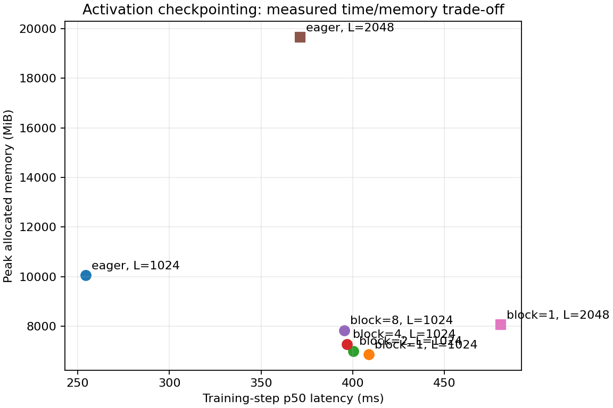
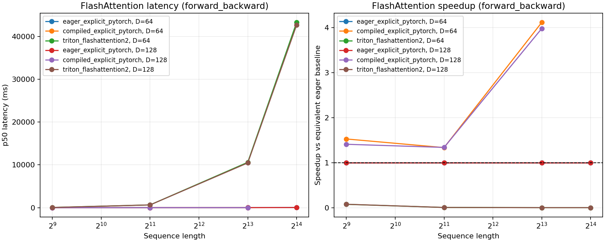

# A2-K：单卡显存优化与 GPU Kernels

> 状态：已发布，可提交。题面版本 `26.1.4-k-rc.3`。
>
> `A2-K` 是 Stanford A2 的第二个子作业，覆盖 Single-GPU Memory 与 GPU Kernels。
> 它不重复 `A2-P` 的 Profiling 任务，也不包含 DDP、optimizer state sharding、FSDP、
> tensor parallel 或多机训练；这些并行训练内容属于后续 `A2-D`。
>
> 上游来源为
> [stanford-cs336/assignment2-systems 固定快照](https://github.com/stanford-cs336/assignment2-systems/tree/ca8bc81a59b70516f7ebb2da4808daade877c736)，
> [原版 PDF](https://github.com/stanford-cs336/assignment2-systems/blob/ca8bc81a59b70516f7ebb2da4808daade877c736/cs336_assignment2_systems.pdf)
> 固定到 `26.1.4` 对应的
> [starter commit `ca8bc81a59b70516f7ebb2da4808daade877c736`](https://github.com/stanford-cs336/assignment2-systems/commit/ca8bc81a59b70516f7ebb2da4808daade877c736)。原版题面 PDF 的版本号为 `26.1.3`；
> `26.1.4` 只调整了代码测试。本页缩减原版的硬件规模，并把提交改为公开 Markdown
> 报告、轻量结果文件和受控附件；冲突时以本页为准。

本作业要求建立“显存权衡—正确性—性能”链路：先量化 activation checkpointing 的
显存/计算交换，再实现明确的 PyTorch attention 基线，最后完成学生自己编写的
FlashAttention-2 Triton 前向 kernel，并用可复现的 GPU 测量说明它何时更快、为什么更省
显存。只跑通 CPU 模拟、只给一张性能图或直接调用已有 fused attention，都不等于完成。

评分标准与核验方式见
[`assignments/A2-K/EVALUATION.md`](../../../../assignments/A2-K/EVALUATION.md)。开始前必须阅读
[公开性与提交规则](../../../../docs/submission-rules.md)。

## 1. 与原版 A2 的关系

`A2-K` 纳入原版的 6 道题，保留原始分值，总分 **33 分**，不归一化为 100 分：

| 上游 problem | 原始分值 | A2-K 任务 |
| --- | ---: | --- |
| `gradient_checkpointing` | 4 | 任务一：Activation Checkpointing |
| `pytorch_attention` | 2 | 任务二：显式 PyTorch Attention |
| `torch_compile` | 2 | 任务二：`torch.compile` 对照 |
| `flash_forward` | 15 | 任务三：FlashAttention-2 前向 |
| `flash_backward` | 5 | 任务四：重计算式反向 |
| `flash_benchmarking` | 5 | 任务五：正确性与性能矩阵 |

原 PDF 是算法、公式与接口定义的主要参考；本页不复制作业答案、kernel 模板的完整实现或
预填测量数字。原版的 optional Triton backward 和 leaderboard 不属于必做内容。

## 2. 学习目标

完成后，你应当能够：

1. 解释 activation checkpointing 如何用重计算换取峰值显存，并正确测量代价；
2. 区分显式 PyTorch attention、`torch.compile` 生成的 kernel 与自己编写的 Triton kernel；
3. 实现数值稳定的 online softmax 与 FlashAttention-2 tiled forward；
4. 正确保存 log-sum-exp，并用重计算完成 `dQ`、`dK`、`dV`；
5. 用多组 shape、causal/non-causal、输出与梯度误差验证正确性；
6. 在同一硬件、输入、dtype 和测量边界下比较延迟、显存与 speedup；
7. 只提交公开、脱敏、体积受控并可追溯的代码、数据和图表。

## 3. 固定环境、工作目录与版本

### 3.1 RTX 4090 24GB 标准环境

最终性能结果必须在**单张 NVIDIA GeForce RTX 4090 24GB** 上得到。其他 GPU 可以用于开发，
但不能替代本作业的正式矩阵，也不能与 4090 的数字混合计算 speedup。本页所有必做 shape
均已由教师实现按下述 23 GiB allocator 预算完整执行；该预算是资源上限，不是可改小 shape 的
理由。正式运行还必须满足：

- 只让一个进程使用一张物理 GPU；不得使用多卡、CPU/NVMe offload 或远程推理服务；
- checkpoint、compile、correctness 和 attention benchmark 各自使用新的 Python 进程串行
  执行，不得把多组模型同时留在显存中，也不得并发运行正式矩阵；
- GPU 使用默认频率和 power limit，不手动超频或降功耗；运行期间没有其他计算任务；
- 开始正式矩阵前可用显存不少于 `22 GiB`；不足时等待资源释放，不得缩小 shape；
- 每个正式实验进程必须在第一次 CUDA allocation 前把 PyTorch allocator 上限设为
  `23552 MiB`（23 GiB），并把实际 fraction 与上限写入 metadata；
- performance 统一使用 BF16；扩展正确性至少包含一个关闭 TF32 的 FP32 配置；
- 输入、模型、optimizer 和随机数据在计时区间外创建；每个被测 CUDA 区间前后正确同步；
- 显存测量前调用 `torch.cuda.reset_peak_memory_stats()`，同时报告
  `max_memory_allocated()` 与 `max_memory_reserved()`；
- attention microbenchmark 使用
  `triton.testing.do_bench(warmup=100, rep=300, quantiles=[0.2, 0.5, 0.8])`
  或严格等价的 CUDA event 流程；这里 `warmup` 和 `rep` 的单位是毫秒。

统一使用以下等价逻辑设置 allocator 上限；必须在创建 CUDA tensor、模型或 optimizer 之前
调用。真实 24GB 卡与更大显存的开发卡都使用同一个 23 GiB 预算，从而避免在大卡上无意写出
24GB 卡无法复现的实现：

```python
import torch

total_bytes = torch.cuda.get_device_properties(0).total_memory
allocator_limit_bytes = 23 * 1024**3
allocator_fraction = min(1.0, allocator_limit_bytes / total_bytes)
torch.cuda.set_per_process_memory_fraction(allocator_fraction, device=0)
```

`set_per_process_memory_fraction` 只约束 PyTorch allocator，不包含 CUDA context 和驱动开销；
因此 `peak_reserved <= 23552 MiB` 是必需条件，但不能代替整卡无其他任务和 24 GiB 总上限。
如固定教师实现可以完成而你的实现触发 allocator OOM，应先排查张量生命周期、显式二次方
中间量和跨配置残留，不能静默降配。

开始正式运行前保存以下脱敏信息：

```bash
nvidia-smi \
  --query-gpu=name,memory.total,memory.free,driver_version,power.limit,pstate \
  --format=csv,noheader
```

`results/run_metadata.json` 必须记录 GPU 型号、总显存、开始时可用显存、Driver、CUDA、
PyTorch、Triton、power limit、P-state、TF32 设置、计时器、warm-up 和 measurement
设置；不得记录 UUID、主机名、用户名、内部资源编号或路径。助教复跑时以同规格 4090 为准。

### 3.2 固定工作目录与版本

`SummerQuest-2026` 与上游工作仓库必须保持同级：

```text
仓库父目录/
├── SummerQuest-2026/
└── assignment2-systems/
```

在 SummerQuest 仓库根目录执行：

```bash
git clone https://github.com/stanford-cs336/assignment2-systems.git ../assignment2-systems
git -C ../assignment2-systems checkout ca8bc81a59b70516f7ebb2da4808daade877c736
git -C ../assignment2-systems switch -c a2-k/MAK1MAAaa
git -C ../assignment2-systems rev-parse HEAD
```

最后一条命令必须输出上述固定 commit。实现、官方 tests、虚拟环境、编译缓存、完整 trace
和本地原始结果都留在 `../assignment2-systems`，不要把上游仓库整体复制进 SummerQuest。

在上游仓库中使用以下学生代码边界：

```text
assignment2-systems/
├── cs336_systems/
│   └── a2k/
│       └── **/*.py                 # A2-K 实现
├── tests/
│   └── adapters.py                 # 连接官方 tests
├── student_scripts/
│   └── a2k/
│       └── **/*.py                 # benchmark、正确性与汇总脚本
└── local_results/                  # 本地原始结果，不整体提交
```

不得把实现塞入 `tests/test_attention.py`，也不得修改公共测试来绕过 adapter。A2-K 代码必须
能通过 `tests/adapters.py` 调用。

## 4. 创建提交目录

已有个人目录的同学，在 SummerQuest 根目录运行：

```bash
python3 scripts/create_assignment.py --name '钱张枫' --assignment A2-K
```

脚手架会校验固定兄弟仓库，并创建：

```text
students/钱张枫/assignments/A2-K/
├── README.md
├── submission/
│   ├── cs336_systems/
│   │   └── a2k/
│   │       └── **/*.py
│   ├── tests/
│   │   └── adapters.py
│   └── student_scripts/
│       └── a2k/
│           └── **/*.py
├── results/
│   ├── correctness.json
│   ├── unit_tests.txt
│   ├── checkpointing.csv
│   ├── attention_baseline.csv
│   ├── compile_comparison.csv
│   ├── flash_benchmark.csv
│   ├── memory_evidence.json
│   └── run_metadata.json
└── assets/
    └── *.{png,jpg,jpeg,webp,svg}   # 至少 2 张，必须被 README 引用
```

完成或更新上游工作区的 A2-K 代码后运行：

```bash
python3 scripts/sync_a2k_submission.py --name '钱张枫'
```

同步脚本只复制 `cs336_systems/a2k/**/*.py`、`tests/adapters.py` 和
`student_scripts/a2k/**/*.py`。它不会复制公共 tests、其他 A2 子作业代码、结果、编译缓存、
trace、依赖或上游仓库元数据。轻量结果和压缩图片由本人确认脱敏后放入个人 A2-K 目录。

### 4.1 本次实现与正式环境

- 题面版本为 `26.1.4-k-rc.3`，固定 starter commit 为
  `ca8bc81a59b70516f7ebb2da4808daade877c736`；正式结果对应实现 commit 为
  `dcf93d8c194ce1729f8b6583850294674e010199`。
- 已完成显式 PyTorch attention、纯 PyTorch tiled FlashAttention reference、学生 Triton
  forward、两条 autograd 路径，以及 checkpoint、correctness、attention、compile、Flash、
  memory 汇总和图表生成脚本。必做项均已完成；可选的自定义 Triton backward 未实现，当前
  backward 使用题面允许的 PyTorch tiled 重计算。
- 正式实验使用单张 NVIDIA GeForce RTX 4090，显存总量 `24564 MiB`，正式进程启动时空闲
  `23718 MiB`，可见 CUDA 设备数为 1。Driver 为 560.28.03，CUDA 为 12.6，PyTorch 为
  2.7.1+cu126，Triton 为 3.3.1，power limit 为 `450 W`，运行期间 P-state 为 P0/P2。
- 首次 CUDA allocation 前设置 `23552 MiB` allocator 上限，实际 fraction 为
  `0.976813`。性能矩阵统一 BF16；扩展正确性使用 FP32，并关闭 matmul/cudnn TF32；性能
  进程记录 `matmul_allow_tf32=false`。
- attention 计时使用 `triton.testing.do_bench`，配置为 `warmup=100 ms`、`rep=300 ms`，
  保存实际 timing 列表对应的样本数、累计测量时长和 p20/p50/p80。cold compile wall time 与
  steady-state latency 分开记录。

完整公开环境、命令和配置见 [`results/run_metadata.json`](results/run_metadata.json)。正式包装器
在开跑前校验 HEAD、A2-K 源码、官方 attention tests 和 adapters 均与上述实现 commit 一致；
5 个正式进程记录同一 commit、`formal=true` 和 `status=success`。

## 5. 任务一：Activation Checkpointing

### 5.1 理论分析

回答原版 `gradient_checkpointing` 的理论部分：

1. 对由 `N` 个相同 Transformer block 组成的序列，说明在忽略计算代价时如何安排
   checkpoint，包括是否嵌套；
2. 给出峰值 activation memory 与总计算量相对 `N` 的渐近表达；
3. 提供不超过 20 行的伪代码或代码骨架，清楚标出 checkpoint 边界。

不能只写“每层 checkpoint”；必须解释保存的边界 activation、重计算区间和峰值出现位置。

#### 理论回答

对由 `N` 个相同 block 组成的模型，采用非嵌套的连续分段 checkpoint，设每段包含 `s` 个
block。前向只保存每段输入边界，数量为 `O(N / s)`；反向重计算当前段时短暂保留至多
`O(s)` 个内部 activation，因此峰值 activation memory 为：

~~~text
O(N / s + s)
~~~

令 `s` 约为 `sqrt(N)`，峰值 activation memory 为 `O(sqrt(N))`。每个 block 最多额外
重算一次，总计算量仍为 `O(N)`，但训练时间存在常数倍重计算开销。实现不嵌套 checkpoint，
以避免重复重算和难以审计的边界生命周期。

~~~python
def checkpointed_blocks(blocks, x, block_size):
    for start in range(0, len(blocks), block_size):
        segment = tuple(blocks[start : start + block_size])

        def run_segment(hidden, layers=segment):
            for layer in layers:
                hidden = layer(hidden)
            return hidden

        x = checkpoint(run_segment, x, use_reentrant=False)
    return x
~~~

### 5.2 固定实验

标准矩阵使用 Stanford medium 配置、24 层、batch size 1、context length 1024、BF16
autocast、FP32 参数和 AdamW，测量一个完整 training step。固定比较：

- 不使用 checkpoint；
- 非嵌套 checkpoint block size 为 `1`、`2`、`4`、`8` 层。

每个配置至少 3 个 warm-up step 和 5 个 measurement step。每轮测量前重置 peak memory
统计，记录 5 个 step latency 原始值、p50、peak allocated 和 peak reserved。模型、输入、
loss、optimizer、seed 与测量边界保持一致；不得把模型构造、首次编译或数据生成计入正式
step。

完成标准矩阵后，再在 context length 2048 上运行“不使用 checkpoint”和标准矩阵中
peak allocated 最低的 checkpoint 配置。baseline OOM 可以作为有效边界记录，但至少一个
checkpoint 配置必须在 23 GiB allocator 预算内成功。若该配置仍 OOM，保留失败记录并联系
助教排查；context length 1536 只能作为诊断，不得替代必做的 2048 配置。不得静默改变配置
标签或只保留成功行。

把结果写入 `results/checkpointing.csv`，至少包含：

```text
config_id,model_size,num_layers,context_length,batch_size,dtype,
checkpoint_block_size,nested,warmup_steps,measurement_steps,
step_time_ms_samples,step_time_ms_p50,peak_allocated_mib,peak_reserved_mib,status
```

报告必须解释最佳 block size 为什么不是只由 checkpoint 数量决定，并同时讨论显存收益和
重计算代价。

### 5.3 正式结果与权衡

完整原始行见 [`results/checkpointing.csv`](results/checkpointing.csv)。

| context | block size | step p50 (ms) | peak allocated (MiB) | peak reserved (MiB) | status |
| ---: | ---: | ---: | ---: | ---: | --- |
| 1024 | none | 254.458 | 10065.657 | 10224 | success |
| 1024 | 1 | 408.674 | 6865.751 | 7022 | success |
| 1024 | 2 | 400.375 | 7004.470 | 7154 | success |
| 1024 | 4 | 396.734 | 7283.313 | 7368 | success |
| 1024 | 8 | 395.257 | 7839.126 | 7962 | success |
| 2048 | none | 371.245 | 19660.513 | 20164 | success |
| 2048 | 1 | 480.577 | 8063.802 | 8414 | success |

在 context 1024 下，block size 1 相比无 checkpoint 将 reserved peak 降低 `31.3%`，代价
是 step p50 增至 `1.61x`。在 2048 边界下，block size 1 将 reserved peak 降低 `58.3%`，
step p50 为 `1.29x`。最佳 block size 同时受边界 activation 数量、段内临时 activation、
kernel 调度和重计算开销影响，不能只按 checkpoint 数量判断。7 行均在 allocator guard 内
成功，未删除或改写边界行。



## 6. 任务二：PyTorch Attention 与 `torch.compile`

### 6.1 显式 PyTorch 基线

实现显式 attention 基线：`QK^T`、scale、causal mask、softmax、`PV`。基线不得调用
`torch.nn.functional.scaled_dot_product_attention`、第三方 FlashAttention 或其他会自动
派发 fused attention 的接口。

固定使用 batch size 1、BF16、causal attention，测试以下核心笛卡尔积：

- sequence length：`512`、`2048`、`8192`；
- head dimension：`64`、`128`。

每个配置记录 forward、backward 和 forward-backward 的 p20/p50/p80 latency、正式测量
设置、peak allocated、peak reserved 和状态；OOM 作为结果行保留。输入分配和随机生成
不计时。结果写入
`results/attention_baseline.csv`。

#### 实现与正式结果

显式基线按 `QK^T -> scale -> causal mask -> softmax -> PV` 执行，不调用
`scaled_dot_product_attention` 或第三方 fused attention。完整 18 行见
[`results/attention_baseline.csv`](results/attention_baseline.csv)。在 batch 1、causal、BF16、
sequence 8192、head dim 128 下，forward/backward/forward-backward p50 分别为
`2.680 / 4.242 / 6.846 ms`，reserved peak 分别为 `1066 / 1578 / 1578 MiB`。

### 6.2 `torch.compile` 对照

对以下三个代表配置比较 eager 与 compiled attention：

- `(sequence=512, head_dim=64)`；
- `(sequence=2048, head_dim=128)`；
- `(sequence=8192, head_dim=128)`。

必须把首次 compile/cold-start 时间与 steady-state latency 分开。另在 Stanford small 模型、
batch size 1、context length 512、BF16 上比较 eager/compiled 的 forward、forward-backward
与完整 training step。结果写入 `results/compile_comparison.csv`。

报告不能仅以“compiled 更快”作结；需要说明 graph break、shape specialization、编译缓存和
测量稳定性。

### 6.3 正式 compile 对照

完整 24 行对照见 [`results/compile_comparison.csv`](results/compile_comparison.csv)。在上述
8192/128 配置下，compiled forward/backward/forward-backward p50 为
`0.671 / 1.122 / 1.719 ms`，相对 eager 的 steady-state speedup 为
`4.00x / 3.78x / 3.98x`。

Stanford small 模型、batch 1、context 512 的结果如下：

| phase | eager p50 (ms) | compiled p50 (ms) | steady speedup | compiled cold start (ms) |
| --- | ---: | ---: | ---: | ---: |
| forward | 42.143 | 10.966 | 3.84x | 27254.993 |
| forward-backward | 108.703 | 30.294 | 3.59x | 12237.221 |
| training step | 110.992 | 35.397 | 3.14x | 73.724 |

compiled steady state 有稳定收益，但首次 shape/backend 编译需要额外 wall time，因此 cold
start 未混入 steady latency。512 attention forward 的 compiled p50 为 `0.130 ms`，eager
为 `0.604 ms`，steady-state 加速约 `4.65x`，但首次 compiled forward 仍需约 `8.60 s`。
实际部署还需要考虑 shape specialization、graph break 和缓存复用；本次固定 shape 的热态
结果不能直接外推到动态 shape 工作负载。

## 7. 任务三：FlashAttention-2 前向

### 7.1 纯 PyTorch tiled 参考

实现原版要求的纯 PyTorch `torch.autograd.Function`：

- 以 tile 方式计算 attention，不调用 Triton；
- 输出 `O`；
- 保存 `Q`、`K`、`V`、`O` 与唯一一个 shape 为 `[batch, n_queries]` 的
  log-sum-exp `L`；
- 接口包含默认值为 `False` 的 `is_causal`；
- 通过 `tests.adapters.get_flashattention_autograd_function_pytorch` 暴露类对象。

该实现用于逐 tile 调试和反向参考，不以性能为目标。

#### 实现记录

纯 PyTorch tiled reference 使用 FP32 online-softmax row max、row sum 和 output accumulator，
逐 key/value tile 更新归一化状态；前向保存 `Q`、`K`、`V`、`O` 和唯一的
`[batch, n_queries]` FP32 LSE。实现同时支持 causal/non-causal，并通过
[`submission/tests/adapters.py`](submission/tests/adapters.py) 暴露给官方测试。

### 7.2 学生编写的 Triton 前向

使用自己编写的 `@triton.jit` kernel 实现 FlashAttention-2 tiled forward：

1. query tile 由一个 program instance 负责；
2. key/value tile 在 kernel 内循环；
3. 使用数值稳定的 online softmax；
4. accumulator 与 online softmax 状态使用 FP32；
5. 输出 `O` 并保存 `L`；
6. 同时支持 causal 与 non-causal；
7. 通过 `tests.adapters.get_flashattention_autograd_function_triton` 暴露类对象。

不得把 PyTorch baseline、`scaled_dot_product_attention`、第三方 flash-attn、xFormers、
课程外已有 kernel 或远程服务包装成 Triton 实现。阅读论文和文档可以，但提交代码必须由
本人实现并能解释 tile、pointer、mask 与数值稳定性。

`TRITON_INTERPRET=1` 可以用于 CPU 调试，但只证明 interpreter 路径；它不能替代真实 GPU
kernel、CUDA 官方测试或性能测量。

### 7.3 Triton 实现与参数选择

学生 forward 位于
[`submission/cs336_systems/a2k/flash_triton.py`](submission/cs336_systems/a2k/flash_triton.py)，
使用真实 `@triton.jit` kernel。一个 program 负责一个 query tile，并在 kernel 内循环处理
key/value tiles；本次正式配置为 `query_tile=64`、`key_tile=64`、`num_warps=4`、
`num_stages=1`。QK 与 PV 分块计算均在 kernel 内完成，row max、row sum 和 accumulator 使用
FP32；causal mask 按 query/key 的全局位置在 tile 内应用，最终输出 O 并保存 FP32 LSE。

tile 64 在当前 head dim 64/128 矩阵上兼顾并行度、寄存器压力和掩码边界处理。保存 LSE 而不
保存完整注意力矩阵，使反向可以重计算概率，同时避免持久化二次方大小的中间量。

## 8. 任务四：FlashAttention-2 反向

按照原版公式使用重计算得到 `dQ`、`dK`、`dV`。必做版本允许使用普通 PyTorch 函数与
`torch.compile`，但必须接入 PyTorch 和 Triton 两个 `autograd.Function`，支持 causal 与
non-causal，并返回与输入顺序一致的梯度。

在真实 CUDA GPU 上运行：

```bash
uv run pytest tests/test_attention.py -v
```

报告测试数量、通过/失败/跳过数量、GPU 型号、命令和 commit。没有 CUDA 时被跳过的 Triton
测试不能写成“通过”。将脱敏后的测试输出保存为 `results/unit_tests.txt`。

自定义 Triton backward 是可选扩展，不计入必做分数，也不能弥补前向正确性缺失。

### 8.1 反向实现与边界

PyTorch 与 Triton 两个 `autograd.Function` 均使用纯 PyTorch tiled attention 重计算概率并
返回 `dQ`、`dK`、`dV`；Triton 路径只把学生 kernel 用于 forward，没有把重计算 backward
描述为 Triton 性能优化。该 backward 在 sequence 8192 的 backward/forward-backward 约为
`10.42–10.61 s`，在 16384 边界约为 `42.71–43.31 s`，但 reserved peak 最高仅
`2782 MiB`。结果反映的是以显著重计算时间换取低显存，而不是反向加速。

## 9. 任务五：正确性与性能矩阵

### 9.1 扩展正确性

除官方 tests 外，至少覆盖：

- 3 个随机 seed；
- head dimension `32`、`64`、`128`；
- causal 与 non-causal；
- forward output、log-sum-exp、`dQ`、`dK`、`dV`。

记录 shape、dtype、最大绝对误差、最大相对误差、容差和 pass/fail。结果写入
`results/correctness.json`。至少一个正确性配置使用 FP32；性能矩阵统一使用 BF16。

#### 正确性结果

扩展正确性覆盖 3 个 seed、head dimension 32/64/128、causal/non-causal、纯 PyTorch tiled
与学生 Triton 两条路径，并逐项比较 O、LSE、dQ、dK、dV。36 个 FP32 case、180 个指标全部
通过，TF32 关闭；详情见 [`results/correctness.json`](results/correctness.json)。正式 CUDA
官方测试为 6 passed、0 failed、0 skipped，命令、GPU 与 commit 见
[`results/unit_tests.txt`](results/unit_tests.txt)。早期 CPU 诊断中的 4 个 CUDA skip 没有计入
正式通过数。

### 9.2 固定性能矩阵

在同一张 GPU 上比较：

1. 显式 eager PyTorch attention；
2. compiled PyTorch attention；
3. 学生 Triton FlashAttention-2。

固定 batch size 1、BF16、causal。核心矩阵要求三种实现全部参加，使用：

- sequence length：`512`、`2048`、`8192`；
- head dimension：`64`、`128`；
- phase：forward、backward、forward-backward。

另做长序列边界矩阵：sequence length `16384`、head dimension `64` 和 `128`、三种 phase，
至少比较 eager PyTorch 与学生 Triton；compiled PyTorch 在该边界为可选。即使 eager OOM，
也必须保留失败行并继续尝试学生 Triton，不得缩小 shape。

按 3.1 的固定 `do_bench` 协议测量。每行记录 implementation、shape、dtype、phase、
p20/p50/p80 latency、peak allocated、peak reserved、相对同 shape eager 的 speedup、
status，以及 Triton 的 query/key tile、num warps 和 num stages。结果写入
`results/flash_benchmark.csv`。只有 implementation 之外的所有条件相同且两行都成功时
才能计算 speedup；不得跨 GPU、跨 shape、跨 dtype、跨 causal 设置或使用 OOM 行计算。

### 9.3 正式性能结果

正式 Flash 矩阵包含 66/66 个 success 行，核心矩阵与 16384 边界使用同一张 GPU、输入生成
规则、BF16、causal 设置和计时边界。完整行见
[`results/flash_benchmark.csv`](results/flash_benchmark.csv)。代表性 forward 结果如下：

| sequence | head dim | eager p50 (ms) | compiled p50 (ms) | Triton p50 (ms) | Triton speedup vs eager |
| ---: | ---: | ---: | ---: | ---: | ---: |
| 8192 | 64 | 2.652 | 0.646 | 0.242 | 10.97x |
| 8192 | 128 | 2.679 | 0.671 | 0.481 | 5.57x |
| 16384 | 64 | 10.709 | - | 0.500 | 21.43x |
| 16384 | 128 | 10.744 | - | 1.230 | 8.74x |



学生 Triton forward 在长序列上具有明显延迟和显存优势；正式结论不把慢速的 PyTorch tiled
重计算 backward 描述为性能优化。三个性能 CSV 的全部成功行都记录非空
`measurement_sample_count` 和由实际 timing 列表求和得到的 `measurement_duration_ms`，没有
把目标 `rep=300 ms` 当作固定实测时长。例如 16384/head dim 64 Triton backward 记录 1 个
样本、`43297.1992 ms`，head dim 128 forward-backward 记录 1 个样本、`42711.4609 ms`。

### 9.4 低显存开发诊断（`formal=false`）

在正式运行前曾于同型号 GPU、启动空闲 `15668 MiB` 且存在外部计算进程的环境执行完整固定
矩阵。该环境低于 `22528 MiB` gate，因此所有数据明确保留 `formal=false`，不用于正式
speedup、显存结论或第 13 节验收。诊断完成 72/72 correctness cases、18/18 attention 行、
24/24 compile 行和 66/66 Flash 行；checkpoint 为 6 success，加一个 context 2048 无
checkpoint 的预期 OOM。该结果只用于证明实现能在约 15.3 GiB 空闲显存下推进开发，并验证
OOM 行不会被静默删除。

## 10. Markdown 报告与必交结果

最终主报告固定为个人 A2-K 目录下的 `README.md`，不提交 PDF、Office、notebook 或
notebook 导出。报告必须包含：

1. 完成范围、未完成项、题面版本和固定 starter commit；
2. 公开、脱敏的 RTX 4090 24GB、空闲显存、Driver、CUDA、PyTorch、Triton、power limit、
   P-state、TF32 与编译配置；
3. checkpoint 理论、代码骨架、固定矩阵和显存/时间权衡；
4. 显式 PyTorch attention 与 compiled attention 的边界和结果；
5. Triton forward 的 tile、online softmax、mask、精度和保存张量设计；
6. 官方 GPU tests 与扩展正确性结果，明确区分 pass、fail、skip；
7. 核心性能矩阵、16384 长序列边界、OOM/编译失败和至少两张图；
8. 每个关键数字对应的轻量结果文件与最小复现命令；
9. 组织内公开的飞书补充文档链接。

`results/run_metadata.json` 至少记录 commit、seed、命令，以及 3.1 规定的硬件和测量字段。
不得记录主机名、用户名、IP、内部路径、GPU UUID、进程列表或凭据。

`results/memory_evidence.json` 必须汇总所有正式进程的最高 `peak_allocated_mib`、
`peak_reserved_mib`、allocator limit/fraction、24 GiB 硬上限与 `within_24gib`。如果有条件
额外采集 `nvidia-smi` 进程峰值，可以作为补充字段，但不要提交包含进程列表或内部标识的
原始采样日志。

最小结构如下；数值必须来自本人的正式矩阵，不能照抄示例占位符：

```json
{
  "allocator": {
    "allocator_fraction": 0.0,
    "allocator_limit_mib": 23552
  },
  "hard_limit_mib": 24576,
  "pytorch_peak_allocated_mib": 0.0,
  "pytorch_peak_reserved_mib": 0.0,
  "within_24gib": true
}
```

### 10.1 完成范围与正式结果索引

必做范围已全部完成；未实现的自定义 Triton backward 属于可选扩展，不影响必做范围。正式
结果仅采用通过单卡 RTX 4090、22 GiB 起始空闲显存、单可见设备和 23 GiB allocator guard
检查的 `formal=true` 运行。各项轻量证据如下：

| 子任务 | 正式结果 | 本阶段最高 `peak_reserved_mib` | 证据 |
| --- | --- | ---: | --- |
| 官方 GPU tests | 6 passed、0 failed、0 skipped | - | [`results/unit_tests.txt`](results/unit_tests.txt) |
| 扩展正确性 | 36/36 case；180/180 个 O/LSE/dQ/dK/dV 指标通过 | 24 | [`results/correctness.json`](results/correctness.json) |
| Checkpointing | 7/7 success，包含 1024 标准矩阵与 2048 边界 | 20164 | [`results/checkpointing.csv`](results/checkpointing.csv) |
| 显式 attention | 18/18 BF16 phase success | 1578 | [`results/attention_baseline.csv`](results/attention_baseline.csv) |
| `torch.compile` | 24/24 对比行 success | 3098 | [`results/compile_comparison.csv`](results/compile_comparison.csv) |
| Flash 矩阵 | 66/66 行 success，包含 16384 边界 | 6186 | [`results/flash_benchmark.csv`](results/flash_benchmark.csv) |

[`results/memory_evidence.json`](results/memory_evidence.json) 汇总 112 条正式观测，最高
`peak_allocated_mib=19660.513`、`peak_reserved_mib=20164`，并记录
`within_allocator_guard=true`、`within_24gib=true`。环境、seed、命令和配置见
[`results/run_metadata.json`](results/run_metadata.json)。8 个结果文件和两张图片共
`320382 bytes`，约 `0.31 MiB`，低于 2 MiB 限制；公开候选文件未包含主机名、用户名、内部
路径、GPU UUID、进程列表或 Slurm 标识。

### 10.2 最小复现命令

~~~bash
python -m pytest --no-header --tb=no -v --disable-warnings tests/test_attention.py
python -m student_scripts.a2k.correctness --formal
python -m student_scripts.a2k.benchmark_checkpointing --formal
python -m student_scripts.a2k.benchmark_attention --formal
python -m student_scripts.a2k.benchmark_compile --formal
python -m student_scripts.a2k.benchmark_flash --formal
~~~

### 10.3 补充文档与未完成项

- 飞书补充实验文档：https://fudan-nlp.feishu.cn/wiki/FXJwwSYWni0CdgkosgHcEjWAncd?from=from_copylink。
- 必做实验和报告内容已完成；可选的自定义 Triton backward 未实现。
- 将本 README 复制到 SummerQuest 并补充飞书链接后，仍需运行
  `python3 scripts/validate_repo.py`，以目标仓库的最终输出核验目录、链接、文件类型和 staged
  内容。

## 11. 文件与附件限制

| 范围 | 限制 |
| --- | ---: |
| 学生目录内任意单文件 | 不超过 5 MiB |
| A2-K `README.md` | 不超过 1 MiB |
| `results/` 与 `assets/` 公开附件合计 | 不超过 2 MiB |

只允许：

- `submission/cs336_systems/a2k/**/*.py`；
- `submission/tests/adapters.py`；
- `submission/student_scripts/a2k/**/*.py`；
- `results/**/*.{csv,json,jsonl,md,txt}`；
- `assets/**/*.{png,jpg,jpeg,webp,svg}`。

明确禁止提交：

- `.nsys-rep`、Chrome trace、memory snapshot、pickle、SQLite；
- Triton/PyTorch compile cache、PTX、CUBIN、共享库、wheel；
- 数据、模型权重、checkpoint、虚拟环境、依赖锁和上游 `.git`；
- 压缩包、PDF、Office、notebook 与 notebook 导出；
- 未裁剪终端截图、内部主机名、IP、用户名、路径、UUID、进程信息和任何凭据。

附件指 `results/` 与 `assets/` 中的轻量汇总、metadata 和图片；`README.md` 与
`submission/` 代码不计入 2 MiB 附件限额。图片应裁剪到关键曲线或表格并压缩，完整 benchmark
日志和逐秒显存采样保留在个人工作目录，助教抽查时再按指定的组内受控方式提供。

## 12. 提交前自检与 PR

```bash
python3 scripts/sync_a2k_submission.py --name '钱张枫'
python3 scripts/validate_repo.py
git status --short
git diff --check
git diff --cached --stat
git diff --cached
```

本次 PR 只修改 `students/钱张枫/assignments/A2-K/`。分支使用
`a2-k/MAK1MAAaa`，PR 标题使用 `[A2-K] 钱张枫 - 简短说明`，commit 示例：

```text
feat(a2-k): submit 钱张枫 memory and kernels report
```

## 13. 最终验收清单

以下状态按正式结果源目录与现有 SummerQuest 个人目录核验。目标目录中的 8 个结果文件和
2 张图片与正式源文件 SHA-256 完全一致；官方校验器未报告本 A2-K 的附件类型、大小或禁止
文件问题。替换 README 并补充飞书链接后，提交前仍需重新运行校验器和检查 staged diff。

- [x] 固定 starter commit 正确，工作仓库位于 `../assignment2-systems`。
- [x] 所有正式结果来自单张 RTX 4090 24GB，开跑前可用显存不少于 22 GiB。
- [x] 各正式脚本串行、独立进程执行，首次 CUDA allocation 前设置了 23 GiB allocator 上限。
- [x] checkpoint 的 1024 标准矩阵与 2048 边界实验完整，OOM/fallback 如实记录。
- [x] PyTorch 基线是显式 attention，没有调用已有 fused attention。
- [x] pure PyTorch tiled 与学生 Triton forward 均通过对应正确性检查。
- [x] Triton forward 包含真实 `@triton.jit` kernel、online softmax 和 causal mask。
- [x] PyTorch/Triton 两个 autograd path 都能返回正确的 `dQ`、`dK`、`dV`。
- [x] 官方 GPU tests 没有把 skip 写成 pass。
- [x] 核心矩阵与 16384 边界矩阵使用同硬件、同输入、同 dtype、同 causal 和同测量边界。
- [x] README 中每个关键数字都能回到 `results/` 或明确命令。
- [x] `memory_evidence.json` 证明 peak reserved 不超过 23552 MiB，并如实记录 24 GiB 判定。
- [x] 至少两张图片被 README 引用，文件类型和大小通过校验。
- [x] 未提交缓存、binary、trace、权重、数据、压缩包、内部信息或凭据。

常用资料：
[Triton](https://triton-lang.org/)、
[PyTorch `torch.compile`](https://pytorch.org/docs/stable/torch.compiler.html)、
[PyTorch activation checkpointing](https://pytorch.org/docs/stable/checkpoint.html)、
[FlashAttention-2](https://arxiv.org/abs/2307.08691)。
