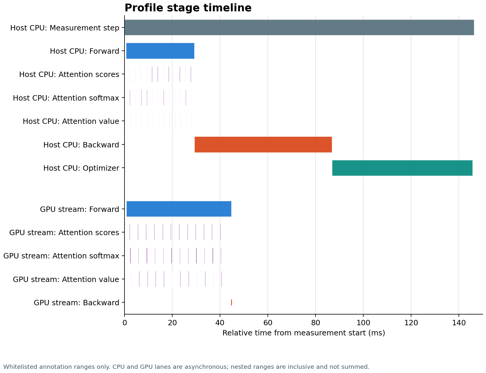
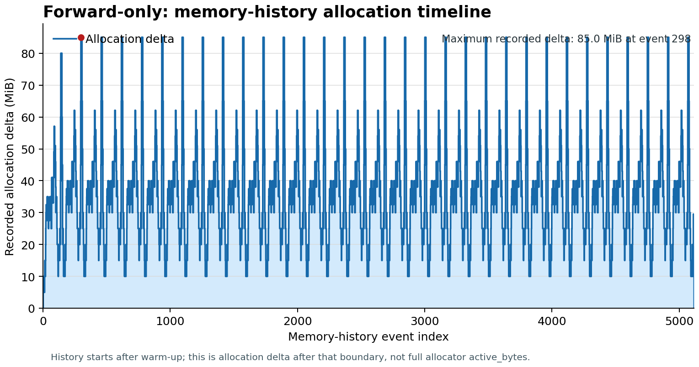
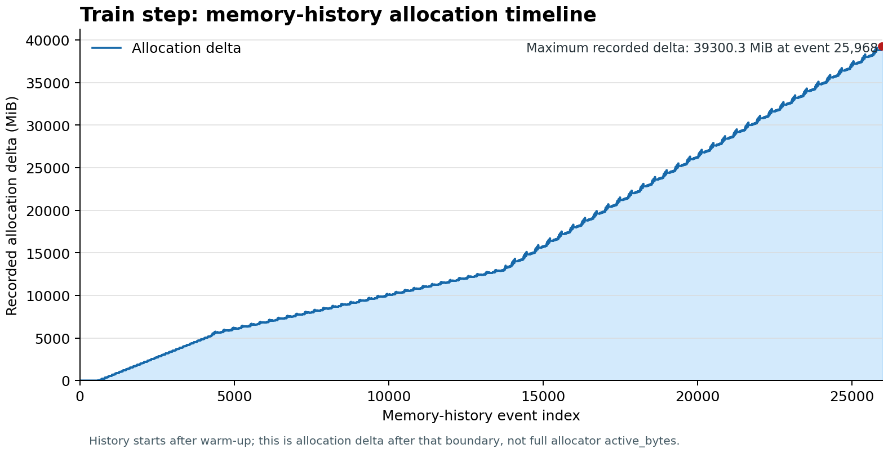

# A2-P 公开提交：钱张枫

## 基本信息

- 作业题面版本：`26.1.4-rc.3`
- 完成范围：端到端 benchmark、六个完整 `train_step` 的 `torch.profiler` trace、FP16 累加与 BF16 autocast 对照、XL 显存矩阵与 OOM fallback。
- 未完成项：公开轻量汇总未保留可复核的单次最大 allocation 与脱敏 stack 摘要；两张公开 memory 图是 allocation-delta 时间线而非完整 Active Memory Timeline。相应限制见第 4、5 节，且不对这些缺口给出无法回溯的定量结论。端到端、profile、mixed precision 和 memory 峰值/OOM/fallback 测量已完成。
- 上游 starter commit：`ca8bc81a59b70516f7ebb2da4808daade877c736`
- 本地工作仓库：`../assignment2-systems`

## 环境与工具

| 项目 | 公开、脱敏的信息 |
| --- | --- |
| GPU | NVIDIA A800-SXM4-80GB |
| NVIDIA Driver / CUDA runtime | NVIDIA Driver 发行版未在公开轻量 metadata 中留存；CUDA runtime 12.6 |
| PyTorch / Python | 2.7.1+cu126 / 3.10.12 |
| Compute profiler | `torch.profiler`，启用 CPU 与 CUDA activities |
| 其他限制 | XL/context 2048/batch 4 的完整 train step OOM；已保留失败记录和实际 fallback 配置。 |

## 1. End-to-End Benchmark

### 复现命令与计时方法

统一基线为 small、batch size 4、context length 512、FP32、seed `20260728`。`forward` 只执行前向；`forward_backward` 执行前向、cross entropy 和 backward；`train_step` 还包括 `zero_grad` 和 AdamW 更新。

计时器是 `time.perf_counter()`。每个 CUDA measurement step 都在开始计时前和 workload 结束后调用 `torch.cuda.synchronize()`；模型、优化器和随机 batch 初始化均在计时边界外。每组保留 10 次 measurement，常规配置先运行 5 次 warm-up。完整机读 raw timing、均值、样本标准差和 CV 见 [`results/benchmark.csv`](results/benchmark.csv)。

```bash
python profiling/benchmark.py --model-size small --batch-size 4 \
  --context-length 512 --mode train_step --warmup 5 --steps 10 \
  --dtype fp32 --seed 20260728 --device cuda \
  --output results/benchmark/small_train_step_w5.csv
```

### 结果

| mode | warm-up | 10 次 raw timing（ms） | mean ± sample std（ms） | CV |
| --- | ---: | --- | ---: | ---: |
| forward | 5 | 43.262, 43.242, 43.236, 43.249, 43.285, 43.231, 43.244, 42.970, 43.216, 43.238 | 43.217 ± 0.089 | 0.206% |
| forward_backward | 5 | 132.408, 132.435, 132.398, 132.375, 132.387, 132.395, 132.390, 132.363, 132.372, 132.372 | 132.389 ± 0.021 | 0.016% |
| train_step | 5 | 144.249, 144.000, 144.088, 144.020, 143.974, 143.979, 143.966, 143.942, 143.967, 143.987 | 144.017 ± 0.091 | 0.063% |
| train_step | 0 | 450.529, 145.139, 144.330, 144.138, 146.458, 144.289, 144.299, 144.355, 144.321, 144.297 | 175.216 ± 96.738 | 55.211% |

### 分析

`forward_backward` 的均值约为 `forward` 的 3.06 倍，新增部分主要是 loss 与反向传播。`train_step` 相比 `forward_backward` 多约 11.63 ms，主要来自梯度清理和 AdamW 更新。未 warm-up 的首个 `train_step` 为 450.529 ms，显著高于后续稳定样本；5 次 warm-up 后 `train_step` 的 CV 降至 0.063%，因此后续比较使用 warm-up 后数据。

## 2. Compute Profiling

### 六个 `train_step` trace 与命令

六个 run 均使用完整 `train_step`、batch size 4、FP32 和相同的 `torch.profiler` 口径。每个 run 先完成 3 次普通 warm-up；profiler schedule 为 `wait=0, warmup=1, active=1, repeat=1`，只记录一个预热后的 active measurement step。阶段标记包括 `profile/warmup`、`profile/measure`、`forward`、`backward`、`optimizer`、`attention/scores`、`attention/softmax` 和 `attention/value`。轻量汇总和六个 run 的配置见 [`results/profile/trace_summary.csv`](results/profile/trace_summary.csv) 与 [`results/profile/run_metadata.json`](results/profile/run_metadata.json)。

| model | context | dtype | measurement step（ms） |
| --- | ---: | --- | ---: |
| small | 256 | FP32 | 127.591 |
| small | 512 | FP32 | 146.450 |
| small | 1024 | FP32 | 321.523 |
| medium | 256 | FP32 | 242.898 |
| medium | 512 | FP32 | 447.844 |
| medium | 1024 | FP32 | 952.874 |

```bash
python profiling/benchmark.py --profile-matrix \
  --profile-model-sizes small medium \
  --profile-context-lengths 256 512 1024 \
  --model-size small --batch-size 4 --warmup 3 --dtype fp32 \
  --seed 20260728 --device cuda
```

small 从 context 256 到 1024 的 measurement step 增长为 2.52 倍，medium 对应为 3.92 倍。长度增加带来 attention 的二次项，而 medium 的层数与宽度进一步放大了该成本。

### Kernel、Calls 与时间线

下图来自 `small/context=512` 的真实 Chrome trace，经裁剪和脱敏后以 Host CPU、GPU stream 两个 lane 展示。CPU/GPU 异步且阶段嵌套，因此只作为时间线证据展示，不能跨 lane 或与内部 operator 直接相加。



代表性 run 的下表选取 CPU host `record_function` 范围。CUDA total 是 profiler 对该范围的归因统计，不是可相加的 wall-clock 分段。

| `small/context=512` host range | Calls | CPU total（µs） | CUDA total（µs） |
| --- | ---: | ---: | ---: |
| `profile/measure` | 1 | 146428.754 | 54274.285 |
| `forward` | 1 | 28622.172 | 42509.282 |
| `backward` | 1 | 57598.875 | 1.760 |
| `optimizer` | 2 | 59082.348 | 11763.243 |
| `attention/scores` | 12 | 2341.480 | 2952.849 |
| `attention/softmax` | 12 | 1685.782 | 3530.993 |
| `attention/value` | 12 | 1420.977 | 2548.176 |

`backward` 的 host 范围 CUDA annotation 很短，不能据此推断完整反向 GPU 用时；因此还需结合 operator 行。相同 trace 中，`aten::bmm` 为 327 calls、累计 CUDA total 为 99.082 ms，`autograd::engine::evaluate_function: BmmBackward0` 为 109 calls、累计 CUDA total 为 65.930 ms；矩阵乘法及其反向传播是最明显的 CUDA 工作来源。`Optimizer.step#AdamW.step` 的 GPU annotation 为 12.349 ms。operator、GPU annotation 和父范围均可能重叠，报告没有将它们相加。

### 工具边界

`torch.profiler` 的 CPU/CUDA activities 与 `record_function` ranges 可在 Chrome-compatible viewer 或 Perfetto 阅读；它不等同于 Nsight Systems，故本报告不声称 CUDA API 到 kernel 的完整系统级关联，也不伪造 nsys 专属字段。完整 Chrome trace 仅在本地留存。

## 3. Mixed Precision

### 四种累加实验

四个实验均将 `0.01` 累加 1000 次，数学结果为 10。实际输出见 [`results/mixed_precision.json`](results/mixed_precision.json)。

| case | result | absolute error |
| --- | ---: | ---: |
| FP32 accumulator + FP32 input | 10.0001335144 | 0.0001335144 |
| FP16 accumulator + FP16 input | 9.9531250000 | 0.0468750000 |
| FP32 accumulator + FP16 input | 10.0021362305 | 0.0021362305 |
| FP32 accumulator + explicit FP16→FP32 input | 10.0021362305 | 0.0021362305 |

FP16 输入在量化时已经引入误差；即使改用 FP32 累加器，显式上转也不能恢复已量化的输入。FP16 累加器的误差扩大到 0.046875，说明每次 reduction/累加的低精度舍入会继续积累。FP32 累加器能避免后者，但不能撤销输入量化误差。

### FP32 与 BF16 autocast

ToyModel 使用 CUDA BF16 autocast，实测 dtype 为：

| 项目 | dtype |
| --- | --- |
| 参数 | FP32 |
| `fc1` 输出 | BF16 |
| LayerNorm 输出 | FP32 |
| logits | BF16 |
| loss | FP32 |
| gradients | FP32 |

small、batch size 4、context length 512、warm-up 5、10 次 measurement 的语言模型对照如下。峰值取 `peak_allocated`，不是 reserved。

| workload | FP32 mean ± std（ms） | BF16 mean ± std（ms） | BF16 speedup | FP32 / BF16 peak allocated（MiB） |
| --- | ---: | ---: | ---: | ---: |
| forward_backward | 131.805 ± 0.122 | 58.298 ± 3.259 | 2.261× | 4157.6 / 3236.3 |
| train_step | 138.214 ± 0.080 | 74.104 ± 4.559 | 1.865× | 5148.7 / 4216.6 |

在 A800 上，BF16 通过 Tensor Core 降低矩阵计算时间，并降低 activation 等张量的显存占用；两种 workload 均显示较低的 peak allocated。BF16 的指数范围大于 FP16，因而对大幅度值更稳健；但其尾数精度仍有限，所以 autocast 会将 LayerNorm、loss 等数值敏感的 reduction 保留为 FP32。本次 `train_step` 的 loss 相对差约为 `2.76e-5`，两种精度的 logits 与 loss 都为有限值；同时 BF16 的 CV 较高，速度收益应与波动一并解读。

## 4. Memory Profiling

### 配置、峰值与 fallback

使用 XL、FP32，原始请求为 batch size 4、context 128 和 2048，分别执行 forward 与完整 `train_step`。每个可完成配置先执行一次 warm-up，再启用 PyTorch memory history，清理缓存并 reset peak 统计，然后只执行一次 measurement workload。完整轻量数据见 [`results/memory/peaks.csv`](results/memory/peaks.csv) 与 [`results/memory/run_metadata.json`](results/memory/run_metadata.json)。

`active` 是 allocator 的 `active_bytes.all`，表示活跃 allocator block；`allocated` 是活跃 tensor 占用；`reserved` 是 caching allocator 向驱动保留的内存。这三种口径不混用。

| 请求配置 | 实际配置 | 状态 | active peak（MiB） | allocated peak（MiB） | reserved peak（MiB） |
| --- | --- | --- | ---: | ---: | ---: |
| XL, ctx 128, bs 4, forward | XL, ctx 128, bs 4, forward | completed | 13217.807 | 13217.807 | 13246.000 |
| XL, ctx 128, bs 4, train_step | XL, ctx 128, bs 4, train_step | completed | 52648.993 | 52648.993 | 54046.000 |
| XL, ctx 2048, bs 4, forward | XL, ctx 2048, bs 4, forward | completed | 21819.650 | 21819.650 | 24048.000 |
| XL, ctx 2048, bs 4, train_step | XL, ctx 2048, bs 4, train_step | warm-up OOM | 78302.119 | 78302.119 | 79432.000 |
| XL, ctx 2048, bs 4, train_step | XL, ctx 2048, bs 1, train_step | measurement OOM | 78863.834 | 78863.834 | 80258.000 |
| XL, ctx 2048, bs 4, train_step | XL, ctx 1024, bs 1, train_step | completed fallback | 57714.374 | 57714.374 | 58766.000 |

两次 OOM 的公开摘要仅保留失败阶段和失败申请量，分别为 2.00 GiB 与 512.00 MiB；失败申请不是已分配的最大单次 allocation，不能以此替代该指标。

### Timeline、allocation 与 residual/gradient





两张图从 warm-up 后开启的 memory history 重构，纵轴是该边界后记录的 allocation delta，横轴为 event index；它们用于观察 allocation 生命周期，不等同于 Memory Visualizer 的完整 Active Memory Timeline，也不能替代 `peaks.csv` 中的 allocator peak。context 128 上，完整 `train_step` 的 active peak 为 52648.993 MiB，约为 forward 的 3.98 倍；反向阶段需保留 activations、产生 gradients，并使 AdamW 状态参与内存占用，因此远高于 forward。

XL 的 `d_model=2560`。单个 FP32 residual stream 的理论大小为：

```text
B × T × d_model × 4 bytes
```

batch size 4、context 128 时为 `4 × 128 × 2560 × 4 = 5,242,880 bytes = 5 MiB`；context 2048 时为 80 MiB。该单 tensor 远小于实测 peak，因为各层会同时保留 residual、attention/MLP 中间量，且训练还保留 autograd activation、gradient 和 optimizer 相关状态。

公开轻量结果未保留单次最大 allocation 或可公开的 stack 摘要，因此不能把 residual 理论值与该单次 allocation 做可回溯的数值对照，也不对其归属作推断。这是本报告明确保留的证据缺口；峰值分析只依据上述三类 allocator peak、两个时间线和阶段语义。

## 5. 限制与复现

- 代码同步命令：`python3 scripts/sync_a2p_submission.py --name '钱张枫'`
- 轻量结果目录：`results/`
- 未提交的本地大型原始文件：完整 Chrome trace、Nsight 报告、memory snapshot、pickle 与依赖环境；仅本地留存。
- 精确 NVIDIA Driver 发行版未写入公开轻量 metadata；不将 trace 的 CUDA Driver API 版本当作 NVIDIA 驱动发行版，因此当前环境以 GPU、CUDA runtime、PyTorch/Python 版本复现。
- 已知限制：CUDA total 是 framework profiler 的归因数据，嵌套 range/operator 可能重叠，不能直接相加为端到端 wall-clock 时间；公开 memory 图由 warm-up 后的 memory history 重构，纵轴为 allocation delta、横轴为 event index，不是完整 Active Memory Timeline，allocator peak 以 `results/memory/peaks.csv` 为准；单次最大 allocation/stack 摘要未纳入公开轻量结果。
- 最小复现步骤：执行 `python profiling/benchmark.py --help`、`python profiling/mixed_precision.py --help`、`python profiling/memory_snapshot.py --help` 查看统一入口；在 CUDA 环境用第 1、2、4 节命令重新采集轻量结果；最后运行 `python3 scripts/sync_a2p_submission.py --name '钱张枫'` 同步代码。

## 飞书补充文档

- https://fudan-nlp.feishu.cn/wiki/HVV4wdi0Riu8YMkBMtWctZxUnYc

## 自检

- [x] 本 PR 只包含我本人本次 A2-P 的文件。
- [x] `README.md` 是 Markdown 主报告，所有图片使用相对路径和有意义的 alt text。
- [x] 每个关键数字都能回到命令、`results/` 或 metadata。
- [x] 引用仓库外源码或资料时使用固定 commit 的 GitHub HTTPS 绝对 URL，未写入本机路径或 `file://` 链接。
- [x] 已用 nsys 或 `torch.profiler` 完成六个 `train_step` trace，并提交轻量汇总。
- [x] 已提交 1 张 Compute Profile 关键图和至少 2 张 Memory Timeline，均已裁剪、压缩并被报告引用。
- [x] `results/` 与 `assets/` 公开附件合计不超过 2 MiB。
- [x] 未提交 `.nsys-rep`、snapshot、完整 trace、权重、数据、压缩包或依赖环境。
- [x] GitHub 内容不含内部主机名、IP、账号、路径、UUID、进程或未公开项目。
- [x] GitHub 和飞书正文都不含 Secret、Token、Cookie、密码或私钥。
- [x] 飞书补充文档为组织内公开，且未开启互联网公开访问。