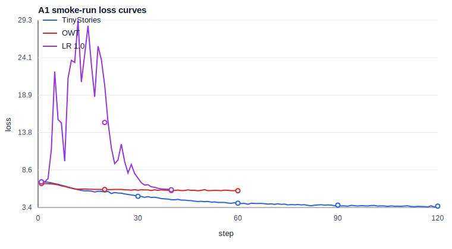

# A1 公开提交：陈匡巍

> 本文件和同目录代码公开可见。只提交允许公开且已经脱敏的内容；组织内材料放在下方登记的飞书补充文档中，密钥和访问凭据不进入任何提交材料。

## 基本信息

- 作业题面版本：26.0.4
- 上游 starter commit：`a158843b20107949f1a8d7df1b05cd33b9166712`
- 本地工作仓库：`../assignment1-basics`，与 `SummerQuest-2026` 同级
- 完成范围：21 个 adapter 接口对应实现、官方测试、BPE/tokenizer、Transformer LM、训练工具、checkpoint、训练/生成脚本，以及一组公开数据切片 smoke-run 日志
- 未完成项：未完成题面建议的 TinyStories 10K tokenizer + 10,000 step baseline、OWT 32K tokenizer 全量训练和长时间消融；本报告中的实验结果只作为小规模功能验证和趋势观察
- 官方测试：`python3 -m pytest -q`，结果为 `47 passed, 1 xpassed`

评分标准与评测方式见 [A1 EVALUATION](../../../../assignments/A1/EVALUATION.md)；日志格式见 [A1 题面《实验日志格式》](../../../../assignments/A1/README.md#实验日志格式)。

## 书面题

### `unicode1`

Unicode code point 是字符的抽象编号，例如 `牛` 是 `U+725B`。UTF-8 是把 code point 写成 byte 序列的编码方式，例如 `牛`.encode("utf-8") 得到三个 byte：`E7 89 9B`。Python 中 `len("牛") == 1`，但 `len("牛".encode("utf-8")) == 3`，说明“字符数”和“byte 数”不是同一件事。

### `unicode2`

Byte-level BPE 从 256 个单 byte token 出发，因此任意 UTF-8 文本都可以被表示，不会出现传统词表意义上的 OOV。解码时不能逐 token 单独 UTF-8 decode，因为一个 Unicode 字符可能被拆在多个 byte token 中；正确做法是先拼接全部 token bytes，再整体用 UTF-8 decode，并对非法片段使用 replacement character 处理。

### AdamW 显存、FLOPs 与时间核算

AdamW 对每个参数维护参数本身、梯度、一阶矩 `m` 和二阶矩 `v`。若全部为 fp32，训练时至少约为：

```text
parameter 4 bytes + gradient 4 bytes + m 4 bytes + v 4 bytes = 16 bytes / parameter
```

实际训练还会有激活、临时 buffer、框架状态和可能的 master weights，因此峰值显存会高于这个下界。一次 AdamW 更新主要是逐元素的 weight decay、两个动量更新、bias correction、sqrt/divide 和参数更新；可粗略按十余次 elementwise FLOPs/parameter 估计，通常远小于 Transformer forward/backward 的矩阵乘法成本。

本次 smoke-run TinyStories 配置为 `d_model=128`、2 层、4 头、context length 64、batch size 64、120 step，共处理约 `120 * 64 * 64 = 491,520` 个 token，训练耗时约 5.05 秒。该吞吐只用于验证训练 loop 和日志记录，不能直接外推到题面 baseline 的 512 维、4 层、context 256、10,000 step 目标。

## 实现说明

真实实现放在 `submission/cs336_basics/adapters_impl.py`，`submission/tests/adapters.py` 只负责导入和转发。实现覆盖：

- BPE 训练、special token 处理、`encode` / `decode` / `encode_iterable`
- `Linear`、`Embedding`、`RMSNorm`、`SiLU`、`SwiGLU`
- RoPE、masked scaled dot-product attention、causal multi-head self-attention
- Pre-Norm Transformer block 和完整 decoder-only Transformer LM
- stable softmax、cross-entropy、global gradient clipping、cosine schedule、AdamW、checkpoint save/load
- 可配置训练/消融/生成脚本：`submission/scripts/run_a1_experiments.py`

BPE 训练使用 pair count 与受影响 pre-token 的增量更新，避免每轮全量复制所有 token 序列；官方 `test_train_bpe_speed` 和正确性测试均通过。

## 实验设置

实验脚本使用公开数据源的固定前缀切片：

- TinyStories：`TinyStoriesV2-GPT4-valid.txt` 前 5,000,000 字符
- OWT：`owt_valid.txt` 前 5,000,000 字符

本次提交的 smoke-run 为节省时间使用较小配置：

```text
TinyStories vocab size: 1000
OWT vocab size: 800
context length: 64
d_model: 128
d_ff: 320
layers / heads: 2 / 4
device: CUDA-compatible accelerator
```

我也尝试启动 10K/32K 词表切片实验，但 OWT 32K BPE 预处理时间明显变长，未纳入本次提交日志。提交的日志不包含原始数据、checkpoint、模型权重或内部路径。

## Tokenizer 实验

| 数据 | bytes | tokens | compression ratio | longest token | throughput |
| --- | ---: | ---: | ---: | ---: | ---: |
| TinyStories 切片评估 | 500,170 | 157,181 | 3.18 bytes/token | 13 bytes | 537,694 bytes/s |
| OWT 切片评估 | 503,943 | 213,107 | 2.36 bytes/token | 13 bytes | 518,303 bytes/s |

TinyStories 的压缩率高于 OWT，符合预期：儿童故事语料重复模式和短语结构更集中，BPE 更容易把常见片段合并成较长 token。OWT 文本风格更杂，单位 token 覆盖的 byte 数更少。

## 训练与消融结果



| run | step | batch | final val loss | train time |
| --- | ---: | ---: | ---: | ---: |
| TinyStories smoke | 120 | 64 | 3.5880 | 5.05s |
| OWT smoke | 60 | 32 | 5.7225 | 0.47s |
| LR 0.001 | 40 | 32 | 5.6344 | 0.32s |
| LR 0.01 | 40 | 32 | 5.3986 | 0.32s |
| LR 0.1 | 40 | 32 | 5.6617 | 0.32s |
| LR 1.0 | 40 | 32 | 5.8517 | 0.32s |
| batch 1 | 30 | 1 | 5.7276 | 0.24s |
| batch 64 | 30 | 64 | 5.2212 | 0.25s |
| batch 128 | 30 | 128 | 5.1379 | 0.26s |
| no RMSNorm | 50 | 32 | 5.7427 | 0.33s |
| Post-Norm | 50 | 32 | 4.1001 | 0.39s |
| NoPE | 50 | 32 | 4.7307 | 0.30s |
| SiLU FFN | 50 | 32 | 4.6472 | 0.38s |

分析：

- TinyStories smoke-run 的 train loss 从约 6.93 降到 3.57，说明训练 loop、反向传播、优化器、验证和日志记录都能正常工作。
- 在短 run 中，batch size 64/128 的验证损失低于 batch size 1，主要因为每步看到的 token 数更多，梯度估计更稳定。
- LR sweep 中 `0.01` 在 40 step 内最好；`0.1` 和 `1.0` 明显变差，可作为高学习率不稳定的短 run 证据，但还没有长到出现 NaN 发散。
- 消融结果来自很短训练，不能作为架构优劣的最终结论。No RMSNorm 明显较差；Post-Norm、NoPE、SiLU FFN 在这个小规模设置下并未恶化到不可训练，说明需要更长训练和统一 token budget 才能做可靠判断。
- OWT smoke-run 的 validation loss 高于 TinyStories，符合更杂语料和更小 OWT tokenizer 设置下训练更难的预期。

## 文本生成样本

Prompt：

```text
Once upon a time
```

Sample：

```text
Once upon a time, there was a popy plime. She took a big ball, and her and soft tellove used for a big a big box. The little boy named Max.
The girl was very happy to the bird.
<|endoftext|>
```

简评：样本有 TinyStories 风格的人名、简单句和故事结构，但也出现了拼写错误、重复短语和不连贯动作。这符合 120 step 小模型 smoke-run 的预期：模型已学到部分局部格式，但远未达到稳定生成。

## 复现说明

- 环境与依赖：Python 3.12，PyTorch，NumPy，regex，tiktoken，pytest，jaxtyping；官方依赖以 `../assignment1-basics/pyproject.toml` 和 `uv.lock` 为准
- 数据准备：按 Stanford starter README 下载 TinyStories 与 OWT sample；本次 smoke-run 使用公开 validation 文件的固定前缀切片
- 官方测试命令：

```bash
cd ../assignment1-basics
python3 -m pytest -q
```

- smoke-run 命令：

```bash
cd ../assignment1-basics
python3 scripts/run_a1_experiments.py \
  --output runs/a1_public_valid \
  --device cuda \
  --tinystories data/TinyStoriesV2-GPT4-valid.txt \
  --owt data/owt_valid.txt \
  --max-chars 5000000 \
  --tiny-vocab-size 1000 \
  --owt-vocab-size 800
```

- 同步命令：

```bash
cd ../SummerQuest-2026
python3 scripts/sync_a1_submission.py --name '陈匡巍'
```

- 配置文件：无单独配置文件；公开配置记录在 `logs/summary.json` 和各 `summary_*.json` 中

## 实验日志

- 总览：`logs/summary.json`
- Tokenizer：`logs/tokenizer_stats.json`
- TinyStories 主训练：`logs/train_tinystories.jsonl`、`logs/summary_tinystories.json`
- LR sweep：`logs/lr_sweep/`
- Batch size：`logs/batch_size/`
- 四个消融：`logs/ablation_*.jsonl`、`logs/summary_ablation_*.json`
- OWT：`logs/train_owt.jsonl`、`logs/summary_owt.json`
- 文本生成：`logs/generation_sample.json`

JSONL 中逐点记录 `step`、`wall_clock_sec`、`train_loss`、`lr`，并在验证点记录 `val_loss`；summary 文件记录最终 validation loss、训练时间和关键配置。

## 飞书补充文档

- 链接：https://lako5livxd0.feishu.cn/wiki/Y2cIw8TNGioGcek6RImcJPNdnre?from=navigation

该文档设置为组织内公开，未开启互联网公开访问，只保存不能公开到 GitHub 但确有审核必要的最小差量材料。GitHub 和飞书正文均不保存 Secret、Token、Cookie、密码或私钥。
