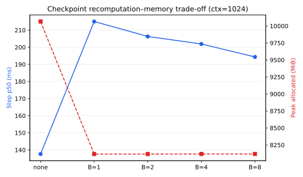
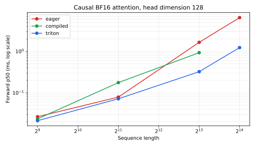

# A2-K 公开提交：陈匡巍

## 基本信息

- 题面版本：`26.1.4-k-rc.3`
- starter commit：`ca8bc81a59b70516f7ebb2da4808daade877c736`
- 完成范围：checkpoint 理论与固定矩阵、显式 PyTorch attention、compile cold/steady
  对照、纯 PyTorch tiled reference、本人编写的 Triton FlashAttention-2 forward、
  重计算 backward、官方测试、36 项扩展正确性、66 行性能矩阵与 24 GiB 显存证据
- 未完成项：无

## 环境与正式运行约束

| 项目 | 值 |
| --- | --- |
| GPU | 单张 NVIDIA GeForce RTX 4090；物理设备报告 `49140 MiB` |
| 开跑前空闲显存 | `48234 MiB` |
| allocator limit / fraction | `23552 MiB` / `0.48421737` |
| Driver / CUDA | `550.163.01` / `12.8` |
| PyTorch / Triton | `2.7.0+cu128` / `3.3.0` |
| power limit / P-state | 默认 `450 W` / 开跑时 `P0` |
| TF32 | performance 开启；FP32 correctness 关闭 |
| compile | Inductor、full graph；每个 workload 使用独立进程和空 cache |
| attention timer | `triton.testing.do_bench(warmup=100, rep=300, quantiles=[.2,.5,.8])` |

物理卡大于标准 24GB，因此每个正式进程在任何 CUDA tensor 之前调用
`set_per_process_memory_fraction`，使用题面更严格的 23 GiB 预算。checkpoint、compile、
correctness、官方 tests 与 attention matrix 在新 Python 进程中串行执行，只暴露一张卡，
没有 offload 或并发正式实验。最高 peak allocated/reserved 为 `19664.4/20240 MiB`，
[`memory_evidence.json`](results/memory_evidence.json) 给出 `within_24gib=true`。

## 1. Activation Checkpointing

### 1.1 理论

忽略计算代价时，对连续 block 区间递归二分，并在每层递归使用嵌套 checkpoint。反向时从
递归路径上的最近边界重算当前子区间，叶子处才物化一个 block 的 residual；平衡树深度为
`O(log N)`，峰值 dominant activation memory 为 `O(log N)`。每层递归覆盖总计 `N` 个
block forward，因此 forward-equivalent work 为 `O(N log N)`，另有 `O(N)` backward。

不超过 20 行的边界骨架：

```python
def nested_blocks(x, blocks, lo=0, hi=None):
    hi = len(blocks) if hi is None else hi
    if hi - lo == 1:
        return blocks[lo](x)                 # 叶子：单层 residual
    mid = (lo + hi) // 2
    def left(z):
        return nested_blocks(z, blocks, lo, mid)
    def right(z):
        return nested_blocks(z, blocks, mid, hi)
    x = checkpoint(left, x, use_reentrant=False)   # 左区间入口
    return checkpoint(right, x, use_reentrant=False)  # 右区间入口
```

固定实验只允许一次重算，故代码使用题面指定的非嵌套连续分组。对 block size `B`，边界
数量约 `N/B`，重算当前组时最多物化 `B` 层，近似峰值为 `O(N/B + B)`；每层额外重算一次，
总计算仍为 `O(N)` 但常数变大。

### 1.2 固定矩阵

Stanford medium、24 层、batch 1、BF16 autocast、FP32 参数、AdamW；3 个 warm-up 与
5 个 raw measurement samples。完整样本见
[`checkpointing.csv`](results/checkpointing.csv)。

| context | block size | p50 (ms) | peak allocated (MiB) | peak reserved (MiB) |
| ---: | --- | ---: | ---: | ---: |
| 1024 | none | 137.59 | 10065.7 | 10172 |
| 1024 | 1 | 215.03 | 8116.5 | 8170 |
| 1024 | 2 | 206.29 | 8116.5 | 8162 |
| 1024 | 4 | 201.90 | 8117.5 | 8220 |
| 1024 | 8 | 194.32 | 8117.5 | 8178 |
| 2048 | none | 379.18 | 19664.4 | 20240 |
| 2048 | 1 | 482.56 | 8134.9 | 9690 |



ctx1024 下 B=1/2 的最低 allocated peak 几乎相同，比 baseline 少 `19.36%`；B=8 反而最快。
原因是实测峰值还受单层 attention/FFN 临时张量、Adam state、allocator bin 与释放时刻控制，
不是 checkpoint 数量的单调函数。ctx2048 的 B=1 将 allocated 从 `19.20 GiB` 压到
`7.94 GiB`，代价是 p50 增加约 `27.3%`。

## 2. 显式 PyTorch Attention 与 `torch.compile`

`explicit_attention` 明确执行 `QKᵀ → scale → causal mask → softmax → PV`；没有调用
`scaled_dot_product_attention`、flash-attn、xFormers 或其他 fused API。
[`attention_baseline.csv`](results/attention_baseline.csv) 包含
`sequence={512,2048,8192} × head_dim={64,128} ×
phase={forward,backward,forward_backward}` 共 18 行，全部成功，并记录 p20/p50/p80 与两种
peak memory。

| sequence | head dim | forward p50 (ms) | backward p50 (ms) | fwd+bwd p50 (ms) |
| ---: | ---: | ---: | ---: | ---: |
| 512 | 64 | 0.026624 | 0.033792 | 0.193744 |
| 512 | 128 | 0.026464 | 0.036864 | 0.198464 |
| 2048 | 64 | 0.073728 | 0.091136 | 0.248832 |
| 2048 | 128 | 0.078848 | 0.104448 | 0.189440 |
| 8192 | 64 | 1.625088 | 2.402240 | 3.943424 |
| 8192 | 128 | 1.650688 | 2.438144 | 4.020176 |

compile 对照将第一次调用单独计为 cold-start，再用同一 `do_bench` 协议测 steady state：

| workload | shape | eager p50 (ms) | compiled cold (ms) | compiled steady p50 (ms) |
| --- | --- | ---: | ---: | ---: |
| attention fwd+bwd | 512×64 | 0.191 | 2731.4 | 0.123 |
| attention fwd+bwd | 2048×128 | 0.201 | 2904.6 | 0.132 |
| attention fwd+bwd | 8192×128 | 4.015 | 2837.9 | 1.644 |
| small forward | batch1/ctx512 | 13.286 | 17334.3 | 3.119 |
| small fwd+bwd | batch1/ctx512 | 45.913 | 29307.9 | 14.523 |
| small train step | batch1/ctx512 | 48.394 | 27784.7 | 20.010 |

为消除已有磁盘 cache 对 cold 数字的污染，六个 workload 分别在新 Python 进程和空
`TORCHINDUCTOR_CACHE_DIR` 中执行；CSV 的 `cold_start_context` 逐行保存这一条件。
首次调用需要捕获 graph、生成并编译 kernel，所以毫秒级 steady 优势无法摊平
2.7–29.3 秒的首次成本。固定 shape 以 `fullgraph=True` 成功，因而没有 graph break；
改变 sequence/head dim 会触发新的 shape specialization，真实服务仍可在后续请求中命中
cache。完整 12 行见
[`compile_comparison.csv`](results/compile_comparison.csv)。

## 3. FlashAttention-2 Forward

### 3.1 Pure PyTorch tiled reference

参考 autograd function 以 query/key tile `32×32` 迭代，不物化完整 `N×N` 矩阵。每个 query
tile 保存 FP32 running max `m`、denominator `l` 和 output accumulator；新 key tile 到来时
用 `exp(m_old-m_new)` 重标定旧状态。forward 保存 `Q/K/V/O/L`，其中唯一 `[batch,
n_queries]` 张量是 FP32 log-sum-exp `L=m+log(l)`，同时支持 causal 与 non-causal。

### 3.2 本人编写的 Triton kernel

真实 `@triton.jit` kernel 的 grid 为 `(ceil_div(Nq, Bq), batch)`：一个 program 负责一个
query tile，在 kernel 内只用一个循环遍历 key/value tile。`D≤64` 使用 `Bq=64`，`D=128`
使用 `Bq=32`；`Bk=64`、`num_warps=4`、`num_stages=2`。Q/K/V/O 使用二维 block pointer，
L 使用显式 stride；boundary mask 支持非整 tile，causal mask 比较全局 query/key index。

score、`m/l` 与 output accumulator 为 FP32；FP32 correctness 路径的两个 `tl.dot` 显式
指定 IEEE input precision，避免 Triton 默认 TF32 偷换验证口径。softmax numerator 在与 V
相乘前转成 V dtype，O 写回输入 dtype，L 保持 FP32。online recurrence 在任何时刻只持有
`Bq×Bk` score tile，因此 forward HBM activation 从二次方降为线性。

## 4. Backward 与正确性

两个 autograd path 共用重计算式 backward。由保存的 O 和上游 dO 先算
`D=rowsum(O∘dO)`，再重建 `S=QKᵀ/√d` 与 `P=exp(S-L)`，依次得到
`dV=PᵀdO`、`dP=dOVᵀ`、`dS=P∘(dP-D)`、`dQ=dSK/√d`、`dK=dSᵀQ/√d`。
CUDA path 交给 `torch.compile(fullgraph=True)` 融合逐元素重计算；没有在 forward 保存 P。

官方原始 tests：

```text
6 passed, 0 failed, 0 skipped
```

包括 PyTorch forward/backward、Triton causal/non-causal forward/backward，命令与脱敏输出见
[`unit_tests.txt`](results/unit_tests.txt)。实际执行测试为
`uv run --active --no-sync pytest tests/test_attention.py -v`；`--active --no-sync`
仅用于选择已经锁定且与驱动兼容的活动环境，不改变测试集合。GPU、commit 和在 pytest
启动时设置的 allocator guard 也写在该记录中；没有使用 `TRITON_INTERPRET=1`。

扩展矩阵为 2 个实现 × 3 seeds × 3 head dims × causal/non-causal = 36 项；seed 0 使用
关闭 TF32 的 FP32，seed 1/2 使用 BF16。36/36 pass。跨全部配置的最大绝对误差为：

| implementation | O abs | L abs | dQ abs | dK abs | dV abs |
| --- | ---: | ---: | ---: | ---: | ---: |
| PyTorch tiled | 0.015625 | 0.026353 | 0.015625 | 0.015625 | 0.015625 |
| Triton | 0.015625 | 0.026353 | 0.015625 | 0.015625 | 0.015625 |

最大相对误差也如实汇总：

| implementation | O rel | L rel | dQ rel | dK rel | dV rel |
| --- | ---: | ---: | ---: | ---: | ---: |
| PyTorch tiled | 3.9406 | 0.008714 | 3.1452 | 3.3145 | 2.5000 |
| Triton | 3.8338 | 0.008714 | 3.7861 | 3.1887 | 2.5000 |

FP32/BF16 的 `atol=rtol` 分别为 `0.02/0.06`，pass 使用
`|actual-ref| ≤ atol + rtol·|ref|` 的逐元素条件。接近零的 reference 会放大上表 relative
ratio，因此不能只用最大相对比值判失败。逐配置数据见
[`correctness.json`](results/correctness.json)。

## 5. 固定性能矩阵

全部使用 batch1、BF16、causal、同一输入与 100/300 ms `do_bench`。核心矩阵 54 行包含
三种实现、6 个 shape、3 个 phase；16K 边界 12 行至少包含 eager/Triton。66/66 行成功，
完整 p20/p50/p80、显存、speedup、tile 与状态在
[`flash_benchmark.csv`](results/flash_benchmark.csv)。

下表给出 head dim 128 的 p50；括号为相对同 shape eager speedup：

| seq | implementation | forward ms | backward ms | fwd+bwd ms | forward peak allocated MiB |
| ---: | --- | ---: | ---: | ---: | ---: |
| 512 | eager | 0.0265 (1.00×) | 0.0369 | 0.1985 | 18.1 |
| 512 | compiled | 0.0235 (1.13×) | 0.0307 | 0.1505 | 17.4 |
| 512 | Triton | 0.0212 (1.25×) | 0.0922 | 0.2029 | 16.9 |
| 2048 | eager | 0.0788 (1.00×) | 0.1044 | 0.1894 | 38.8 |
| 2048 | compiled | 0.1761 (0.45×) | 0.0768 | 0.3748 | 26.8 |
| 2048 | Triton | 0.0717 (1.10×) | 0.2120 | 0.2765 | 18.8 |
| 8192 | eager | 1.6507 (1.00×) | 2.4381 | 4.0202 | 346.4 |
| 8192 | compiled | 0.9298 (1.78×) | 1.0957 | 2.1330 | 154.2 |
| 8192 | Triton | 0.3236 (5.10×) | 2.7750 | 3.0617 | 26.3 |
| 16384 | eager | 6.5157 (1.00×) | 9.6492 | 16.1240 | 1316.5 |
| 16384 | Triton | 1.2320 (5.29×) | 10.1473 | 11.3111 | 36.3 |

以 8192×128 为代表，三种 phase 的完整分位数为：

| phase | implementation | p20 / p50 / p80 (ms) | speedup vs eager |
| --- | --- | --- | ---: |
| forward | eager | 1.6476 / 1.6507 / 1.6538 | 1.00× |
| forward | compiled | 0.9267 / 0.9298 / 0.9318 | 1.78× |
| forward | Triton | 0.3218 / 0.3236 / 0.3246 | 5.10× |
| backward | eager | 2.4361 / 2.4381 / 2.4402 | 1.00× |
| backward | compiled | 1.0916 / 1.0957 / 1.1028 | 2.23× |
| backward | Triton | 2.7699 / 2.7750 / 2.7806 | 0.88× |
| fwd+bwd | eager | 4.0172 / 4.0202 / 4.0224 | 1.00× |
| fwd+bwd | compiled | 2.1299 / 2.1330 / 2.1361 | 1.88× |
| fwd+bwd | Triton | 3.0556 / 3.0617 / 3.0691 | 1.31× |



短序列时 launch 与 online-softmax bookkeeping 占比高，Triton 优势有限；到 8192/16384，
避免 score/P 的 HBM 往返使 forward 达到 `5.10×/5.29×`，且 16K forward allocated peak
从 `1316.5` 降至 `36.3 MiB`。当前必做 backward 是 compiled PyTorch 重计算而非自定义
Triton backward，所以单独 backward 没有相同优势，甚至略慢；但 16K end-to-end 仍为
`1.43×`。p20/p50/p80 间距很小，说明这些长序列结论不是单个异常样本。这也解释了为什么
不能用 forward 图替代三 phase 矩阵。

## 6. 复现与公开性

```bash
python3 scripts/sync_a2k_submission.py --name '陈匡巍'
python -m student_scripts.a2k.run_checkpointing \
  --output results/checkpointing.csv
python -m student_scripts.a2k.run_compile_comparison \
  --output results/compile_comparison.csv
python -m student_scripts.a2k.run_correctness --output results/correctness.json
python -m student_scripts.a2k.run_attention_benchmarks \
  --flash-output results/flash_benchmark.csv \
  --baseline-output results/attention_baseline.csv
python -m student_scripts.a2k.run_unit_tests --uv \
  --output results/unit_tests.txt
```

- 代码边界：`submission/cs336_systems/a2k/`、`submission/tests/adapters.py`、
  `submission/student_scripts/a2k/`
- 未提交：compile cache、PTX/CUBIN、binary、完整 trace、上游仓库与依赖环境
- 固定上游：
  [assignment2-systems pinned commit](https://github.com/stanford-cs336/assignment2-systems/tree/ca8bc81a59b70516f7ebb2da4808daade877c736)
- 飞书补充文档入口（个人组织内主页 A2 索引）：
  https://lako5livxd0.feishu.cn/wiki/Y2cIw8TNGioGcek6RImcJPNdnre?from=navigation

## 自检

- [x] 所有正式进程单卡串行，开跑前空闲显存大于 22 GiB，allocator 上限 23552 MiB。
- [x] checkpoint 1024 固定矩阵与 2048 边界完整。
- [x] 显式 baseline 未调用 fused attention。
- [x] 提交包含本人编写的真实 Triton online-softmax forward kernel。
- [x] 官方测试无 skip；扩展 O/L/dQ/dK/dV 36/36 pass。
- [x] 54 行核心矩阵与 12 行 16K 边界矩阵完整。
- [x] 每个关键数字可回溯到 CSV/JSON；未提交内部信息或大型原始产物。
