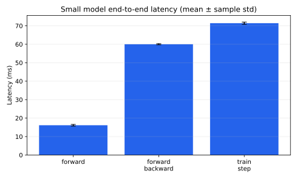
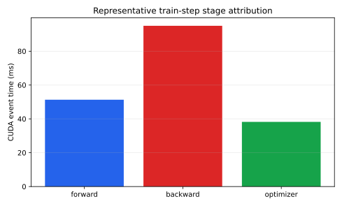
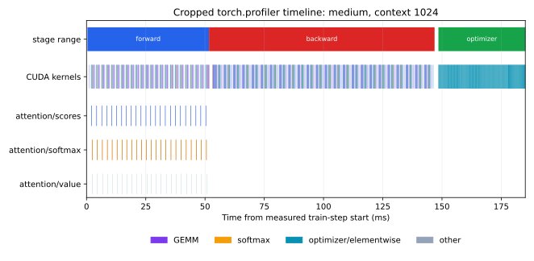
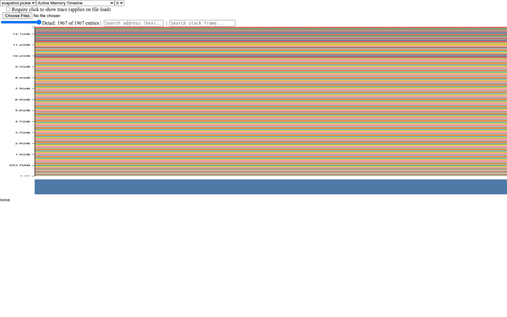
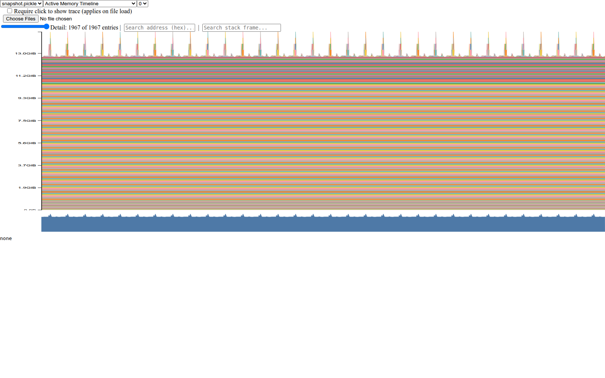
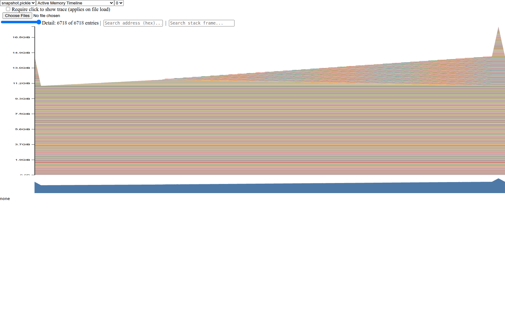
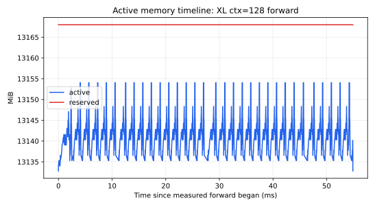
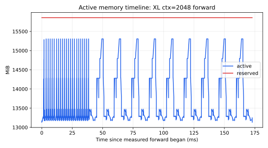
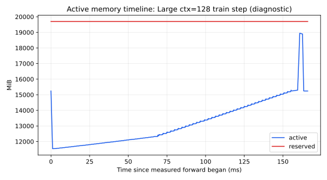

# A2-P 公开提交：陈匡巍

> 本目录只包含公开、脱敏的报告、轻量汇总、图和本人编写的 profiling 代码。完整 Chrome
> trace 与 PyTorch memory snapshot 仅保留在本地工作区，没有进入 Git。

## 基本信息

- 题面版本：`26.1.4-rc.3`
- starter commit：`ca8bc81a59b70516f7ebb2da4808daade877c736`
- 完成范围：End-to-End Benchmark、`2 × 3` Compute Profile、四种累加实验、ToyModel
  dtype 检查、五档模型 FP32/BF16 对照（含 10B 容量证明）、XL memory history、
  saved-tensor 分析、规定 fallback 与补充 full-step timeline
- 未完成项：无。23 GiB 预算内不能完成的 training-step 配置均保留为 OOM 边界结果
- 轻量证据：[`results/`](results/)

## 环境与测量约束

| 项目 | 公开、脱敏的信息 |
| --- | --- |
| GPU | NVIDIA GeForce RTX 4090；物理设备报告 `49140 MiB` |
| 开跑前空闲显存 | `48234 MiB` |
| PyTorch allocator | 每个进程首次分配前限制为 `23552 MiB`，fraction `0.48421737` |
| Driver / CUDA | `550.163.01` / `12.8` |
| PyTorch | `2.7.0+cu128` |
| Compute profiler | `torch.profiler`（CPU + CUDA activities）；Nsight Systems `2025.1.1` 仅作环境核对 |
| TF32 | benchmark/profile 打开；精度实验保留 FP32/BF16 实际 dtype |
| seed | `2026` |

物理卡的显存大于标准 24GB，但所有正式进程都使用更严格的 23 GiB PyTorch allocator
预算。计时前后均执行 `torch.cuda.synchronize()`；模型、optimizer、输入和随机数据都在
计时区间外创建。

## 1. End-to-End Benchmark

统一配置为 small、batch size 4、context 512、FP32。入口支持 `forward`、
`forward_backward`、`train_step`、warm-up、steps、dtype、seed、compile 与输出路径。
`forward` 在 `no_grad` 中只含模型前向；`forward_backward` 每步清梯度并包含 loss 与
backward；`train_step` 再包含 AdamW step。

最小复现命令：

```bash
python -m profiling.benchmark \
  --model-size small --batch-size 4 --context-length 512 \
  --mode train_step --warmup 5 --steps 10 --dtype fp32 \
  --output results/train_step.json
```

完整 raw samples 在 [`results/benchmark.csv`](results/benchmark.csv)；这里原样列出四行：

| mode | warm-up | raw timings (ms) | mean ± sample std (ms) | CV |
| --- | ---: | --- | ---: | ---: |
| forward | 5 | 16.482, 16.484, 16.487, 16.480, 16.588, 16.371, 15.509, 15.632, 15.674, 15.616 | 16.132 ± 0.456 | 2.83% |
| forward+backward | 5 | 60.112, 60.056, 60.392, 59.543, 60.484, 60.024, 59.968, 59.625, 60.354, 59.832 | 60.039 ± 0.315 | 0.52% |
| train step | 5 | 71.025, 71.298, 70.656, 71.266, 72.842, 71.376, 71.580, 71.126, 71.922, 71.136 | 71.423 ± 0.601 | 0.84% |
| train step | 0 | 428.492, 80.772, 74.685, 74.223, 73.032, 71.651, 71.515, 71.242, 71.729, 70.896 | 108.824 ± 112.358 | 103.25% |



无 warm-up 时首步 `428.5 ms` 把 lazy library/kernel setup、allocator 扩容和 Adam state
初始化混入了 measurement；其余样本很快回到约 `71 ms`。CUDA context 已在模型和输入
搬到设备时建立，不把它误归因到该首步。五步预热后 CV 降到
`0.84%`，也说明只报告均值会掩盖冷启动偏差。

## 2. Compute Profiling

六个 trace 都是 batch size 1、FP32、完整 `train_step`。每个进程先执行 3 个不采集的
warm-up step，再由 `torch.profiler` 捕获一个稳定 step；范围包括 `profile/warmup`、
`profile/measure`、`forward`、`backward`、`optimizer` 与三个 attention 子阶段。

```bash
python -m profiling.run_profile_suite \
  --output results/profile/trace_summary.csv \
  --metadata-output results/profile/run_metadata.json \
  --trace-directory local_results/profile_raw
```

| model | context | forward (ms) | backward (ms) | optimizer (ms) |
| --- | ---: | ---: | ---: | ---: |
| small | 256 | 26.672 | 49.299 | 12.135 |
| small | 512 | 26.119 | 47.977 | 12.177 |
| small | 1024 | 31.386 | 48.737 | 12.127 |
| medium | 256 | 50.142 | 95.316 | 38.176 |
| medium | 512 | 49.181 | 96.889 | 38.261 |
| medium | 1024 | 51.321 | 95.017 | 38.221 |



下图不是由聚合均值画出的替代图，而是从 medium/1024 的实际 Chrome trace 裁剪重建；
保留高层 stage、真实 CUDA kernel 和三个 attention range 的共同时间轴，完整 trace 不提交。



代表配置的 op/kernel 证据如下；CPU 与 CUDA 累计时间不混为一列：

| stage/type | name | calls | CPU total (ms) | CUDA total (ms) |
| --- | --- | ---: | ---: | ---: |
| full-step op | `aten::bmm` | 651 | 13.648 | 40.294 |
| backward op | `BmmBackward0` | 217 | 11.636 | 26.914 |
| forward kernel | CUTLASS `128×64` TN GEMM | 120 | — | 5.447 |
| forward kernel | softmax warp forward | 24 | — | 3.407 |
| optimizer kernel | AdamW multi-tensor multiply | 42 | — | 7.389 |

attention 的 `scores`、`softmax`、`value` range 均调用 24 次，CUDA 时间分别为 `4.719`、
`6.116`、`1.069 ms`。softmax FLOPs 远少于两个矩阵乘，但仍需读写二次方 score 张量，
所以其耗时没有按 FLOPs 比例消失；backward 又增加两个 BMM 方向和多个逐元素 kernel，
成为三个大阶段中最慢的一段。

[`trace_summary.csv`](results/profile/trace_summary.csv) 保留每个 run 的主要 op/range、Calls、
累计 CPU/CUDA 时间；[`run_metadata.json`](results/profile/run_metadata.json) 保留六条命令
与本地 trace 文件名。完整 Chrome trace 约 8–17 MiB/个，只留本地。

这里的 capture schedule 是 3 个 profiler 外的完整 warm-up step，加 1 个 active
measurement step；`profile/warmup` 是进入 capture 前的同步边界，不伪装成额外训练 step。
`torch.profiler` 同时启用 CPU/CUDA activities，能把框架 op、record_function range 与
CUDA kernel 放到同一时间线，但不
提供 Nsight Systems 那种系统级 CUDA API → kernel 关联，因此本报告不伪造 nsys
专属字段。阶段 CUDA event 可相加作粗粒度归因；嵌套 op 的累计 profiler 时间不能再次相加，
否则会重复计数。

## 3. Mixed Precision

### 3.1 四种累加

| 输入 / accumulator | 结果 | 相对精确值 10 的绝对误差 |
| --- | ---: | ---: |
| FP32 / FP32 | 10.0001335 | 0.0001335 |
| FP16 / FP16 | 9.9531250 | 0.0468750 |
| FP16 / FP32 | 10.0021362 | 0.0021362 |
| FP16 后显式转 FP32 / FP32 | 10.0021362 | 0.0021362 |

FP16 accumulator 在和越来越大的部分和相加时反复舍入，因而误差最大。后两种写法一致：
即使累加使用 FP32，`0.01` 在成为 FP16 输入时已被量化，这部分误差无法靠随后 upcast
恢复。

### 3.2 ToyModel dtype 与语言模型对照

CUDA BF16 autocast 下的实测 dtype：

| 对象 | dtype |
| --- | --- |
| 参数 / 参数梯度 | FP32 / FP32 |
| 第一层线性输出 | BF16 |
| LayerNorm 输出 | FP32 |
| logits / loss | BF16 / FP32 |

LayerNorm 的均值、方差与归一化是 reduction，低精度累加容易放大舍入或溢出；BF16 的指数
范围虽接近 FP32，比 FP16 稳定，但尾数仍更短，因此框架仍把敏感 reduction 保持在 FP32。
线性层则可使用 BF16 Tensor Core。

语言模型统一为 batch4/context512、forward+backward、5 warm-up/10 measurement；每个
model/dtype 在新进程运行，避免上一行的 reserved cache 污染：

| model | precision | mean ± sample std (ms) | peak alloc / reserved (MiB) | final loss | status |
| --- | --- | ---: | ---: | ---: | --- |
| small | FP32 | 60.377 ± 0.071 | 4157.6 / 4288 | 9.28475 | ok |
| small | BF16 | 47.779 ± 0.108 | 3241.1 / 3564 | 9.28392 | ok |
| medium | FP32 | 174.888 ± 0.101 | 10817.3 / 11256 | 9.27468 | ok |
| medium | BF16 | 123.700 ± 0.212 | 8565.0 / 8912 | 9.27501 | ok |
| large | FP32 | 397.692 ± 0.269 | 20751.4 / 20976 | 9.32488 | ok |
| large | BF16 | 263.362 ± 0.287 | 17000.9 / 17636 | 9.32463 | ok |
| XL | FP32 | — | 23197.1 / 23512 | — | OOM at warm-up |
| XL | BF16 | — | 23313.9 / 23544 | — | OOM at warm-up |
| 10B | FP32 | — | — | — | capacity precheck at setup |
| 10B | BF16 | — | — | — | capacity precheck at setup |

从 small 到 large，BF16 speedup 约为 `1.26× → 1.41× → 1.51×`，说明规模增大后 Tensor
Core GEMM 的收益更能摊薄框架开销；allocated peak 分别减少约 `22.0%/20.8%/18.1%`。
对应 loss 在同一 seed 下接近，只能说明这些随机步骤的数值趋势一致，不能据此外推长期训练
精度。XL 两行在相同 23 GiB guard 下都如实保留为 OOM。10B 共有
`12,832,823,808` 个参数；autocast 不改变 FP32 参数存储，因此仅参数就需
`48,953.34 MiB`，已超过 `23,552 MiB` allocator 上限，尚未计入 activation、gradient
和 optimizer state。两行由 meta-device 精确计数后在 `setup/parameters` 阶段作确定性容量
前检，不分配约 48 GiB 主机参数，也不伪造 timing。完整 dtype、raw timings、容量证明与
显存见 [`mixed_precision.json`](results/mixed_precision.json)。

## 4. Memory Profiling

每个成功配置先 warm-up，再开启 `torch.cuda.memory._record_memory_history`；snapshot
用 PyTorch `torch.cuda._memory_viz.trace_plot` 生成官方 Active Memory Timeline 页面并
截取脱敏图；同时按 `alloc/free_completed` 事件重建更易阅读的汇总曲线。`allocated` 是
`max_memory_allocated()` 的峰值口径，`reserved` 是 caching allocator 向 CUDA 保留的
segment，active 是当前尚未完成释放的 block；三者不能混作同一口径。

| model / context / mode | status | peak allocated (MiB) | peak reserved (MiB) | failure stage |
| --- | --- | ---: | ---: | --- |
| XL / 128 / forward | ok | 13154.1 | 13168 | — |
| XL / 128 / train step | OOM | 23386.7 | 23526 | warm-up |
| XL / 2048 / forward | ok | 15305.7 | 15858 | — |
| XL / 2048 / train step | OOM | 22938.0 | 23048 | warm-up |
| XL / 1024 / train step fallback | OOM | 23246.0 | 23528 | warm-up |
| Large / 2048 / train step fallback | OOM | 23123.4 | 23500 | warm-up |
| Large / 128 / train step diagnostic | ok | 19071.2 | 19696 | — |

下面三张 PNG 是由本地 snapshot 直接载入 PyTorch 官方 memory visualizer 生成的截图；
页面只显示通用文件名 `snapshot.pickle`，不含本地路径、主机名或 UUID。







为便于在静态报告中读取峰值变化，下面保留由同一 snapshot 事件生成的三张汇总曲线：







所有失败行都保留原标签。XL/2048 失败后严格按 XL/1024、Large/2048 顺序诊断；没有用
1536 或更小 shape 冒充必做配置。规定 fallback 全部完成后，额外的 Large/128 只用于提供
成功 full-step 的阶段时间线，不替代任何 XL 或 Large/2048 行。该图可见 forward 中 saved
residual 逐层累积、backward 中 residual 被释放而 parameter gradients 产生、首次 warm-up
已经建立的 Adam state 在 optimizer 阶段被复用。失败发生在 warm-up，说明 FP32 参数、
梯度、saved activations 和 Adam states 的组合已达到 23 GiB 边界，而不是 profiler 本身
失败。

XL residual stream 的 FP32 理论大小为
`batch × context × d_model × 4 bytes`：ctx 128 为
`1 × 128 × 2560 × 4 / 1024² = 1.25 MiB`，ctx 2048 为 `20 MiB`。snapshot 中最大
active allocation 为 `100 MiB`，正好对应 `2560 × 10240 × 4 bytes` 的单个 FFN 权重或
同规模临时张量；它明显大于一个 residual stream。

另外用 `saved_tensors_hooks` 单独测量 XL/ctx128 的一个 TransformerBlock：40 个保存引用
对应 `42.85 MiB` unique storage。前五类为 View `22.0 MiB (51.34%)`、Mul `7.5 MiB
(17.50%)`、Sigmoid `5.0 MiB (11.67%)`、ReshapeAlias `2.5 MiB (5.83%)`、Add
`2.5 MiB (5.83%)`，见
[`saved_tensors.json`](results/memory/saved_tensors.json)。一个 XL block 的参数梯度理论上
约为四个 `2560²` attention 矩阵加三个 `2560×10240` FFN 矩阵，即约 `400.02 MiB`
FP32；backward 在释放上述 residual 的同时产生这些梯度，因此完整训练峰值远高于 forward。

## 5. 复现、限制与公开性

- 同步命令：`python3 scripts/sync_a2p_submission.py --name '陈匡巍'`
- 原始 trace/snapshot：只留本地；公开目录仅含 CSV/JSON 与由其生成的 SVG
  及裁剪、脱敏后的官方 memory visualizer PNG
- 附件内没有主机名、IP、用户名、UUID、进程列表、内部路径或凭据
- 固定上游资料：
  [assignment2-systems at pinned commit](https://github.com/stanford-cs336/assignment2-systems/tree/ca8bc81a59b70516f7ebb2da4808daade877c736)
- 飞书补充文档入口（个人组织内主页 A2 索引）：
  https://lako5livxd0.feishu.cn/wiki/Y2cIw8TNGioGcek6RImcJPNdnre?from=navigation

除前文 benchmark/profile 命令外，其余最小复现入口为：

```bash
python -m profiling.mixed_precision \
  --output results/mixed_precision.json
python -m profiling.run_memory_suite \
  --output results/memory/peaks.csv \
  --metadata-output results/memory/run_metadata.json \
  --local-directory local_results/memory_raw
python -m profiling.saved_tensor_analysis \
  --context-length 128 \
  --output results/memory/saved_tensors.json
```

## 自检

- [x] 三种 mode、同步、5/10 warm-up/measurement 与 warm-up=0 对照完整。
- [x] 两个模型、三个 context 的六个稳定 `train_step` trace 完整。
- [x] 累加误差、ToyModel dtype、五档模型 BF16 时间/显存/数值或严格容量证明均有机器可读证据。
- [x] XL 128/2048 forward 与 train-step OOM/fallback 全部保留。
- [x] 实际 compute trace 时间线、三张官方 memory visualizer 截图和三张事件汇总曲线
  均被正文引用。
- [x] 未提交完整 trace、snapshot、权重、数据、压缩包、依赖或内部信息。
