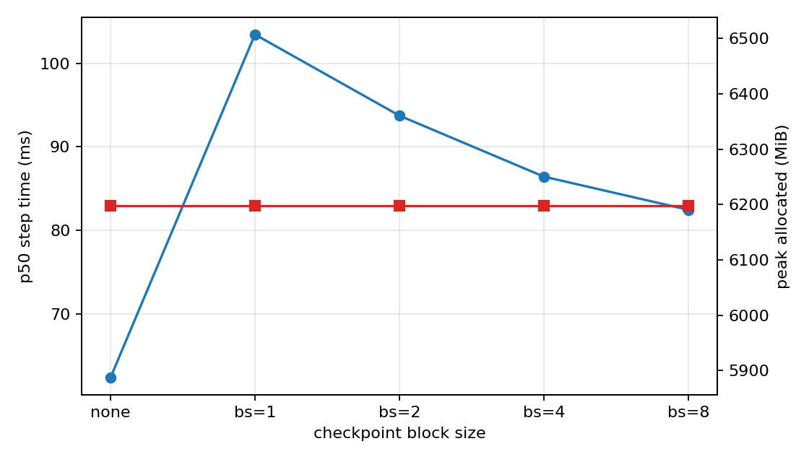
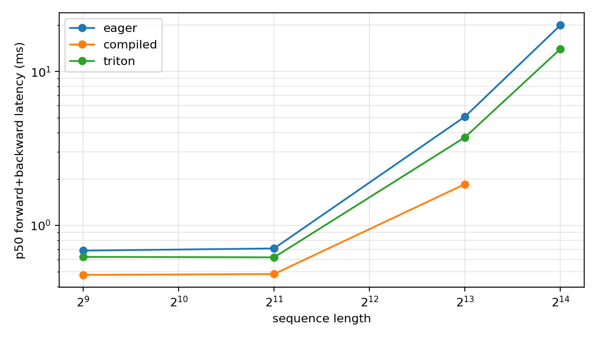

# A2-K 公开提交：陈博闻

本目录提交 CS336 Assignment 2 Systems 的 A2-K：Single-GPU Memory 与 GPU Kernels。代码、轻量结果和图片均按公开仓库要求整理，完整 trace、cache、环境和大型原始文件未提交。

## 基本信息

- 作业题面版本：`26.1.4-k-rc.3`
- 完成范围：activation checkpointing、显式 PyTorch attention、`torch.compile` 对照、pure PyTorch tiled FlashAttention reference、学生 Triton FlashAttention-2 forward、recompute backward、官方测试、扩展正确性与性能矩阵。
- 未完成项：无
- 上游 starter commit：`ca8bc81a59b70516f7ebb2da4808daade877c736`
- 工作仓库位置：`../assignment2-systems`
- 关键结果：`results/`；图片：`assets/`

## 环境与工具

| 项目 | 公开、脱敏的信息 |
| --- | --- |
| GPU 查询 | `NVIDIA GeForce RTX 4090, 49140 MiB, 48613 MiB, 550.163.01, 450.00 W, P3` |
| Driver / CUDA | Driver `550.163.01` / CUDA `12.1` |
| PyTorch / Triton | PyTorch `2.5.1+cu121` / Triton `3.1.0` |
| power limit / P-state | `450.00 W` / `P3` |
| TF32 | matmul `False`，cuDNN `True` |
| allocator | limit `23552 MiB`，fraction `0.484217` |
| measurement | attention: `triton.testing.do_bench(warmup=100, rep=300, quantiles=[0.2,0.5,0.8])`; checkpoint: 3 warm-up + 5 measurement steps |

## 1. Activation Checkpointing

对 `N` 个顺序 Transformer block，checkpoint 边界放在 block 之间。前向只保存每段开头 activation；反向到某段时从该边界重新执行段内 forward，再计算梯度。固定非嵌套 block size 为 `B` 时，保存边界数量约 `N / B`，段内重算区间峰值约随 `B` 增长，因此忽略参数和常数项后 activation 峰值近似为 `O(N / B + B)`；计算量仍为 `O(N)`，但训练 step 常数因重计算变大。

```python
def forward_with_checkpoint(blocks, x, block_size):
    if block_size is None:
        for block in blocks:
            x = block(x)
        return x
    for start in range(0, len(blocks), block_size):
        end = min(start + block_size, len(blocks))
        x = checkpoint_sequential(blocks[start:end], 1, x, use_reentrant=False)
    return x
```

固定实验来自 [`results/checkpointing.csv`](results/checkpointing.csv)：

| context | ckpt block | p50 step ms | peak allocated MiB | peak reserved MiB | status |
| ---: | --- | ---: | ---: | ---: | --- |
| 1024 | none | 62.35 | 6197.2 | 6364.0 | ok |
| 1024 | 1 | 103.45 | 6197.2 | 6378.0 | ok |
| 1024 | 2 | 93.73 | 6197.2 | 6438.0 | ok |
| 1024 | 4 | 86.42 | 6197.2 | 6406.0 | ok |
| 1024 | 8 | 82.45 | 6197.2 | 6366.0 | ok |
| 2048 | none | 76.96 | 6716.7 | 6834.0 | ok |
| 2048 | 1 | 105.47 | 6218.2 | 6390.0 | ok |

本次 1024 矩阵里各 checkpoint 配置的 `peak_allocated` 与 baseline 相同，说明该模型/实现下峰值主要被参数、optimizer state、logits/loss 或非 block 内 activation 支配，而不是被 `checkpoint_sequential` 覆盖的 block activation 支配；时间上 block size 8 最快，block size 1 最慢，符合“更细粒度 checkpoint 会带来更多调度与重计算开销”的预期。2048 下 baseline 未 OOM，但 checkpoint block 1 把 peak allocated 从 `6716.7 MiB` 降到 `6218.2 MiB`，代价是 p50 step 从 `77.0 ms` 增到 `105.5 ms`。

## 2. PyTorch Attention 与 torch.compile

显式 baseline 位于 `submission/cs336_systems/a2k/attention.py`，按 `QK^T -> scale -> causal mask -> softmax -> PV` 展开，并返回 log-sum-exp；没有调用 `scaled_dot_product_attention`、flash-attn、xFormers 或其他 fused attention。完整 baseline 矩阵见 [`results/attention_baseline.csv`](results/attention_baseline.csv)。

`torch.compile` 对照见 [`results/compile_comparison.csv`](results/compile_comparison.csv)。cold-start 与 steady-state 分开记录，下面只列 forward-backward 或 train step 的 p50 摘要：

| kind | seq | head dim | impl | phase | cold compile ms | p50 ms | speedup vs eager |
| --- | ---: | ---: | --- | --- | ---: | ---: | ---: |
| attention | 512 | 64 | eager | forward_backward | - | 0.663 | - |
| attention | 512 | 64 | compiled | forward_backward | - | 0.590 | 1.12 |
| attention | 2048 | 128 | eager | forward_backward | - | 0.708 | - |
| attention | 2048 | 128 | compiled | forward_backward | - | 0.482 | 1.47 |
| attention | 8192 | 128 | eager | forward_backward | - | 5.090 | - |
| attention | 8192 | 128 | compiled | forward_backward | - | 1.852 | 2.75 |
| small_transformer | 512 | 64 | eager | model_train_step | - | 28.433 | - |
| small_transformer | 512 | 64 | compiled | model_train_step | - | 18.815 | - |

短 attention shape 上 compile 主要消除 Python/op 调度和部分 elementwise 开销；8192 长序列上 compiled attention 的 p50 从 `5.090 ms` 到 `1.852 ms`，收益更明显。small Transformer train step 中 compiled p50 为 `18.815 ms`，eager 为 `28.433 ms`，但 compiled peak reserved 更高，且首次 compile 时间不能混入 steady-state。

## 3. FlashAttention-2 Forward

`FlashAttentionTorch` 是 pure PyTorch tiled reference。它按 query tile 与 key/value tile 循环，维护 FP32 的 row-wise `m`、`l` 和 output accumulator：

```text
m_next = max(m, rowmax(scores))
p      = exp(scores - m_next)
alpha  = exp(m - m_next)
acc    = acc * alpha + p @ V_tile
l      = l * alpha + rowsum(p)
L      = m + log(l)
```

`FlashAttentionTriton` 使用真实 `@triton.jit` forward kernel。launch grid 是 `(ceil(n_queries / 64), batch)`，一个 program instance 负责一个 query tile；kernel 内循环 key/value tile，使用 online softmax、causal mask、FP32 accumulator，默认 `Q_TILE_SIZE=64`、`K_TILE_SIZE=64`、`num_stages=3`，head dim 64 用 4 warps、head dim 128 用 8 warps。forward 保存 `Q/K/V/O/L`，其中 `L` 是唯一 `[batch, n_queries]` log-sum-exp tensor。

## 4. Backward 与正确性

Backward 使用 `Q/K/V/O/dO/L` 重计算得到梯度：

```text
P  = exp(S - L)
D  = rowsum(O * dO)
dV = P^T dO
dS = P * (dO V^T - D)
dQ = dS K / sqrt(d)
dK = dS^T Q / sqrt(d)
```

CUDA 上该 recompute backward 由 `torch.compile(fullgraph=True)` 包装；CPU 上保留 eager fallback。官方测试见 [`results/unit_tests.txt`](results/unit_tests.txt)：`6 passed, 0 failed, 0 skipped, 2 warnings`。

扩展正确性见 [`results/correctness.json`](results/correctness.json)，覆盖 3 个 seed、head dim `32/64/128`、causal/non-causal、FP32/BF16、`O/L/dQ/dK/dV`。摘要：

| implementation | rows | passed | max abs O | max abs L | max abs dQ | max abs dK | max abs dV |
| --- | ---: | ---: | ---: | ---: | ---: | ---: | ---: |
| pytorch | 36 | 36 | 0.007770 | 0.000001 | 0.007812 | 0.007812 | 0.003906 |
| triton | 36 | 36 | 0.007952 | 0.002550 | 0.007812 | 0.007812 | 0.005845 |

相对误差在接近 0 的梯度元素上会被放大，因此以 JSON 中逐行 `atol/rtol` 和 pass/fail 作为判定口径。

## 5. 性能矩阵

完整矩阵见 [`results/flash_benchmark.csv`](results/flash_benchmark.csv)，包含 forward、backward、forward-backward 的 p20/p50/p80、raw samples、峰值显存、speedup 和 Triton tile 参数。下面列 forward-backward 摘要：

| seq | head dim | impl | p50 ms | peak reserved MiB | speedup vs eager | status |
| ---: | ---: | --- | ---: | ---: | ---: | --- |
| 512 | 64 | eager | 0.663 | 24.0 | - | ok |
| 512 | 64 | compiled | 0.590 | 24.0 | 1.12 | ok |
| 512 | 64 | triton | 0.630 | 26.0 | 1.05 | ok |
| 512 | 128 | eager | 0.685 | 24.0 | - | ok |
| 512 | 128 | compiled | 0.476 | 24.0 | 1.44 | ok |
| 512 | 128 | triton | 0.624 | 26.0 | 1.10 | ok |
| 2048 | 64 | eager | 0.755 | 64.0 | - | ok |
| 2048 | 64 | compiled | 0.578 | 64.0 | 1.31 | ok |
| 2048 | 64 | triton | 0.655 | 74.0 | 1.15 | ok |
| 2048 | 128 | eager | 0.708 | 66.0 | - | ok |
| 2048 | 128 | compiled | 0.482 | 66.0 | 1.47 | ok |
| 2048 | 128 | triton | 0.620 | 80.0 | 1.14 | ok |
| 8192 | 64 | eager | 5.003 | 670.0 | - | ok |
| 8192 | 64 | compiled | 1.740 | 414.0 | 2.88 | ok |
| 8192 | 64 | triton | 3.246 | 818.0 | 1.54 | ok |
| 8192 | 128 | eager | 5.090 | 682.0 | - | ok |
| 8192 | 128 | compiled | 1.852 | 424.0 | 2.75 | ok |
| 8192 | 128 | triton | 3.736 | 830.0 | 1.36 | ok |
| 16384 | 64 | eager | 19.828 | 2602.0 | - | ok |
| 16384 | 64 | triton | 11.847 | 3134.0 | 1.67 | ok |
| 16384 | 128 | eager | 19.994 | 2622.0 | - | ok |
| 16384 | 128 | triton | 14.013 | 3646.0 | 1.43 | ok |





Triton forward 避免显式保存 `seq_len x seq_len` attention matrix，但本实现 backward 仍用 PyTorch 重计算并会重新物化 score/probability，所以端到端显存不一定低于 eager。性能上，Triton 在 512 到 2048 的小中等 shape 只略快于 eager；8192 和 16384 上优势更明显，forward-backward speedup 约 `1.36x` 到 `1.67x`。compiled PyTorch 在本环境对长 shape 更快，说明当前 Triton kernel 仍有 tile size、backward 实现和 autotuning 的优化空间。

## 6. 显存证据与复现

显存证据见 [`results/memory_evidence.json`](results/memory_evidence.json)：

```json
{
  "allocator": {
    "allocator_fraction": 0.48421737046550567,
    "allocator_limit_mib": 23552
  },
  "hard_limit_mib": 24576,
  "pytorch_peak_allocated_mib": 6716.7392578125,
  "pytorch_peak_reserved_mib": 6834.0,
  "within_24gib": true
}
```

最小复现命令记录在 [`results/run_metadata.json`](results/run_metadata.json)。正式运行入口：

```bash
python -m student_scripts.a2k.run_formal_suite   --results-dir local_results/a2k   --assets-dir local_results/a2k/assets
```

## 限制与风险

`nvidia-smi` 返回的设备名是 `NVIDIA GeForce RTX 4090`，但 `memory.total` 为 `49140 MiB`。实验进程已经按要求设置 `23552 MiB` allocator 上限，且最高 `peak_reserved` 为 `6834.0 MiB`。

## 飞书补充文档

- 链接：https://fudan-nlp.feishu.cn/wiki/QD26w72kPiHlv2kPNtHcupa7n1b

该文档设置为组织内公开，不开启互联网公开访问。

## 自检

- [x] 固定 starter commit 正确，工作仓库位于 `../assignment2-systems`。
- [x] 所有正式结果来自单张 RTX 4090 24GB，开跑前可用显存不少于 22 GiB。
- [x] 各正式脚本串行、独立进程执行，首次 CUDA allocation 前设置了 23 GiB allocator 上限。
- [x] checkpoint 的 1024 标准矩阵与 2048 边界实验完整，OOM/fallback 如实记录。
- [x] PyTorch 基线是显式 attention，没有调用已有 fused attention。
- [x] pure PyTorch tiled 与学生 Triton forward 均通过对应正确性检查。
- [x] Triton forward 包含真实 `@triton.jit` kernel、online softmax 和 causal mask。
- [x] PyTorch/Triton 两个 autograd path 都能返回正确的 `dQ`、`dK`、`dV`。
- [x] 官方 GPU tests 没有把 skip 写成 pass。
- [x] 核心矩阵与 16384 边界矩阵使用同硬件、同输入、同 dtype、同 causal 和同测量边界。
- [x] README 中每个关键数字都能回到 `results/` 或明确命令。
- [x] `memory_evidence.json` 证明 peak reserved 不超过 23552 MiB，并如实记录 24 GiB 判定。
- [x] 至少两张图片被 README 引用，文件类型和大小通过校验。
- [x] 未提交缓存、binary、trace、权重、数据、压缩包、内部信息或凭据。
