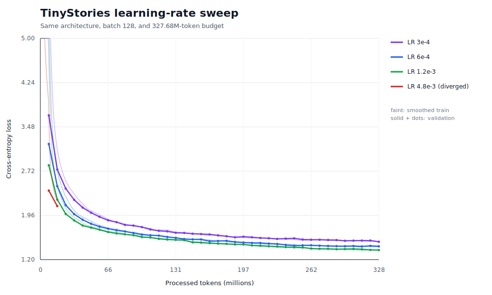
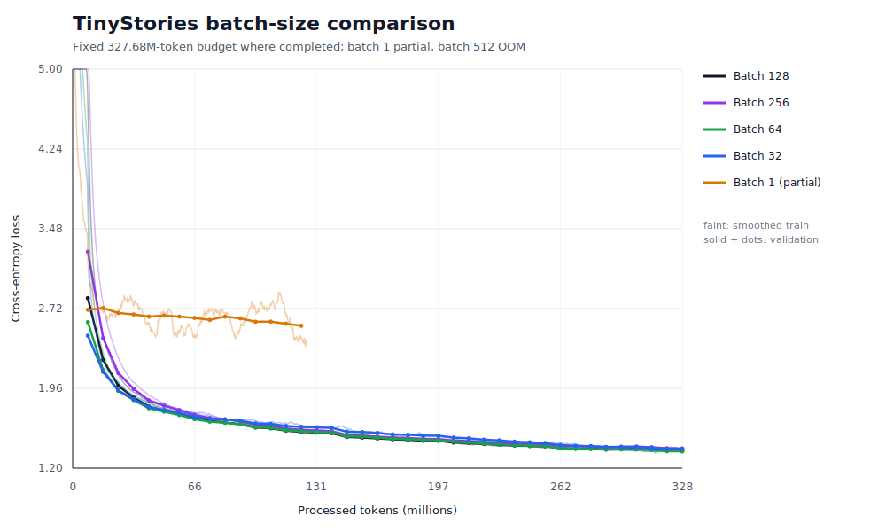
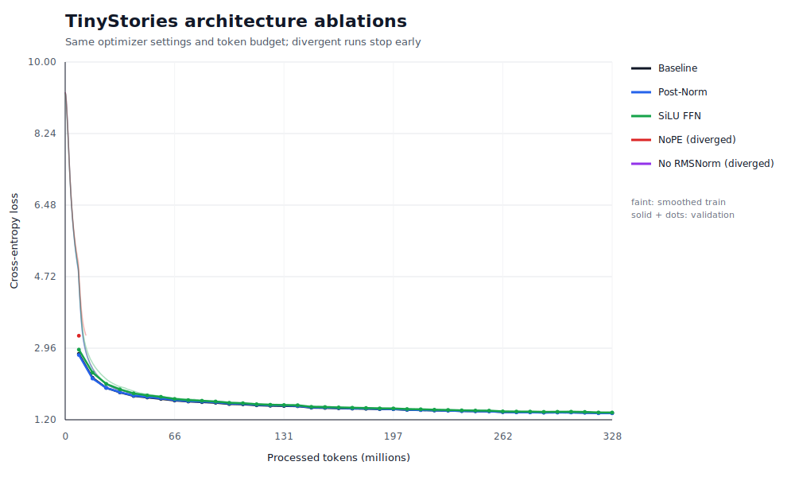
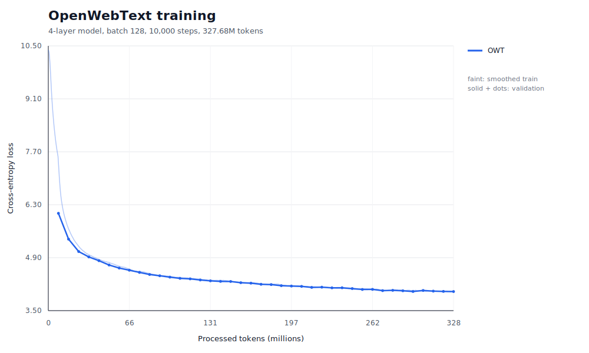

# A1 公开提交：陈嘉骏

> 本报告只包含公开数据上的实验、脱敏后的运行信息和允许公开的代码说明，不包含数据集、
> checkpoint、内部服务器信息或访问凭据。评分标准见
> [`assignments/A1/EVALUATION.md`](../../../../assignments/A1/EVALUATION.md)。

## 基本信息

- 作业题面版本：26.0.4
- 上游 starter commit：`a158843b20107949f1a8d7df1b05cd33b9166712`
- 完成范围：byte-level BPE 训练与流式 Tokenizer、decoder-only Transformer、AdamW 和完整训练
  工具；TinyStories/OWT tokenizer、数据编码、TinyStories 主训练、learning-rate sweep、
  batch-size sweep、四项架构消融、OWT 训练及文本生成。
- 官方测试：`47 passed, 1 xpassed`，无失败；`xpassed` 是普通 `encode` 的预期内存失败测试在
  当前实现中意外通过，严格低内存接口 `encode_iterable` 正常通过。
- 未完成项：batch size 1 的固定 327.68M-token run 只完成 126.16M tokens，全部跑完太耗时。
- 本地工作仓库：`../assignment1-basics`，与 `SummerQuest-2026` 保持同级。

## 书面题

### Unicode 1

1. `chr(0)` 返回 Unicode 码点 U+0000，即 NUL 字符。
2. `repr(chr(0))` 返回可见的转义形式 `\x00`；直接 `print` 时 NUL 没有可见字形，所以看起来
   像没有输出。
3. NUL 可以存在于 Python 字符串中，也会计入长度；它不等同于空字符串或空格。打印时没有
   可见效果，但传入把 NUL 当字符串终止符的 C 接口时需要额外注意。

### Unicode 2

1. UTF-8 是变长、ASCII 兼容的 Unicode 编码。英文字符通常只需一个 byte，同时任意 Unicode
   文本都能由 256 种 byte value 表示，因此适合作为 byte-level tokenizer 的基础。
2. 错误实现把每个 byte 单独做 UTF-8 decode，但一个字符可能跨 2 到 4 个 bytes。例如
   `"牛".encode("utf-8") == b"\xe7\x89\x9b"`，三个 byte 必须拼接后整体解码。
3. `b"\xc8\x01"` 不是合法 UTF-8：`0xc8` 表示一个双字节字符的起始 byte，但后一个 byte
   不是 `10xxxxxx` 形式的 continuation byte，因此整体解码失败。

### 参数量

记 batch size 为 $B$，vocab size 为 $V$，context length 为 $T$，层数为 $L$，hidden size 为
$d$，head 数为 $h$，并按题目假设 $d_{ff}=\frac{8}{3}d$。模型不共享 token embedding 和 LM
head，不使用 Linear bias。

参数量由两套 embedding、attention、SwiGLU 和 RMSNorm 组成：

$$
\begin{aligned}
P
&=2Vd+4Ld^2+3Ldd_{ff}+(2L+1)d \\
&=\boxed{2Vd+12Ld^2+(2L+1)d}.
\end{aligned}
$$

`num_heads` 不改变参数量，因为拆分多个 head 只是 reshape，Q、K、V 和 output projection 的总
权重仍为 $4Ld^2$。

### AdamW 峰值显存

所有参数、梯度、AdamW 状态和题目指定激活都按 FP32（4 bytes）计算：

| 部分 | 显存 |
|---|---:|
| 参数 | $4P$ bytes |
| 梯度 | $4P$ bytes |
| AdamW 一阶和二阶状态 | $8P$ bytes |

固定显存为 $16P$ bytes。按照题目要求列出的 RMSNorm、attention、SwiGLU、final RMSNorm、LM
head 和 cross-entropy 激活，每个 batch element 的激活元素数为：

$$
\begin{aligned}
A
&=L(8Td+4Td_{ff}+2hT^2)+Td+2TV \\
&=L\left(\frac{56}{3}Td+2hT^2\right)+Td+2TV.
\end{aligned}
$$

因此：

$$
\boxed{
M_{total}=16\left[2Vd+12Ld^2+(2L+1)d\right]
+4B\left[L\left(\frac{56}{3}Td+2hT^2\right)+Td+2TV\right]
}
$$

单位为 bytes。具体 GPT-2 shape 按题目实现将 $8d/3$ 取到最近的 64 倍数；GPT-2 XL
（$V=50{,}257,T=1024,L=48,d=1600,h=25$）因此使用 $d_{ff}=4288$：

```text
参数量：                 1,640,452,800
参数显存：                   6.562 GB
梯度显存：                   6.562 GB
AdamW optimizer state：     13.124 GB
固定显存合计：              26.247 GB
每个 batch element 激活：   16.373 GB
```

所以 $M\approx26.247+16.373B$ GB，在题设 80 GB 简化预算下 $B_{max}=3$。该估计不包含
CUDA allocator、kernel workspace、临时 tensor 和内存碎片，实际可运行 batch size 可能更小。

### Forward FLOPs 与训练时间

矩阵乘法 $(m,n)@(n,p)$ 计 $2mnp$ FLOPs，只统计主要矩阵乘法，则一般形式为：

$$
\boxed{F_{forward}=B\left[L(8Td^2+6Tdd_{ff}+4T^2d)+2TVd\right]}.
$$

其中 $8LTd^2$ 来自 QKV 和 attention output projection，$6LTdd_{ff}$ 来自 SwiGLU，
$4LT^2d$ 来自 $QK^T$ 与 attention probability 乘 $V$，$2TVd$ 来自 LM head。当不做 64
倍数取整、直接取 $d_{ff}=8d/3$ 时，前两项合并为 $24LTd^2$。

在 $B=1,T=1024$ 时：

| Shape | Parameters | FP32 参数显存 | Forward FLOPs |
|---|---:|---:|---:|
| GPT-2 small | 162,148,608 | 0.649 GB | 0.292 TFLOPs |
| GPT-2 medium | 406,539,264 | 1.626 GB | 0.830 TFLOPs |
| GPT-2 large | 833,591,040 | 3.334 GB | 1.769 TFLOPs |
| GPT-2 XL | 1,640,452,800 | 6.562 GB | 3.517 TFLOPs |

AdamW 每个参数约 14 FLOPs，因此 GPT-2 XL 的一次 optimizer update 约为 22.966 GFLOPs。若
backward 是 forward 的 2 倍，则训练一步约为 $3F_{forward}+14P$。GPT-2 XL 在 batch size
1024、400,000 steps 下总计约 $4.321\times10^{21}$ FLOPs。单张 H100 以 495 TFLOP/s 峰值、
50% MFU 运行，有效算力为 247.5 TFLOP/s，理论训练时间约 4,850 小时，即 202 天。

## 实现说明

### BPE 与 Tokenizer

- 以 256 个单 byte token 和 special tokens 初始化词表，使用 GPT-2 regex 预分词；pair 只在
  pre-token 内统计，禁止跨 pre-token 或 `<|endoftext|>` merge。
- BPE 训练用 pair count、pair 到受影响 pre-token 的倒排索引和局部增量更新，频率并列时按题目
  规定选择字典序更大的 pair；大语料预分词支持 multiprocessing。
- 编码先分离 special tokens，再做相同正则预分词和 UTF-8 bytes 转换，严格按训练得到的 merge
  rank 合并，绝不根据当前输入重新统计频率。
- 解码先查询每个 ID 对应的 bytes，拼接完整 byte stream 后统一 UTF-8 decode；非法 UTF-8 使用
  U+FFFD 替换。`encode_iterable` 保留跨 chunk 的未决文本，避免任意 chunk boundary 改变结果。

### Transformer

- 从零实现 Linear、Embedding、RMSNorm、SiLU、SwiGLU、RoPE、causal scaled dot-product
  attention、multi-head attention、Transformer block 和完整 LM。
- Linear 权重使用 `(..., d_in) @ (d_out, d_in)^T`；attention 内部明确区分 batch、head、sequence
  和 head dimension，causal mask 的 `True` 表示允许注意。
- RoPE 只应用于 Q/K，不应用于 V；RMSNorm 在平方和归一化前转为 float32；模型 forward 返回
  logits，不在模型内部提前 softmax。

### 训练与生成

- 从零实现稳定 softmax/cross-entropy、AdamW、linear warmup + cosine decay 和全局 gradient
  norm clipping；AdamW checkpoint 保存并恢复 optimizer state。
- mmap 数据集随机抽取长度为 `context_length + 1` 的片段，input 与 target 右移一位。
- 训练脚本支持 validation、JSONL 日志、checkpoint、resume 和配置文件；生成支持 temperature、
  nucleus top-p、EOS 停止和最大生成长度。
- 核心实现未使用 `nn.Linear`、`nn.Embedding`、`nn.RMSNorm`、`torch.nn.functional` 中的现成
  核心算子或 `torch.optim.AdamW`。

## Tokenizer 实验

两个 tokenizer 都加入 `<|endoftext|>`，compression ratio 定义为原始 UTF-8 bytes / encoded
tokens。训练/验证数据编码为 NumPy raw `uint16`，训练时通过 mmap 读取。

| 数据集 | Vocab | Merges | Train tokens | Validation tokens | 训练时间 |
|---|---:|---:|---:|---:|---:|
| TinyStories | 10,000 | 9,743 | 541,229,347 | 5,465,883 | 172.47 s |
| OpenWebText | 32,000 | 31,743 | 2,727,120,452 | 66,401,098 | 15,890.63 s |

TinyStories 使用 8 个 CPU workers 在完整训练集上复测，外层 wall-clock 为 172.97 秒；复测
artifact、vocab 和 merges 与原产物逐字节一致。OWT 完整训练约 4 小时 24 分 51 秒。两者均低于
题目分别给出的 30 分钟和 12 小时 CPU 预算。

### Compression ratio 与吞吐

以下吞吐在完整 validation 文件上使用单进程流式 `encode_iterable` 测量：

| Tokenizer / validation data | Bytes | Tokens | Bytes/token | Bytes/s | Tokens/s |
|---|---:|---:|---:|---:|---:|
| TinyStories 10K / TinyStories | 22,502,601 | 5,465,883 | 4.1169 | 1,457,052 | 353,918 |
| OWT 32K / OWT | 289,998,753 | 66,401,098 | 4.3674 | 658,855 | 150,858 |

OWT 32K 的 compression ratio 比 TinyStories 10K 高约 6.1%，更大词表能够吸收网页语料中的长词
和格式片段。但 OWT 的编码吞吐更低，因为文本分布更复杂、merge 表更大，单个 pre-token 的 BPE
工作量也更高。按当前单进程速度线性外推 825 GB 文本，TinyStories 吞吐对应约 6.55 天，OWT
吞吐对应约 14.5 天；该估算没有计入并行编码和存储带宽差异。

### 最长 token

TinyStories 最长普通 token 为 15 bytes，例如：

```text
" responsibility"
" disappointment"
" accomplishment"
```

OWT 最长 token 为 64 bytes，包括 64 个连续连字符和重复 mojibake `ÃÂ` 的 byte 序列，说明
未清洗网页语料会把分隔线与编码噪声学习进词表。忽略格式噪声后，较长的语义 token 包括
`" telecommunications"`（19 bytes）、`" disproportionately"`（19 bytes）和
`" environmentalists"`（18 bytes）。结构化记录见 [`logs/tokenizer/`](logs/tokenizer/)。

## TinyStories 主训练

baseline 主体模型和训练配置如下：

| 配置 | 值 |
|---|---:|
| vocab size | 10,000 |
| context length | 256 |
| `d_model` / `d_ff` | 512 / 1,344 |
| layers / heads | 4 / 16 |
| batch size / steps | 128 / 10,000 |
| processed tokens | 327,680,000 |
| warmup / schedule | 500 steps / cosine |
| AdamW betas / weight decay | `(0.9, 0.95)` / `0.1` |
| gradient clipping | global norm 1.0 |

原始 max LR `3e-4` baseline 的 validation loss 为 1.5149。调参后 max LR `1.2e-3` 的最终
validation loss 为 **1.3759**，达到题面不高于 1.45 的目标；最终 train loss 为 1.3622，训练
时间为 4,301.15 秒。

## Learning-rate sweep

各完整 run 保持模型、batch size、10,000 steps、327.68M-token budget 和 seed 336 不变。

| Max LR | 状态 | Final/last validation loss | 时间 |
|---:|---|---:|---:|
| `3e-4` | 完成，初始 baseline | 1.5149 | 4,584.10 s |
| `6e-4` | 完成 | 1.4226 | 4,248.81 s |
| `1.2e-3` | 完成，当前最优 | **1.3759** | 4,301.15 s |
| `4.8e-3` | step 526 发散 | last val 2.1191 | 223.54 s |



`3e-4` 在固定预算下欠优化；提高到 `6e-4` 和 `1.2e-3` 后 validation loss 持续改善。`4.8e-3`
在 500-step warmup 刚达到峰值后出现 NaN，因此当前稳定上界位于 `1.2e-3` 与 `4.8e-3` 之间。
逐点日志见 [`logs/lr_sweep/`](logs/lr_sweep/)。

## Batch-size sweep

成功的完整 run 固定总训练量为 327.68M tokens，而不是固定 steps。batch 32、64、128、256
分别训练 40,000、20,000、10,000、5,000 steps；warmup、日志和验证间隔也按 batch size 等比例
调整。早期 batch 256 OOM 发生在共享 GPU 有其他进程占用时，因此随后在独占 47.5 GiB GPU 上从
256 开始按 2 倍递增复测，并在首次 OOM 后停止。

| Batch size | 状态 | Steps | Processed tokens | Last/final val loss | 时间 |
|---:|---|---:|---:|---:|---:|
| 128 | 完成 | 10,000 | 327.68M | 1.3759 | 4,301.15 s |
| 64 | 完成 | 20,000 | 327.68M | **1.3724** | 4,210.57 s |
| 32 | 完成 | 40,000 | 327.68M | 1.3925 | 4,349.45 s |
| 256 | 完成 | 5,000 | 327.68M | 1.3972 | **3,429.57 s** |
| 1 | 部分完成 | 492,800 / 1,280,000 | 126.16M | 2.5563 | 12,290.20 s |
| 512 | OOM | 0 / 2,500 | 0 | N/A | 5.10 s |



batch 64 在本次单 seed 中比 128 低约 0.0036，但差值很小，不能据此声称稳定的泛化优势；batch
32 和 256 略差但都达到 1.45 目标。batch 256 的平均训练吞吐约为 95.5K tokens/s，比 batch 128
高约 25.4%，总时间最短，但 validation loss 比 batch 128 高约 0.0213，体现了吞吐与优化质量的
取舍。batch 1 尚未消耗相同 token budget，不能与完整 run 作最终比较，且 GPU 利用率很低。
独占复测中 batch 512 OOM 时当前训练进程占用 46.14 GiB，错误记录中没有其他共享进程，因此按
2 倍递增得到的最大成功 batch 为 256，首个失败点为 512。早期实验见
[`logs/batch_size/`](logs/batch_size/)，独占倍增复测见
[`logs/batch_size_power2_clean/`](logs/batch_size_power2_clean/)。

## 架构消融

消融使用 max LR `1.2e-3`、batch 128、相同 seed 和 327.68M-token 计划预算，只改变目标组件。
SiLU FFN 使用 `d_ff=2048` 近似匹配 baseline SwiGLU 的参数量。

| 结构 | 状态 | Final/last validation loss | 时间 | 相对 baseline |
|---|---|---:|---:|---:|
| Pre-Norm + RMSNorm + RoPE + SwiGLU | 完成 | 1.3759 | 4,301.15 s | 0 |
| Post-Norm | 完成 | **1.3715** | 3,735.54 s | -0.0044 |
| 参数量近似匹配的 SiLU FFN | 完成 | 1.3901 | 3,557.97 s | +0.0141 |
| NoPE | step 383 发散 | last val 3.2666 | 135.87 s | N/A |
| 删除 RMSNorm | step 2 发散 | N/A | 21.33 s | N/A |



删除 RMSNorm 后首步 loss 为 16.837，step 2 即出现 NaN，说明当前初始化和学习率下归一化对稳定
训练很重要。NoPE 在 warmup 中后段发散，去掉位置信息同时影响建模能力和稳定区间。Post-Norm
在这个单 seed run 中略优于 baseline，但差值不足以支持普遍结论。参数量近似匹配的 SiLU 能稳定
训练，但 validation loss 比 SwiGLU 高约 0.014。日志见 [`logs/ablation/`](logs/ablation/)。

## OpenWebText 训练

OWT 使用同样的 4 层、`d_model=512`、16 heads、context 256、batch 128 和 10,000 iterations，
只把 tokenizer/vocab 改为 OWT 32K。最大 LR 为 `1.2e-3`，共处理 327,680,000 tokens。

| 指标 | 结果 |
|---|---:|
| Final train loss | 3.9821 |
| Final validation loss | 4.0162 |
| 总训练时间 | 6,469.43 s（约 1 小时 47 分 49 秒） |
| OWT train token 数 | 2,727,120,452 |
| 本次训练覆盖量 | 约完整语料的 12.0% |



OWT 的主题、文体和长尾词汇远比 TinyStories 复杂，在相同的小模型和 token budget 下仍明显欠拟合。
TinyStories 与 OWT 使用不同 tokenizer、vocab size 和数据分布，per-token loss 的标尺不同，不能
用 `4.0162 > 1.3759` 直接比较模型质量。逐点记录见 [`logs/owt/`](logs/owt/)。

## 文本生成

生成统一使用 seed 336，最多生成 256 个新 token。TinyStories 样本来自 max LR `6e-4`、
validation loss 1.4226 的 checkpoint；OWT 样本来自上述 10,000-step checkpoint。

| 模型 | Temperature | Top-p | 生成 tokens | 停止原因 | 观察 |
|---|---:|---:|---:|---|---|
| TinyStories | 0.8 | 0.95 | 124 | EOS | 故事完整，但 family/bag 有重复 |
| TinyStories | 0.5 | 0.95 | 157 | EOS | 更确定、更规整，存在 ball/car 指代错误 |
| TinyStories | 0.8 | 0.8 | 211 | EOS | 能收尾，但措辞更窄且重复更多 |
| OWT | 0.8 | 0.95 | 256 | 长度上限 | 主题相关，语义漂移并重复 world/technology |
| OWT | 0.5 | 0.95 | 256 | 长度上限 | 确定性提高，但出现严重短语循环 |
| OWT | 0.8 | 0.8 | 125 | EOS | 更像短新闻并正常结束，但实体和事实不可靠 |

TinyStories baseline 样本：

> Once upon a time, there was a little girl named Lily who was very excited. She wanted to go on a
> trip with her family. They wanted to pack their bags and bags. ... When it was time to go home,
> they packed their things and left the trip. Lily was so happy she packed her bag and said goodbye
> to her family. `<|endoftext|>`

该样本保持了童话语气、人物和旅行主题，并正确生成 EOS，但有 “family”“bags” 的重复和轻微
逻辑冗余。

OWT low-top-p 样本：

> The rapid development of artificial intelligence has led to the introduction of new technology
> to all technologies and systems in the United States. ... The company's research is available in
> the US and Europe. `<|endoftext|>`

该样本具有网页文章的局部句法和段落风格，也能正常终止，但虚构了机构、时间和项目关系，不能
视为事实文本。降低 temperature 会让概率分布更集中，但模型过度偏好少数短语时会加剧重复；降低
top-p 能改善局部结构和 EOS 概率，同时降低词汇多样性。TinyStories 数据域窄且结构规律，因此
同一小模型生成的连贯性明显优于只训练约 0.12 corpus pass 的开放域 OWT 模型。完整六组文本见
[`logs/generation/`](logs/generation/)。

## 复现说明

### 环境与测试

除 GPU wheel 外，环境由上游 `uv.lock` 固定。当前实验机器的 NVIDIA driver 为 550.163.01，使用
CUDA 12.4 wheel；普通 `uv run` 会按当前 lock 切换到 CUDA 13，因此安装后使用 `--no-sync`：

```bash
uv sync --frozen
uv pip install --python .venv/bin/python \
  --index-url https://download.pytorch.org/whl/cu124 \
  'torch==2.6.0'
uv run --no-sync pytest -q
```

当前代码的完整结果为：

```text
47 passed, 1 xpassed in 16.06s
```

### 数据准备

按 Stanford 上游 README 下载公开 TinyStories 和 OpenWebText train/validation 文本到 `data/`。
数据、编码后的大文件和模型 checkpoint 不进入公开提交。Tokenizer 训练与 mmap 编码示例：

```bash
uv run --no-sync python scripts/tokenizer.py train \
  --input data/TinyStoriesV2-GPT4-train.txt \
  --output artifacts/tinystories_10k.json \
  --vocab-size 10000 \
  --special-token '<|endoftext|>' \
  --num-processes 8

uv run --no-sync python scripts/tokenizer.py encode \
  --tokenizer artifacts/tinystories_10k.json \
  --input data/TinyStoriesV2-GPT4-train.txt \
  --output tokenized/tinystories_train.bin \
  --dtype uint16
```

OWT 使用相同命令，将 vocab size 改为 32,000，并替换输入、输出文件名。

### 训练与生成命令

```bash
# 原始 baseline 和 6e-4 run
uv run --no-sync python scripts/train_lm.py --config configs/tinystories_baseline.json
uv run --no-sync python scripts/train_lm.py --config configs/tinystories_lr6e4.json

# 从 1.2e-3 增大到首个发散 LR
uv run --no-sync python scripts/lr_sweep_until_divergence.py \
  --config configs/tinystories_lr6e4.json \
  --start-lr 1.2e-3 --multiplier 4 --max-trials 2

# 固定 token budget 的 batch-size sweep 与独占 GPU 倍增上限实验
uv run --no-sync python scripts/run_batch_size_experiments.py
uv run --no-sync python scripts/run_batch_size_experiments.py \
  --batch-sizes 256 512 1024 2048 \
  --total-tokens 327680000 \
  --max-learning-rate 1.2e-3 \
  --min-learning-rate 1.2e-4 \
  --logs-dir logs/batch_size_power2_clean \
  --runs-dir runs/batch_size_power2_clean \
  --configs-dir configs/batch_size_power2_clean \
  --stop-on-oom --force

# 四项消融
uv run --no-sync python scripts/run_ablation_experiments.py

# OWT 和最终生成
uv run --no-sync python scripts/run_owt_training.py --config configs/owt_baseline.json
uv run --no-sync python scripts/run_generation_experiments.py --device cuda:0

# 从公开 JSONL 重建曲线
uv run --no-sync python scripts/plot_training_curves.py --output-dir plots
```

配置文件位于 `submission/configs/`，核心实现位于 `submission/cs336_basics/`，训练、编码、实验和
生成入口位于 `submission/scripts/`，adapter 位于 `submission/tests/adapters.py`。工作仓库修改后
使用以下命令同步：

```bash
python3 scripts/sync_a1_submission.py --name '陈嘉骏'
```

## 实验日志

- `logs/train_tinystories.jsonl` 与 `logs/summary.json`：原始 TinyStories baseline。
- `logs/lr_sweep/`：三组调高 LR 的逐点 JSONL、run summary 和总汇总。
- `logs/batch_size/`：batch 1/32/64 的原始逐点日志和早期共享-GPU 256 OOM 记录。
- `logs/batch_size_power2_clean/`：独占 GPU 上 batch 256 的完整 JSONL、batch 512 OOM 和倍增汇总。
- `logs/ablation/`：No RMSNorm、Post-Norm、NoPE、SiLU 的日志和 summary。
- `logs/owt/`：OWT 逐点训练日志与最终汇总。
- `logs/tokenizer/`：Tokenizer benchmark、训练计时与对比汇总。
- `logs/generation/`：六组生成文本和结构化采样记录。

训练 JSONL 逐点包含 `step`、`wall_clock_sec`、`train_loss`、`lr`、`processed_tokens`，并定期记录
`val_loss`；summary 记录最终 validation loss、总时间和关键模型/训练配置。公开日志不包含数据、
checkpoint、内部主机名或绝对路径。

## 飞书补充文档

- 链接：未提供。

本次公开 README、实现、脱敏日志、曲线和生成样本已覆盖报告与核验所需内容。
