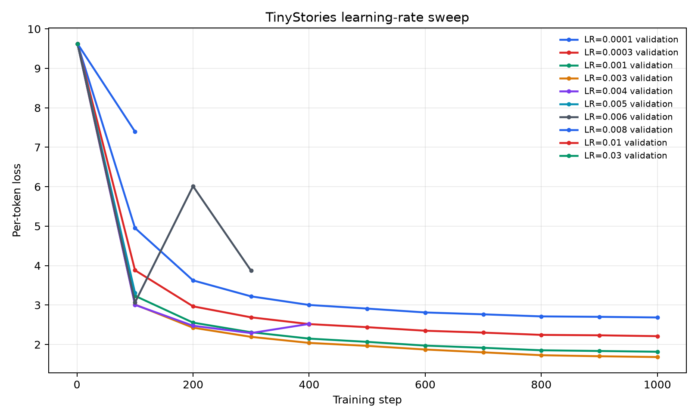
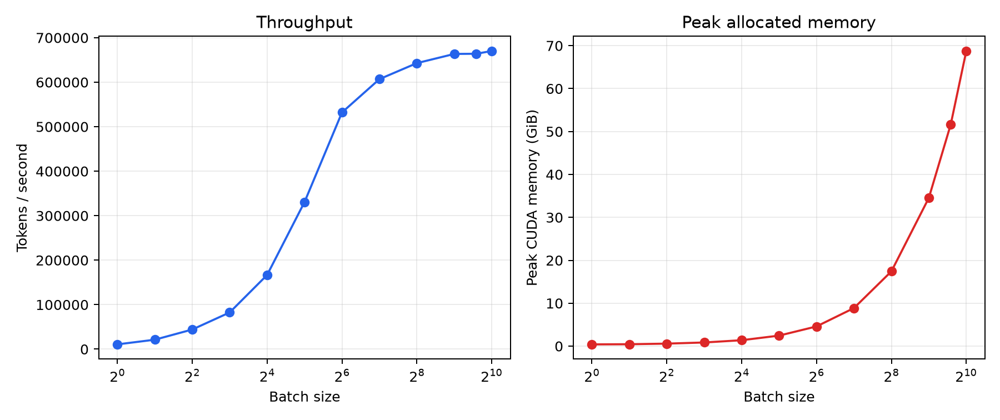
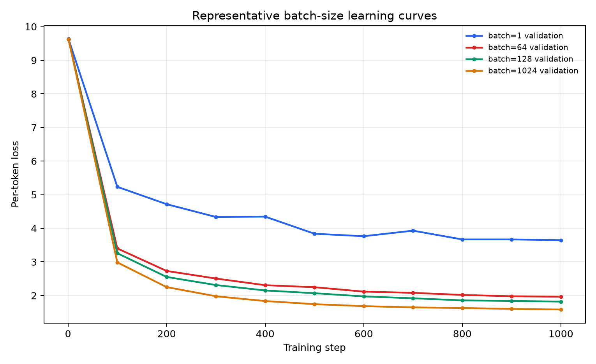
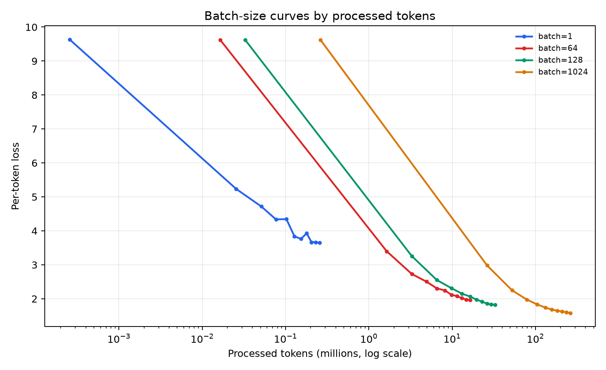
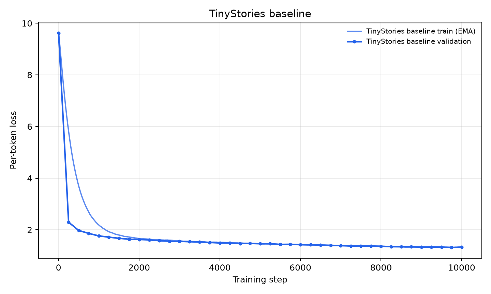
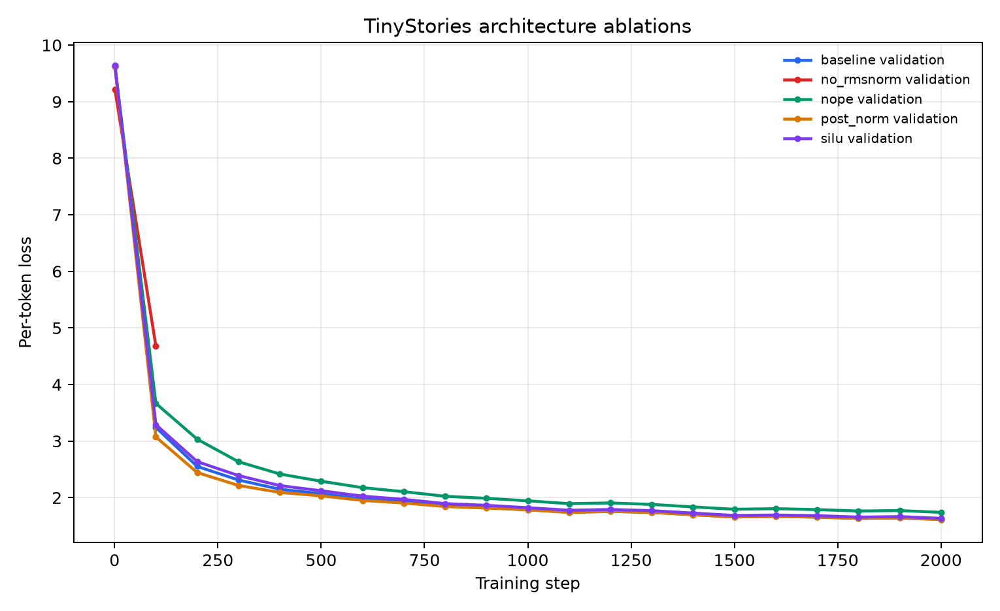
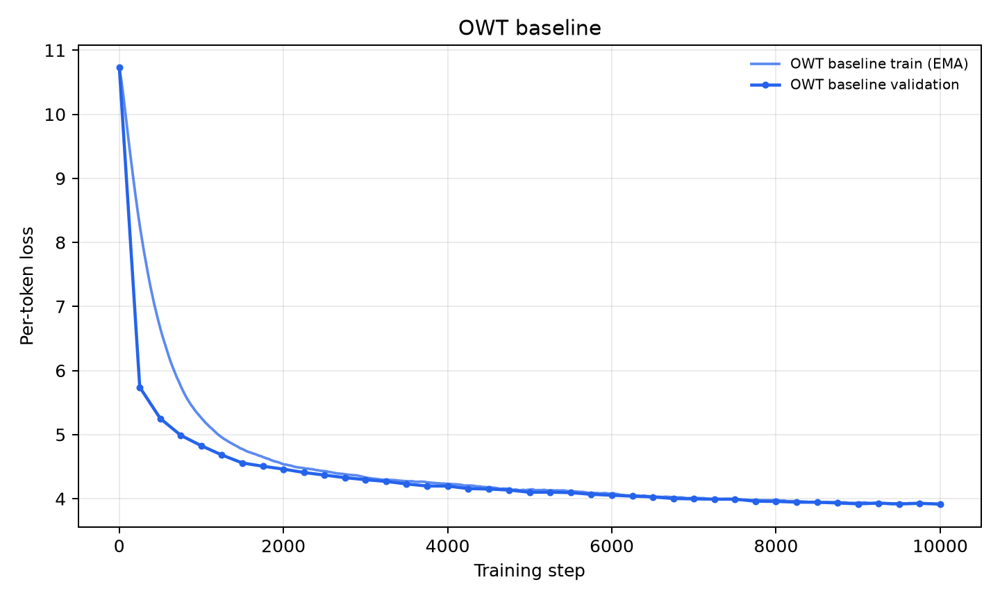

# A1 公开提交：陈耀东

> 本文件和同目录代码公开可见。报告只包含公开语料、脱敏配置和聚合实验结果，不包含内部主机、
> 账号、IP、绝对目录、凭据、数据样例、checkpoint 或原始调度日志。

## 基本信息

- 作业题面版本：26.0.4
- 上游 starter commit：`a158843b20107949f1a8d7df1b05cd33b9166712`
- 完成范围：21 个 adapter 对应真实实现、两套 BPE/tokenizer、Transformer LM、AdamW 训练与生成、
  TinyStories/OWT 正式训练、学习率与 batch 实验、四项消融、书面题和公开实验日志

## 实现与测试

真实逻辑位于 `submission/cs336_basics/`，`submission/tests/adapters.py` 只转发公共测试接口。
实现覆盖：

- byte-level BPE：并行预分词、lazy max-heap、增量 pair 更新、确定性并列处理；
- tokenizer：special token 安全编码、流式 `encode_iterable`、UTF-8 bytes 整体解码；
- 模型：Linear、Embedding、RMSNorm、SwiGLU、RoPE、causal attention、Transformer block/LM；
- 训练：cross-entropy、AdamW、cosine schedule、梯度裁剪、memmap batch、checkpoint；
- 实验：结构化 JSONL 日志、非有限 loss/gradient 检测、bf16、TF32 和 `torch.compile`；
- 生成：temperature、top-p、seed 和 EOS 停止。

测试结果：

- Linux：`47 passed, 1 xfailed`；
- Windows：`46 passed, 2 skipped`，跳过项为平台不提供的 Unix `resource` 行为；
- Ruff：通过。

## Unicode

**unicode1。**

`chr(0)` 返回 U+0000 NUL。其 `repr` 是 `'\x00'`，直接打印时没有可见字形；它仍真实存在于
Python 字符串并占一个字符位置，但部分依赖 C 风格字符串的外部系统可能把它当成结束标记。

UTF-8 对 ASCII 文本紧凑、无字节序问题且是互联网事实标准。把任意文本编码为 UTF-8 bytes 后，
只需固定 256 个 byte 值即可表示，因此 byte-level tokenizer 不会出现词表外字符。

**unicode2。**

错误的逐 byte UTF-8 解码会破坏多字节字符。例如：

```python
"牛".encode("utf-8") == b"\xe7\x89\x9b"
```

三个 byte 单独都不是完整字符，必须整体解码。`b"\x80\x80"` 也是非法 UTF-8，因为两个 byte
都是 continuation byte，却没有合法起始 byte。

## Tokenizer 实验

| 数据集 | 词表 | BPE 时间 | 完整训练集 bytes/token | 并行编码吞吐 | 最长普通 token |
|---|---:|---:|---:|---:|---|
| TinyStories | 10,000 | 111.22 s | 4.116 | 26.4 MB/s | ` accomplishment`，15 bytes |
| OWT | 32,000 | 2934.05 s | 4.371 | 36.7 MB/s | 64-byte 编码噪声 token |

多进程任务的调度层峰值内存约为 4.2GB 和 48.6GB。进程自身的 `getrusage` 统计较低，因为它不
汇总所有 worker；报告采用调度层聚合值。

使用固定 seed 从两个验证集各等概率抽取 10 篇文档：

| 文档 / tokenizer | bytes/token |
|---|---:|
| TinyStories / TinyStories 10K | 4.026 |
| OWT / OWT 32K | 3.984 |
| OWT / TinyStories 10K | 3.334 |

OWT 改用 TinyStories tokenizer 后压缩率约下降 16.3%，说明面向儿童故事学习到的 merge 对网页
术语、专名和复杂标点覆盖较差。按完整语料实测吞吐估算，编码 825GB 文本约需 6.25 到 8.67
小时。两套词表均小于 65536，因此 token ID 使用 `uint16` 足够，并比 `int32` 节省一半空间。

## Transformer 资源核算

记词表大小为 $V$，上下文长度为 $T$，层数为 $L$，模型宽度为 $d$，前馈宽度为 $f$。本实现
不共享输入 embedding 与输出 projection，参数量为：

$$
N=2Vd+L\left(4d^2+3df+2d\right)+d.
$$

对 GPT-2 XL 形状
$(V,T,L,d,h,f)=(50257,1024,48,1600,25,4288)$：

$$
N=1,640,452,800,
$$

float32 参数占约 6.562GB（6.111GiB）。单序列前向矩阵乘法 FLOPs 为：

$$
F_{\mathrm{fwd}}=L\left(8Td^2+4T^2d+6Tdf\right)+2TdV,
$$

得到约 3.517TFLOPs。1024 上下文时 FFN 占 57.53%，是主要计算来源；把上下文增加到 16384
后总 FLOPs 约增至 37.98 倍，两个 $T^2$ attention 矩阵乘法合计占约 61.73%。

| 模型 | 总前向 FLOPs | QKV | 两个 attention $T^2$ 项 | FFN | LM head |
|---|---:|---:|---:|---:|---:|
| GPT-2 Small | 0.292 TF | 14.91% | 13.25% | 39.76% | 27.10% |
| GPT-2 Medium | 0.830 TF | 18.62% | 12.42% | 50.05% | 12.70% |
| GPT-2 Large | 1.769 TF | 20.49% | 10.93% | 54.30% | 7.45% |
| GPT-2 XL | 3.517 TF | 21.47% | 9.16% | 57.53% | 4.68% |

模型增大时，内部 FFN/projection 的占比上升，只执行一次的 LM head 占比下降。

## AdamW 资源核算

取 $f=\frac83d$，参数量化简为：

$$
N=2Vd+L\left(12d^2+2d\right)+d.
$$

float32 下，参数、梯度和两个 optimizer moments 分别占 $4N,4N,8N$ bytes。按题目列出的中间
结果逐项保留，activation 元素数为：

$$
A=B\left[L\left(8Td+4Tf+2hT^2\right)+Td+2TV\right].
$$

因此简化峰值显存上界为：

$$
M_{\mathrm{total}}=16N+4A.
$$

代入 GPT-2 XL：

$$
M_{\mathrm{total}}\approx16.3566B+26.1686\ \mathrm{GB},
$$

80GB 下最大 batch 为 3。一次 AdamW 更新约需 $14N$ FLOPs。GPT-2 XL 单 H100、batch 1024、
400K steps、50% MFU 时，前向加反向理论训练时间约 4850.1 小时（约 202.1 天），AdamW 更新
FLOPs 相比大 batch 模型计算可忽略。

## GPU 运行方式

在相同 batch 128、100-step 配置下：

| 运行方式 | 最终 val loss | 稳态 tokens/s | 峰值显存 |
|---|---:|---:|---:|
| FP32 | 3.9144 | 89,713 | 12.78GB |
| TF32 | 3.9144 | 138,952 | 12.78GB |
| TF32 + compile | 3.9144 | 436,103 | 10.70GB |
| bf16 | 3.9151 | 297,298 | 12.35GB |
| bf16 + compile | 4.8019（50-step） | 610,337 | 9.52GB |

TF32 与 FP32 的短程 loss 基本一致；compile 的冷启动约几十秒，但长训练稳态吞吐显著更高。
正式实验采用 bf16 + compile。

## 学习率实验

固定 TinyStories、batch 128，每组 1000 steps：

| max LR | 最终 validation loss / 状态 |
|---:|---|
| 0.0001 | 2.6852 |
| 0.0003 | 2.2112 |
| 0.001 | 1.8161 |
| 0.003 | **1.6816** |
| 0.004 | 第 432 步发散 |
| 0.005 | 第 128 步发散 |
| 0.006 | 第 327 步发散 |
| 0.008 | 第 105 步发散 |
| 0.01 | 第 88 步发散 |
| 0.03 | 第 43 步发散 |

最佳稳定值为 0.003，且从 0.004 起出现非有限梯度，符合“最佳学习率位于稳定边缘附近”的经验。



## Batch Size

速度/显存扫描覆盖 `1/2/4/8/16/32/64/128/256/512/768/1024`。吞吐从 batch 1 的
10,737 tokens/s 增至 batch 128 的 606,908 tokens/s；继续增至 1024 仅到 670,127 tokens/s，
但峰值显存从 8.87GiB 增至 68.76GiB，因此效率拐点选择 128。



代表性 batch 使用相同学习率和 1000 steps：

| batch | processed tokens | 最终 val loss | 墙钟 | tokens/s | 峰值显存 |
|---:|---:|---:|---:|---:|---:|
| 1 | 0.256M | 3.6462 | 33.1 s | 9,020 | 0.39GiB |
| 64 | 16.384M | 1.9633 | 55.7 s | 352,809 | 4.59GiB |
| 128 | 32.768M | 1.8186 | 59.2 s | 605,643 | 8.87GiB |
| 1024 | 262.144M | 1.5825 | 410.7 s | 668,062 | 68.76GiB |

固定 step 时，大 batch 看过的 token 数更多，因此其最终 loss 更低不能直接解释为优化器在同数据预算
下更好。batch 128 已接近吞吐平台且保留大量显存余量，是正式训练的效率/风险平衡点。





## TinyStories 正式训练

配置为 4 层、16 头、$d=512$、$f=1344$、context 256、batch 128、10,000 steps，总计
327,680,000 tokens。

| 指标 | 结果 |
|---|---:|
| 参数量 | 22,696,448 |
| 最终 validation loss | **1.3302** |
| 目标 | $\le1.45$ |
| 墙钟时间 | 560.2 s |
| 平均吞吐 | 606,479 tokens/s |
| 峰值显存 | 9.52GB |



## 架构消融

为公平比较，使用统一的 2000-step、batch 128、max LR 0.001 配置：

| 模型 | 参数量 | 最终 validation loss / 状态 |
|---|---:|---|
| Pre-Norm + RoPE + SwiGLU | 22,696,448 | **1.6128** |
| Post-Norm | 22,696,448 | 1.6153 |
| NoPE | 22,696,448 | 1.7399 |
| SiLU，$f=2048$ | 22,827,520 | 1.6339 |
| 删除 RMSNorm | 22,691,840 | 第 162 步发散 |

Post-Norm 与 Pre-Norm 在短预算下接近但略差；NoPE 明显变差，说明 RoPE 位置信息有效；近似参数
匹配的 SiLU 参数更多但 loss 更高，支持 SwiGLU 门控机制；无 RMSNorm 在稳定 baseline 学习率下
仍发散，说明归一化对训练稳定性关键。



## OpenWebText 正式训练

OWT 使用相同模型架构和相同 10,000 iterations，词表改为 32K；短测后按题面允许把学习率调整
为 0.001。

| 指标 | 结果 |
|---|---:|
| 参数量 | 45,224,448 |
| 最终 validation loss | **3.9155** |
| 墙钟时间 | 1047.7 s |
| 平均吞吐 | 323,971 tokens/s |
| 峰值显存 | 19.90GB |

OWT 的 loss 不应与 TinyStories 直接按数值解释为同一难度：OWT 词表更大、主题更多、长尾表达和
网页噪声更强，同样模型与 token 预算只能学习到较弱的开放域分布。



## 文本生成

TinyStories 示例表现出完整的儿童故事结构：

> Once upon a time, there was a little girl named Lily who loved to draw. She had a big box of crayons...

模型能够维持角色、冲突、解决和寓意。提高 temperature 会增加想象性，但也增加语义重复；改变
seed 会改变故事主题。本次 top-p 0.9 与 0.95 恰好生成相同文本，说明采样 token 始终位于二者
共有的高概率集合中。

OWT 示例具有科研新闻的表面结构：

> In recent years, researchers have discovered that the presence of a small subset...

但包含虚构专家、术语拼接、因果混乱和重复。temperature 1.0 多样性更高但连贯性更差；提高
top-p 或改变 seed 会明显改变内容。这说明同样架构和预算下，开放域网页文本远难于 TinyStories。

## 实验日志与图表

- TinyStories 正式日志：`logs/train_tinystories/metrics.jsonl` 与 `summary.json`
- OWT 正式日志：`logs/train_owt/metrics.jsonl` 与 `summary.json`
- 学习率：`logs/lr_sweep/initial/`、`logs/lr_sweep/refine/` 及对应汇总
- batch：`logs/batch_size/performance_summary.json` 与 `logs/batch_size/learning_curves/`
- 消融：`logs/ablations/<实验名>/metrics.jsonl` 与 `summary.json`
- tokenizer：`logs/tokenizer/`
- 生成样本：`logs/generation/`
- 汇总：`logs/summary.json`
- 图表：`assets/`

公开日志只保留作业要求的逐点指标、相对配置和聚合结果，不包含 checkpoint、数据、内部路径或
原始调度输出。

## 复现说明

环境使用 Python 3.12/3.13、PyTorch 2.11 和 `uv.lock` 固定依赖。公开数据从题面给出的
TinyStories 与 OWT 链接获取。以下命令在固定兄弟工作仓库 `../assignment1-basics` 根目录执行：

```bash
uv sync --frozen
uv run pytest

uv run python scripts/prepare_data.py \
  --train-text data/TinyStoriesV2-GPT4-train.txt \
  --valid-text data/TinyStoriesV2-GPT4-valid.txt \
  --output-dir data/tinystories_10k \
  --vocab-size 10000

uv run python scripts/run_experiment.py \
  --config configs/tinystories_baseline.json

uv run python scripts/run_experiment.py \
  --config configs/owt_baseline.json
```

配置文件位于 `submission/configs/`，训练、数据编码和生成入口位于 `submission/scripts/`。

## 飞书补充文档

- 链接：[A1 飞书补充文档](https://fudan-nlp.feishu.cn/wiki/MtFzwB8zgiveZck7eehchK8bnih)

飞书只保存不能公开但确有审核必要的最小差量材料，不复制本公开报告，也不开放互联网访问。
