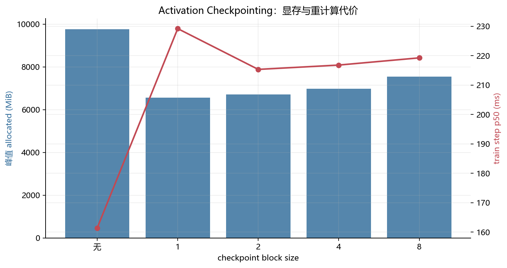
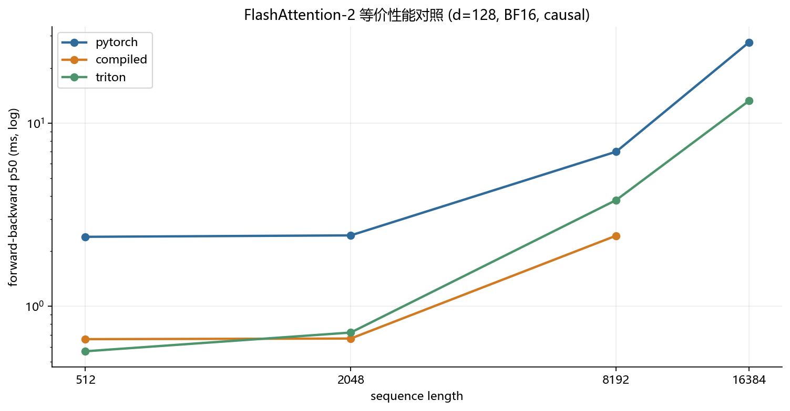

# A2-K：单卡显存优化与 GPU Kernels

> 题面版本：`26.1.4-k-rc.3`
> 上游 starter：`ca8bc81a59b70516f7ebb2da4808daade877c736`
> 当前状态：正式 4090 实验、GPU 测试和报告结果已完成。

## 环境与测量边界

正式结果全部来自单张 `NVIDIA GeForce RTX 4090` 24GB：开跑前空闲 `24110 MiB`，Driver `560.28.03`、CUDA `12.6`、PyTorch `2.11.0+cu126`、Triton `3.6.0`、power limit `450 W`、P-state `P8`。每个正式矩阵串行运行在独立 Python 进程，第一次 CUDA allocation 前设置 `23552 MiB` allocator 上限。attention microbenchmark 使用 100 ms warm-up、300 ms measurement 和 p20/p50/p80。

## Activation Checkpointing

理论上，把 N 个顺序 block 划成约 `sqrt(N)` 个区间，只保存区间边界 activation，backward 时逐区间重算，可将峰值 activation memory 从 `O(N)` 降到 `O(sqrt(N))`，额外计算为 `O(N)`。继续递归嵌套 checkpoint 可以用更多重计算换更低内存，但本作业固定实验使用非嵌套 group。

```python
for start in range(0, N, group_size):
    end = min(start + group_size, N)
    x = checkpoint(run_blocks, x, start, end, use_reentrant=False)
loss = compute_loss(x)
loss.backward()  # 每个区间在反向时重算一次
```



`results/checkpointing.csv` 包含 1024 下 group size 0/1/2/4/8 与 2048 边界。1024 baseline 峰值 **9770 MiB**、p50 **161.4 ms**；group 1 降到 **6568 MiB**，代价是 p50 **229.2 ms**。最佳 block size 不只由 checkpoint 数量决定，还取决于边界 activation、区间重算、allocator 生命周期和 kernel 调度。

## 显式 Attention 与 torch.compile

PyTorch 基线显式执行 `QK^T -> scale -> causal mask -> softmax -> PV`，没有调用 fused SDPA。核心矩阵固定 batch 1、BF16、causal，覆盖 sequence 512/2048/8192 与 d 64/128，并分别记录 forward、backward、forward-backward 的 p20/p50/p80 和峰值显存。

`torch.compile` 的 cold-start 与 steady-state 分开记录。它能融合部分逐元素操作并减少 Python 调度，但 shape specialization 会为不同序列形状生成不同图；图中断和编译缓存都会影响首次运行，因此不能把 cold-start 混进稳定延迟。完整 Stanford small 模型还比较了 eager/compiled 的 forward、forward-backward 和 train step，见 `results/compile_comparison.csv`。

## FlashAttention-2 Forward

纯 PyTorch tiled 参考和学生 Triton kernel 都按 query tile 工作，key/value tile 在内核中流式循环。每行维护 FP32 的运行最大值 `m`、指数和 `l` 与输出累加器 `acc`：

```text
m_new = max(m_old, max(scores_tile))
alpha = exp(m_old - m_new)
l_new = alpha * l_old + sum(exp(scores_tile - m_new))
acc_new = alpha * acc_old + exp(scores_tile - m_new) @ V_tile
O = acc / l,  L = m + log(l)
```

causal mask 在每个 query/key tile 内按全局索引判断。输入与输出可为 BF16，但 online softmax 状态和 accumulator 使用 FP32；这避免长序列指数和的低精度累加失稳。长期中间状态不物化完整 `[S_q, S_k]` 概率矩阵，forward 显存随序列近似线性增长。

## 重计算式 Backward 与正确性

Backward 保存 `Q/K/V/O/L`，用 `P = exp(S - L)` 重算概率，再计算 `dV = P^T dO`、`D = rowsum(O * dO)`、`dS = P * (dP - D)`、`dQ = dS K / sqrt(d)`、`dK = dS^T Q / sqrt(d)`。PyTorch tiled 与 Triton forward 共用这条可编译反向路径，causal/non-causal 均返回 dQ/dK/dV。

4090 官方命令 `python -m pytest tests/test_attention.py -v` 得到 **6 passed in 12.41s**。扩展正确性覆盖 3 个 seed、d=32/64/128、causal/non-causal，共 **18/18 passed**；`results/correctness.json` 保存 O/L/dQ/dK/dV 的最大绝对误差、最大相对误差、atol/rtol 与逐张量判定，没有把 `.pt` tensor 带入提交目录。

## 性能矩阵



`results/flash_benchmark.csv` 每个 phase 一行，核心矩阵有三种实现，16384 边界至少包含 eager 与 Triton。speedup 只在同 GPU、同 shape、同 dtype、同 causal、同 phase 且双方成功时计算。长序列下 Triton forward 不写回二次方 attention 矩阵，因而相对 eager 的显存和带宽优势更明显；backward 仍使用重计算 PyTorch 路径，所以整体 speedup 小于 forward 单阶段。

## 24GB 证据与复现

所有正式进程的最高 PyTorch peak reserved 为 **19696 MiB**，低于 `23552 MiB` allocator 上限；细节在 `results/memory_evidence.json`。公开入口位于 `student_scripts/a2k/`，实现位于 `submission/cs336_systems/a2k/`，adapter 直接返回学生类。缓存、PTX/CUBIN、trace、snapshot、tensor、权重、内部路径、UUID 与凭据均未进入提交目录。

组织内飞书补充文档链接：
