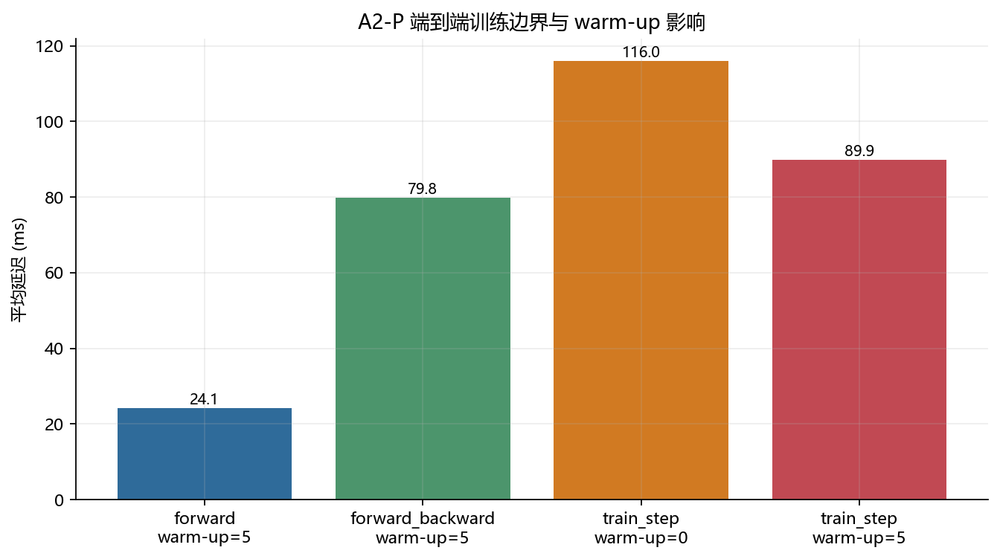
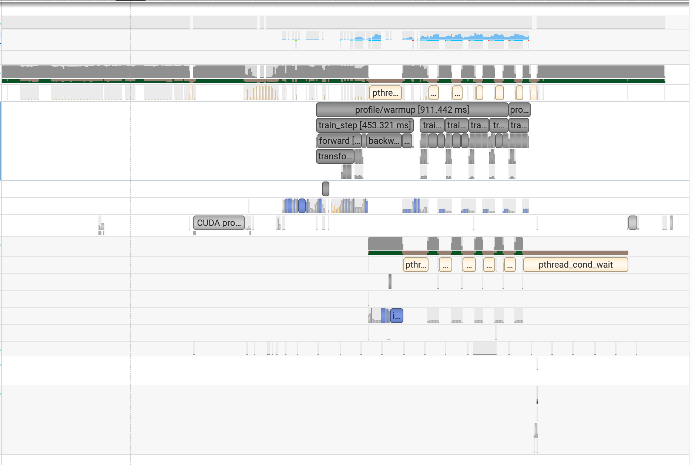
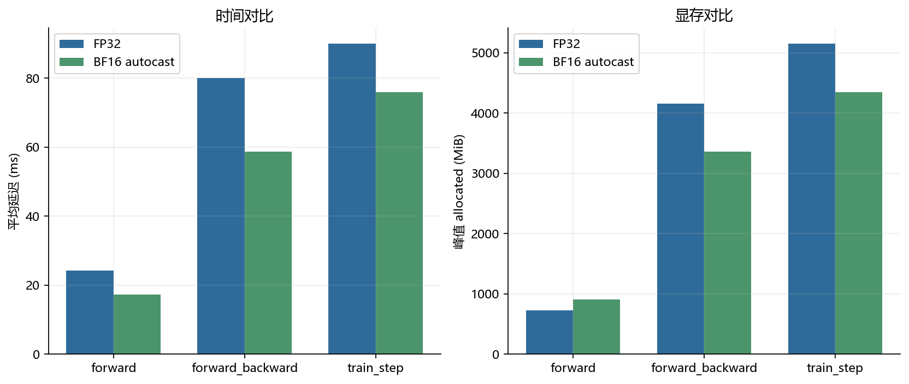
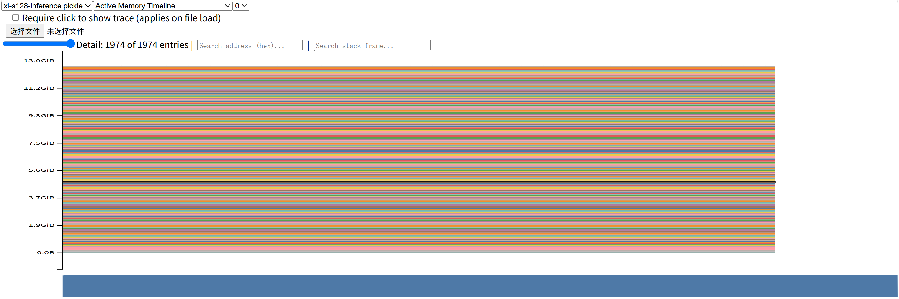
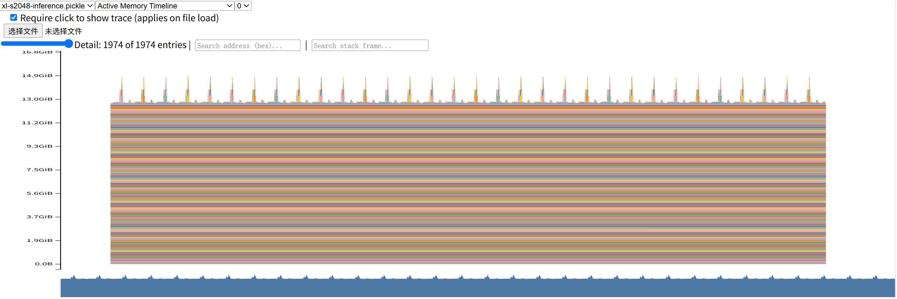

# A2-P：Profiling 与性能分析

> 题面版本：`26.1.4-rc.3`
> 上游 starter：`ca8bc81a59b70516f7ebb2da4808daade877c736`
> 当前状态：正式实验、代码、结果与公开报告已完成。

## 完成范围与环境

本报告覆盖 End-to-End Benchmark、六个 train-step trace、Mixed Precision 与 Memory Profiling。正式结果来自单张 `NVIDIA GeForce RTX 4090`：Driver `560.28.03`、CUDA `12.6`、PyTorch `2.11.0+cu126`、Nsight Systems `2024.3.0.0`。完整 `.nsys-rep`、SQLite 和 memory snapshot 留在实验工作区，提交目录只保留轻量汇总与经过检查的截图。

## 端到端基准

统一配置是 Stanford small、batch 4、context 512、FP32。每个被测 CUDA step 后同步；模型、输入和初始化不计入 measurement。原始 10 个 timing、均值、样本标准差和 CV 位于 `results/benchmark.csv`。

`train_step` 不预热时均值为 **116.01 ms**，预热 5 次后为 **89.90 ms**；前者的第一次 measurement 含 CUDA/allocator/optimizer 的冷启动，导致 CV 从 **0.714** 降到 **0.001**。稳定口径下 forward、forward-backward、完整 train step 依次增加 loss/backward 和 optimizer 工作。

## Compute Profiling

正式矩阵为 small/medium 两个模型与 context 256/512/1024 的 `2 x 3` 组合，全部捕获完整 `train_step`。Nsight 命令使用 `cuda,cudnn,cublas,osrt,nvtx`，阶段标记包含 `profile/warmup`、`profile/measure`、`forward`、`backward`、`optimizer_step` 和三个 attention 子阶段。

轻量 `results/profile/trace_summary.csv` 保存主要 kernel/CUDA API 的 Calls 与累计时间。5 个 case 完成；`medium/context 1024` 在 FP32、batch 4 下真实 OOM，失败行与最小复现配置均保留。两次失败诊断分别暴露 Nsight 2024.3 不支持旧 `--pytorch` 参数和独立 `--` 分隔符；修复后的正式矩阵成功生成 6 个 trace，外层 `process_errors=0`。上图为真实 Nsight Systems 2024.3 界面截图，保留 `profile/warmup`、`train_step`、`forward/backward`、CUDA API 与 GPU kernel 时间线，并裁去无关的进程与硬件标识。该次采集没有产生独立 `optimizer_step` NVTX 事件，因此图中不伪造该轨道；优化器执行仍包含在 `train_step` 总范围与其后半段 GPU kernels 中。

## Mixed Precision

累加实验的四个实际输出位于 `results/mixed_precision.json`。FP16 值先量化会保留输入误差；FP16 accumulator 还会在每次加法继续舍入。把 accumulator 升为 FP32 能消除后者，但不能恢复已经被 FP16 输入量化的信息。

ToyModel 中参数和 gradient 为 FP32，第一层与 logits 为 BF16，LayerNorm 与 loss 为 FP32。语言模型完整 train step 从 **90.01 ms** 降到 **75.86 ms**，峰值 allocated 从 **5154 MiB** 降到 **4351 MiB**。BF16 让矩阵乘使用 Tensor Core，并减少 activation/gradient 流量；reduction、LayerNorm 和 loss 保持 FP32 以控制累加误差。

## Memory Profiling

`results/memory/peaks.csv` 同时报告 active/allocated/reserved 与峰值。两张图是对应 pickle 快照在 PyTorch Memory Visualizer 的 `Active Memory Timeline` 界面中的真实截图；XL inference 在 context 128 和 2048 均成功；完整 FP32 train step 在 23 GiB 预算内 OOM。随后按题面顺序尝试 XL/context 1024 与 Large/context 2048，inference 成功、train step 仍 OOM，且没有静默降配。

Residual stream 单层张量理论大小为 `batch * context * d_model * bytes_per_element`；随着 context 增长，它本身线性增长，但普通 attention 的 score/probability 中间量按 context 平方增长。训练时 saved activations 持续到 backward，再与 gradient 和 optimizer 状态叠加，所以 train step 比 inference 更早到达显存边界。

## 复现与限制

公开代码位于 `submission/profiling/`。正式矩阵由 `python -m profiling.formal --suite all --run-dir private_results_dir` 组织。报告中的数字可追溯到 `results/`；主机名、IP、用户名、内部路径、UUID、trace、snapshot、权重、缓存和压缩包均未进入提交目录。

组织内飞书补充文档链接：
