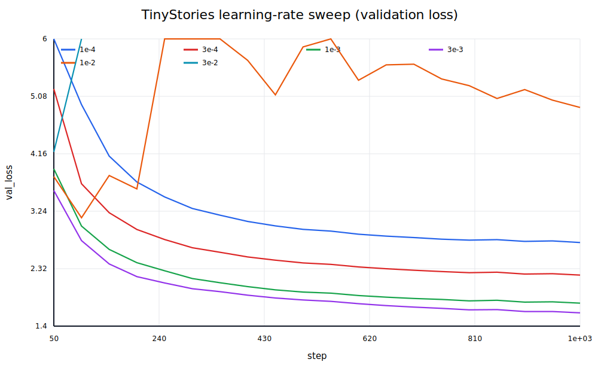
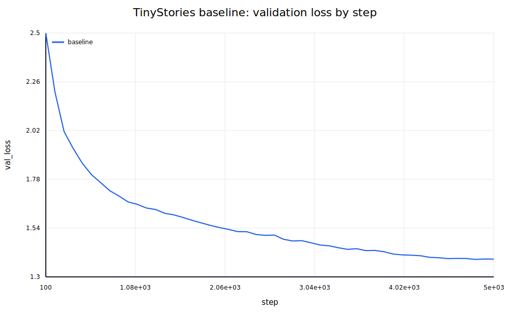
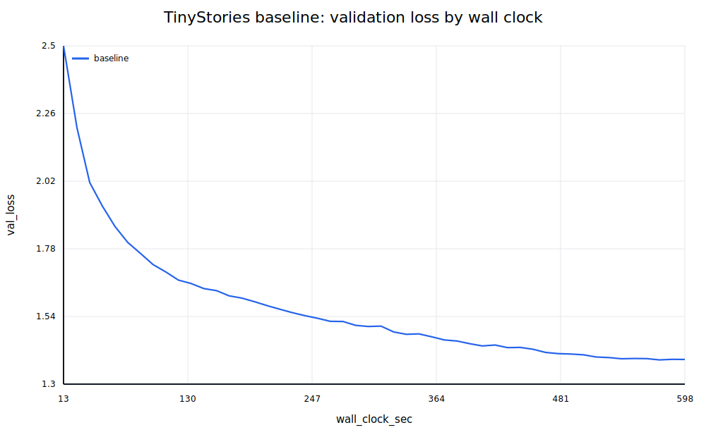
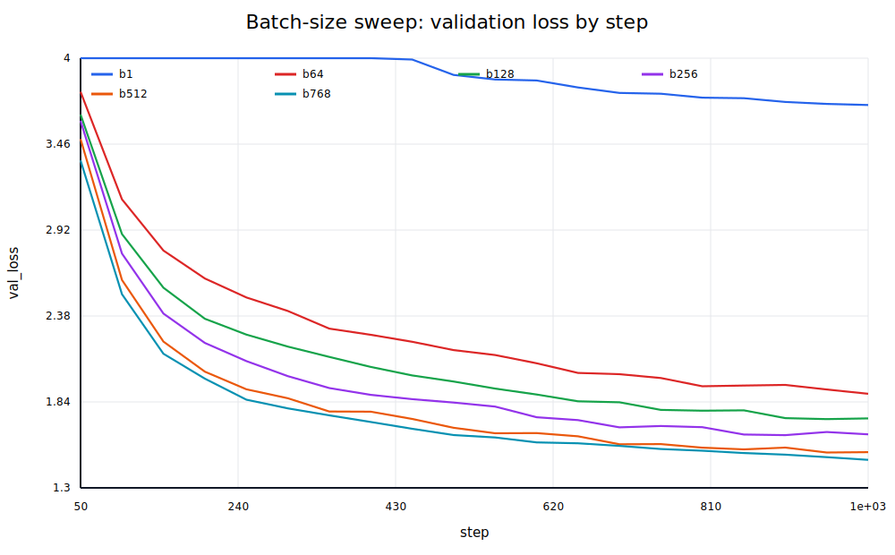
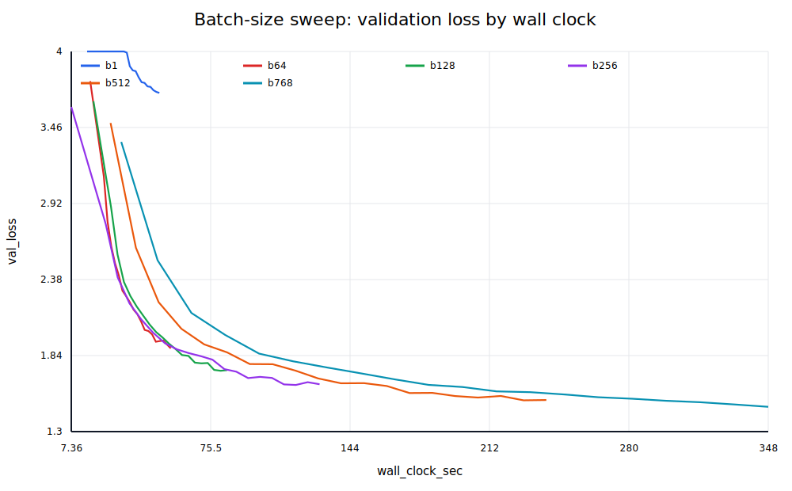
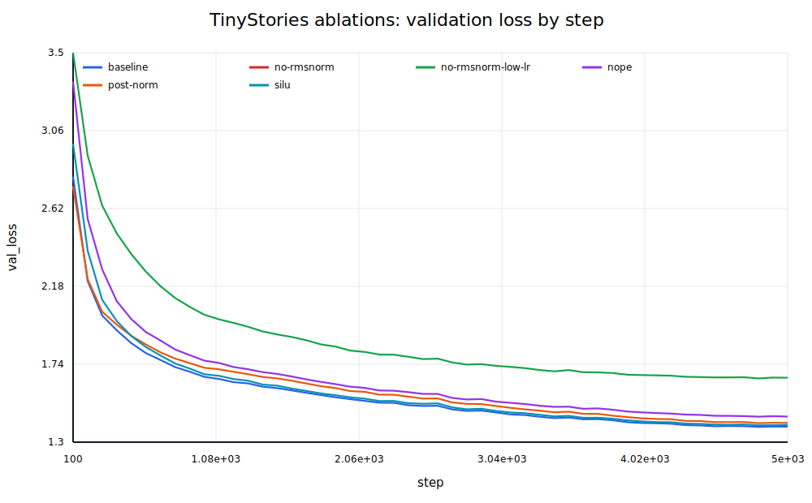
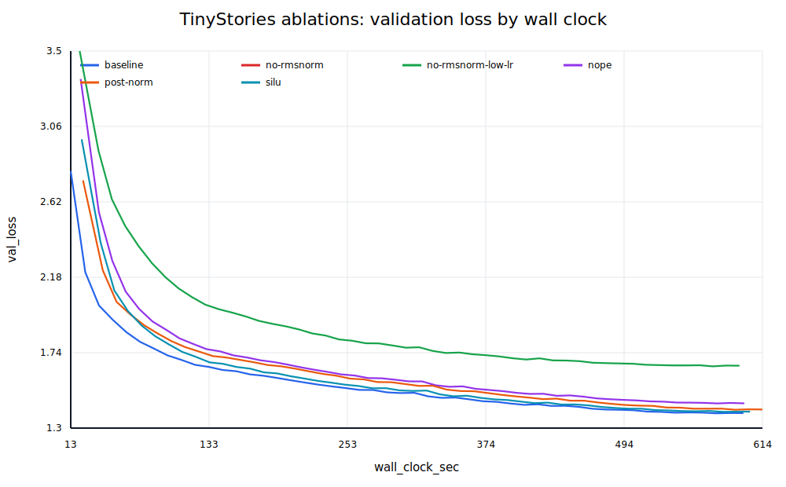
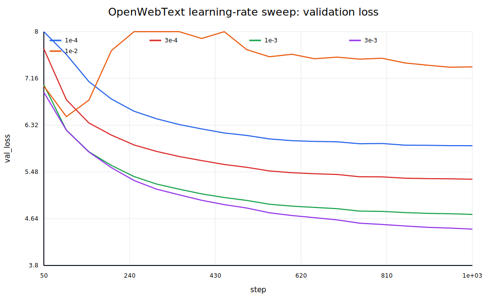
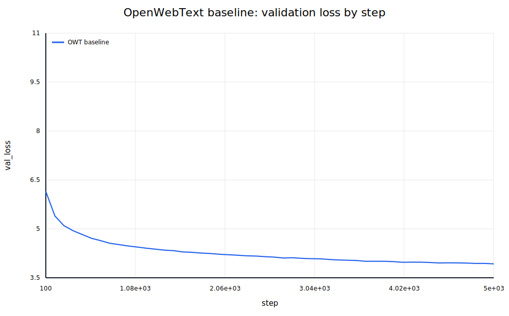
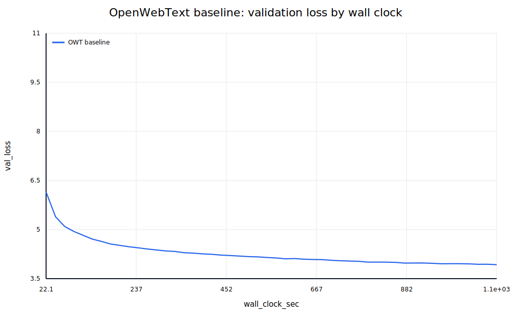

# A1 公开提交：雷梓一

> 本文件和同目录代码公开可见。报告只包含公开数据上的脱敏实验结果，不包含内部主机名、
> IP、账号、绝对路径、数据文件、checkpoint 或访问凭据。

## 基本信息

- 作业题面版本：26.0.4
- 完成范围：21 个 adapter 对应的全部核心实现、全部公开测试、两套 BPE tokenizer、数据编码、TinyStories 学习率与 batch size 扫描、正式训练、四类架构消融、OWT 调参与正式训练、两套文本生成，以及全部书面核算题。
- 未完成项：无
- 上游 starter commit：`a158843b20107949f1a8d7df1b05cd33b9166712`
- 本地工作仓库：`../assignment1-basics`

## 完成结果摘要

- 公共测试：`47 passed, 1 xpassed`；Ruff 与 ty 均通过。
- TinyStories tokenizer：10,000 词表，训练 59.31 秒；完整训练集压缩率 4.1161 bytes/token。
- OWT tokenizer：32,000 词表，训练 1059.57 秒；完整验证集压缩率 4.3674 bytes/token。
- TinyStories 正式模型：5000 步、327,680,000 tokens，最终 validation loss 为 **1.3876**。
- No-RMSNorm 在原最佳学习率下发散；NoPE、Post-Norm、SiLU 的最终 validation loss 分别为 1.4444、1.4086、1.3963。
- OWT 正式模型：5000 步最终 validation loss 为 **3.9269**。

## 实现说明

真实逻辑位于 `submission/cs336_basics/`，adapter 只负责构造模块、加载测试权重与参数转发。

- Tokenizer：byte-level BPE、GPT-2 pre-tokenization、special-token 硬边界、确定性并列规则、增量 pair count、流式编码/解码和多进程预分词。
- Transformer：从零实现 Linear、Embedding、RMSNorm、SiLU、SwiGLU、RoPE、稳定 softmax、scaled dot-product attention、causal multi-head attention、Transformer block 和 decoder-only LM。
- 训练：从零实现 cross-entropy、AdamW、warmup + cosine schedule、全局梯度裁剪、memmap batch sampler、validation、checkpoint 和 JSONL 实验记录。
- 生成：temperature、top-p/nucleus sampling、EOS 提前停止和 context-window 截断。
- 实验工程：配置继承、BF16 autocast、`torch.compile`、逐步吞吐/峰值显存记录、非有限 loss 检测、SVG 曲线生成和 Slurm 批处理入口。

核心实现没有调用现成的 `nn.Linear`、`nn.Embedding`、`torch.nn.functional` 或 `torch.optim.AdamW`。

## 书面题

### Unicode 1

1. `chr(0)` 返回 Unicode 空字符 NUL（U+0000）。
2. 它的 `repr` 是可见的转义形式 `'\x00'`，而直接打印时没有可见字形。
3. NUL 在 Python 字符串中仍是一个真实字符，夹在普通文本中打印时两侧文字看起来直接相连，并不会像某些 C 接口那样自动截断 Python 字符串。

### Unicode 2

1. UTF-8 对 ASCII 保持单字节兼容，英文为主的文本通常比 UTF-16/UTF-32 更紧凑，并且没有 UTF-16/32 的字节序问题，因此适合面向互联网文本的 byte-level tokenizer。
2. 例如 `"牛".encode("utf-8") == b'\xe7\x89\x9b'`；错误函数逐 byte 解码时会在第一个 byte 就抛出 `UnicodeDecodeError`，因为一个 UTF-8 字符可能需要多个 byte，必须整体解码。
3. `b'\xff\xff'` 无法解码成 UTF-8，因为 `0xff` 不是合法的 UTF-8 起始或续接 byte。

### Transformer 参数与 FLOPs 核算

令词表大小为 \(V\)、序列长度为 \(S\)、宽度为 \(d\)、FFN 宽度为 \(d_{ff}\)、层数为 \(L\)。输入 embedding 与非共享输出 LM head 各有 \(Vd\) 个参数；每层 attention、SwiGLU 和两个 RMSNorm 分别有 \(4d^2\)、\(3dd_{ff}\)、\(2d\) 个参数，最后还有一个 \(d\) 维 RMSNorm：

\[
P=2Vd+L(4d^2+3dd_{ff}+2d)+d.
\]

对 GPT-2 XL-shaped 配置 \((V,S,L,d,H,d_{ff})=(50257,1024,48,1600,25,4288)\)，共有 **1,640,452,800** 个参数；FP32 参数本身占 6.5618 GB（约 6.11 GiB）。

一次 forward 中的矩阵乘法如下：

- 每层 Q/K/V 投影：\(6Sd^2\) FLOPs；attention output projection：\(2Sd^2\)。
- 每层 \(QK^T\)：\(2S^2d\)；attention probabilities 与 \(V\) 相乘：\(2S^2d\)。
- 每层 SwiGLU 三个矩阵：\(6Sdd_{ff}\)。
- 最终 LM head：\(2SdV\)。

因此

\[
F_{forward}=L(8Sd^2+4S^2d+6Sdd_{ff})+2SdV.
\]

GPT-2 XL-shaped 在 \(S=1024\) 时一次 forward 为 **3.51677e12 FLOPs**。其中 FFN 占 57.53%，attention 投影占 28.62%，二次复杂度的 attention 矩阵乘占 9.16%，LM head 占 4.68%，所以当前长度下 FFN 是最大项。

| 模型 | forward FLOPs | attention 投影 | 二次 attention | FFN | LM head |
| --- | ---: | ---: | ---: | ---: | ---: |
| GPT-2 small | 2.91648e11 | 19.88% | 13.25% | 39.76% | 27.10% |
| GPT-2 medium | 8.30172e11 | 24.83% | 12.42% | 50.05% | 12.70% |
| GPT-2 large | 1.76853e12 | 27.32% | 10.93% | 54.30% | 7.45% |
| GPT-2 XL | 3.51677e12 | 28.62% | 9.16% | 57.53% | 4.68% |

模型变宽、变深时，FFN 和 attention 投影的占比上升，固定词表对应的 LM head 占比明显下降；在这里序列长度固定，所以二次 attention 的相对占比也随模型参数矩阵变大而下降。

把 XL 的 context length 从 1024 增至 16384 后，一次 forward 增至 **1.33578e14 FLOPs**，是原来的 37.98 倍；二次 attention 项从 9.16% 上升到 61.73%，投影、FFN、LM head 则分别降到 12.06%、24.24%、1.97%。

### AdamW 显存与计算核算

所有张量均按 FP32 计算。参数、梯度和 AdamW 两个 moment 分别占 \(4P\)、\(4P\)、\(8P\) bytes。按照题面指定的 activation 项，每个 Transformer block 保存

\[
B(8Sd+4Sd_{ff}+2HS^2)
\]

个元素；final RMSNorm、output embedding 和 logits cross-entropy 再贡献 \(B(Sd+2SV)\) 个元素。因此：

\[
M_{act}=4B[L(8Sd+4Sd_{ff}+2HS^2)+Sd+2SV],
\]

\[
M_{total}=16P+M_{act}.
\]

代入 XL-shaped 数值后得到

\[
M_{total}=16.37339136\,\text{GB}\times B+26.2472448\,\text{GB}.
\]

在 80 GB 上按此简化核算最大 batch size 为 **3**。

逐参数估算 AdamW 更新约需 \(14P\) 次 elementwise FLOPs：一、二阶 moment 更新约 3P 和 4P，归一化更新约 5P，decoupled weight decay 约 2P。XL-shaped 对应约 **2.2966e10 FLOPs/step**，远小于模型 forward/backward。

XL 每条 1024-token 序列 forward 为 3.51677e12 FLOPs，backward 按 forward 的两倍，batch 1024、400K 步的总训练量约为 \(4.3214\times10^{21}\) FLOPs。单张 H100 在 50% MFU 下有效吞吐为 247.5 TFLOP/s，因此约需 **4850.1 小时**。

### toy SGD 学习率实验

固定 seed 后运行题面中的 inverse-square-root-decay SGD 10 步：lr=10 的 loss 从 24.1693 稳定降到 3.2482；lr=100 在第 4 步后快速降至接近 0；lr=1000 则从 24.1693 爆炸到 2.24e18。完整数值见 `logs/sgd_lr_experiment.json`。

## Tokenizer 实验

### 训练时间、内存与最长 token

| 训练语料 | vocab | merges | 墙钟时间 | 进程峰值 RSS | 作业 MaxRSS | 最长 token |
| --- | ---: | ---: | ---: | ---: | ---: | --- |
| TinyStories | 10,000 | 9,743 | 59.31 s | 529 MB | 3.68 GB | ` accomplishment`（15 bytes） |
| OpenWebText | 32,000 | 31,743 | 1059.57 s | 12.52 GB | 22.28 GB | `ÃÂ` 重复串（64 bytes） |

TinyStories 最长 token 是完整且常见的英文词，符合儿童故事语域；OWT 最长 token 是网页中反复出现的 mojibake/编码污染，体现了开放网页语料比 TinyStories 更嘈杂。代表性 5 MB profile 中，pre-token 计数累计耗时 6.74/8.40 秒，是训练的主要热点，其中正则匹配结果转 bytes 与频次累计占比最大；增量 merge 阶段明显更短。

### 压缩率

在固定 seed 下分别从两个数据集抽取 10 篇文档：

| tokenizer → / sample ↓ | TinyStories sample | OWT sample |
| --- | ---: | ---: |
| TinyStories 10K | 4.0956 bytes/token | 3.3438 bytes/token |
| OWT 32K | 3.9563 bytes/token | 4.5357 bytes/token |

域内 tokenizer 的压缩更好：TinyStories tokenizer 用在 OWT 上时从 OWT tokenizer 的 4.5357 降到 3.3438 bytes/token，即同一文本需要更多 token；反方向也有较小退化。完整验证集交叉编码同样得到 OWT tokenizer 4.3674 vs TinyStories tokenizer 3.1739 bytes/token，以及 TinyStories tokenizer 4.1204 vs OWT tokenizer 4.0056 bytes/token。

完整编码结果：TinyStories train 为 541,229,347 tokens、4.1161 bytes/token；TinyStories valid 为 5,461,210 tokens、4.1204 bytes/token；OWT valid 为 66,401,098 tokens、4.3674 bytes/token；OWT train 为 2,727,120,452 tokens、4.3711 bytes/token，编码耗时 1429.02 秒、吞吐 8.34 MB/s。

### 吞吐与 dtype

单进程 tokenizer microbenchmark 得到 TinyStories tokenizer 0.579 MB/s、OWT tokenizer 0.535 MB/s，据此顺序处理 825 GiB Pile 约需 425.1 和 459.6 小时。正式编码入口使用 32 个进程，TinyStories train 实测 8.51 MB/s，OWT valid 实测 7.65 MB/s。

词表分别为 10K 和 32K，所有 token ID 都小于 \(2^{16}=65536\)，因此 `uint16` 足以无损保存，同时只需 `int32` 一半的磁盘与内存带宽。

## TinyStories 训练实验

所有正式模型使用 4 层、16 头、\(d_{model}=512\)、context 256、SwiGLU \(d_{ff}=1344\)、RoPE、pre-norm；正式 run 的 batch 256、5000 步，共处理 327,680,000 tokens。AdamW 使用 \((\beta_1,\beta_2)=(0.9,0.95)\)、weight decay 0.1、100 步 warmup 和 cosine decay。

### 学习率扫描

先在对数尺度覆盖 1e-4 到 1，再围绕稳定区间加入 3 倍中间点；每个候选跑 1000 步。结果如下：

| peak lr | 结果 |
| ---: | ---: |
| 1e-4 | val 2.7389 |
| 3e-4 | val 2.2178 |
| 1e-3 | val 1.7682 |
| **3e-3** | **val 1.6127（最佳）** |
| 1e-2 | val 4.9017 |
| 3e-2 | 第 129 步发散 |
| 1e-1 | 第 45 步发散 |
| 1 | 第 12 步发散 |



3e-3 位于性能快速改善区间的上沿；再增至 1e-2 虽未产生 NaN，但收敛质量已经严重退化，3e-2 以上直接发散。这与“最佳学习率靠近稳定边界”的经验一致，但真正的最佳点仍需与不稳定区留出约一个数量级以内的安全距离。

### 正式基线

选择 peak lr=0.003、minimum lr=0.0003。5000 步最终 train loss 1.3113，validation loss **1.3876**，总训练墙钟约 598.9 秒，达到题面要求的 1.45。





### Batch size

显存探测中 batch 768 可运行，batch 1024 OOM。1000 步扫描对各 batch 重新选择了适合的学习率，并固定 validation batch 为 128：

| batch | peak lr | final val | wall clock |
| ---: | ---: | ---: | ---: |
| 1 | 3e-4 | 3.7058 | 51.0 s |
| 64 | 2e-3 | 1.8912 | 56.6 s |
| 128 | 3e-3 | 1.7365 | 84.2 s |
| 256 | 3e-3 | 1.6362 | 129.5 s |
| 512 | 4e-3 | 1.5243 | 240.4 s |
| 768 | 4e-3 | 1.4763 | 349.1 s |





在固定步数下，大 batch 每步看到更多 token，所以 validation loss 单调改善；但从 512 增至 768 的收益已明显变小，而墙钟成本继续增长。batch=1 的矩阵太小、统计噪声大且每步只看到极少数据；中等 batch 在收敛、吞吐和显存之间更均衡。该比较不是固定 token budget，因此不能把更大 batch 的全部收益归因于更低的梯度方差。

## 架构消融

| 模型 | peak lr | 状态 / final val | 相对基线 |
| --- | ---: | ---: | ---: |
| Pre-Norm + RoPE + SwiGLU 基线 | 3e-3 | 1.3876 | — |
| No-RMSNorm | 3e-3 | 第 140 步发散；最后一次 val 2.7954 | 不稳定 |
| No-RMSNorm（低 lr） | 3e-4 | 1.6641 | +0.2765 |
| NoPE | 3e-3 | 1.4444 | +0.0568 |
| Post-Norm | 3e-3 | 1.4086 | +0.0210 |
| SiLU FFN（\(d_{ff}=4d\)） | 3e-3 | 1.3963 | +0.0087 |





- RMSNorm 对稳定性最关键：移除后沿用最优 lr 会快速爆炸，降低 10 倍能训练，但最终质量明显落后，说明 normalization 同时扩大了稳定学习率范围并改善优化。
- NoPE 仍能学习，因为 causal mask 本身泄露了部分相对位置信息，但比 RoPE 差 0.0568，显式位置结构仍然有帮助。
- Post-Norm 在这个浅层模型上没有发散，但略差于 Pre-Norm；更深网络通常会放大两者的优化稳定性差异。
- 参数量近似匹配后，非门控 SiLU 只落后 0.0087，差距较小但稳定存在；说明 SwiGLU gating 在相同计算预算附近提供了可测收益。

## OpenWebText 实验

先对 1e-4、3e-4、1e-3、3e-3、1e-2 做 1000 步扫描，再用最佳候选以与 TinyStories 相同的 4 层架构和 5000 个 iteration 正式训练。扫描最终 validation loss 分别为 5.9515、5.3484、4.7166、4.4525、7.3677，因此选择 3e-3；OWT 的最优点与 TinyStories 一致位于 3e-3，但绝对 loss 不应直接跨数据集比较。



正式 OWT 模型使用 peak lr=0.003、min lr=0.0003、batch 256、context 256，与 TinyStories 使用相同的 5000 iterations 和 327.68M tokens。最终 train loss 为 3.8975，validation loss 为 **3.9269**，训练墙钟 1099.0 秒。





TinyStories 的 1.3876 与 OWT 的 3.9269 不能直接理解为同一难度上的“好坏排名”：两者词表、文本域和 token 条件分布都不同。OWT 含有新闻、论坛、网页噪声、格式和编码污染，长程依赖与主题跨度更大；相同模型和 token budget 在 OWT 上要拟合更宽的分布，因此 loss 更高、生成也更不稳定。

## 文本生成

### TinyStories

参数：prompt=`Once upon a time`，temperature=0.8，top-p=0.95，seed=42。模型在生成 179 个新 token 后输出 EOS，符合“至少 256 tokens 或直到第一个 EOS”的要求。

> Once upon a time, there was a little girl named Mia. Mia loved to play with her toys. One day, she found a hidden toy under her bed. It was a small, round ball. Mia was so happy!
>
> Mia showed her toy to her friend, Tim. "Look what I found!" she said. "Let's play with it!" Tim looked at the toy and nodded. They played with the ball all day long. They laughed and had lots of fun.
>
> But then, Mia's mom saw them playing with the toy. She said, "Mia and Tim, it's time to clean up the toys!" Mia and Tim didn't want to stop playing. They said goodbye to the hidden toy and went to clean up the toys. The next day, they played with the toy again, but this time they listened to their mom and played with the ball more carefully.

文本语法通顺、人物与事件基本一致，也学到了 TinyStories 的三段式短故事和道德收尾；不足是 “toy” 重复较多，结尾转折较机械。生成质量主要受训练数据的简单、干净分布与 validation loss 影响，也受到 temperature/top-p、prompt、模型容量、训练 token 数和随机 seed 影响。

### OpenWebText

参数：prompt=`The future of artificial intelligence`，temperature=0.8，top-p=0.95，seed=42，生成 256 个新 token：

> The future of artificial intelligence is at an end.
>
> If your interest in technology or the government has a huge advantage in the world, it is in the interest of everyone on the planet. Whether you’re using your very technical skills, it’s worth the time for you to fix the downfall of the moon. You can use the insights of the past or the future of the future for you to present, and for you to be an advisor.
>
> Despite the small changes in technology, the cost of all the possible benefits can be huge.
>
> High-tech startups are a great way to start your journey. You may be planning to bring their people to the moon in time to get you a new opportunity to get more capital, or even more space. If you’re not 100% sure that you’re going to be able to bring the extra cash to their “children.” In this case, you’ll be able to get a small, unassuming person to have an “child.”
>
> Think about it: The problem with micro-neocons is that it works exactly as well as you can. You’re going to have to pay a lot of money for the moon’s satellites. It’s pretty expensive. If you’re not

这段输出能维持英文标点、段落和若干网页评论式短语，但语义连续性明显弱于 TinyStories，出现 “future of the future”、moon/satellites 等跳跃和不自然搭配。原因包括 OWT 本身的多域噪声、更大的词表与更高的 token-level entropy，以及相同训练预算不足以覆盖它的长尾分布；temperature/top-p 也会直接改变这种局部连贯与全局发散的权衡。

## 实验日志

`logs/` 中保留了所有训练类 run 的逐点 JSONL 与 summary。每条逐点记录包含 `step`、`wall_clock_sec`、`train_loss`、`lr`，并定期包含 `val_loss`；summary 包含最终 loss、总时间、模型与训练配置。目录对应关系：

- `logs/tinystories_baseline/`：正式 TinyStories 训练和生成。
- `logs/lr_sweep/`、`logs/batch_size/`：学习率与 batch size 实验。
- `logs/ablations/`：No-RMSNorm、低学习率重试、NoPE、Post-Norm、SiLU。
- `logs/owt_lr_sweep/`、`logs/owt_baseline/`：OWT 调参与正式训练。
- `logs/tokenizers/`：tokenizer 训练、编码和压缩/吞吐摘要。

公开日志不包含 Slurm 原始输出、节点名、分区、绝对路径、数据、checkpoint 或环境凭据。

## 复现说明

环境由上游 `uv.lock` 固定；实验使用 Python 3.13、PyTorch 2.11、CUDA BF16、单 GPU。公开数据为 TinyStoriesV2-GPT4 与 OpenWebText，下载后使用本提交脚本训练 tokenizer 和编码，不把数据本身放入提交。

```bash
uv sync --frozen
uv run pytest -q
uv run ruff check cs336_basics tests/adapters.py scripts
uv run ty check cs336_basics scripts

uv run python scripts/train_tokenizer.py --input DATASET_TRAIN.txt --vocab-size 10000 \
  --output-dir artifacts/tokenizers/tinystories --num-processes 32
uv run python scripts/encode_dataset.py --input DATASET_TRAIN.txt \
  --vocab artifacts/tokenizers/tinystories/vocab.json \
  --merges artifacts/tokenizers/tinystories/merges.json --output DATASET_TRAIN.bin
uv run python scripts/train_lm.py --config configs/tinystories_baseline.json \
  --output-dir runs/tinystories_baseline
uv run python scripts/generate.py --config configs/tinystories_baseline.json \
  --checkpoint CHECKPOINT.pt --vocab VOCAB.json --merges MERGES.json \
  --device cuda --output GENERATION.json
```

同步命令：`python3 scripts/sync_a1_submission.py --name '雷梓一'`。可复现配置位于 `submission/configs/`，训练、编码、生成、绘图与 tokenizer 指标入口位于 `submission/scripts/`。

## 飞书补充文档

- 链接：[雷梓一 - A1 补充材料](https://fudan-nlp.feishu.cn/wiki/DIzMwV9epiqkMykuLsrcD4Mjnhb?from=from_copylink)

本 该 A1 补充文档设置为组织内公开，未开启互联网公开访问，仅保存 A1 验收所需的最小组内差量材料。
