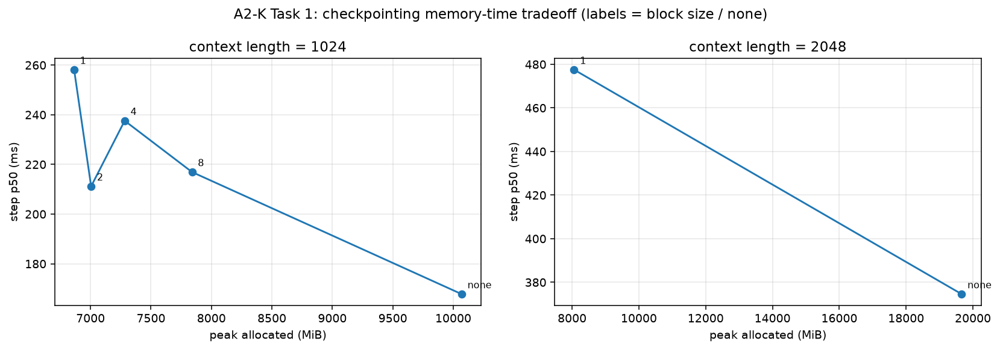
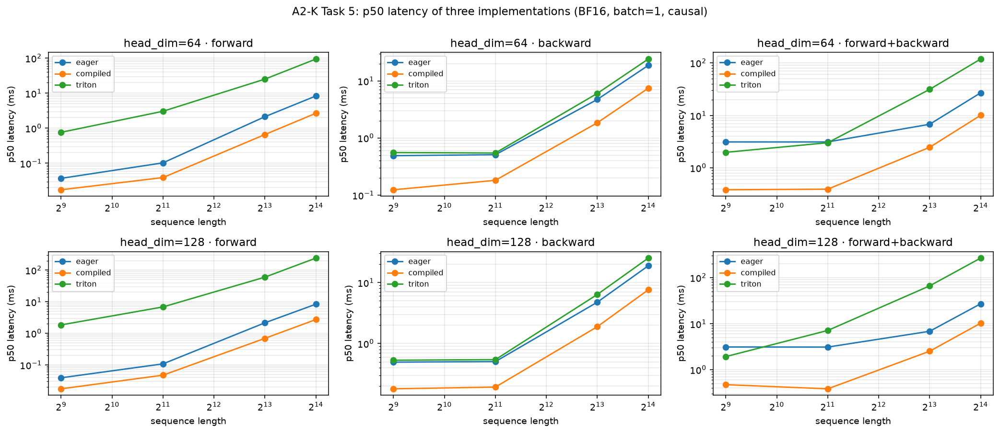
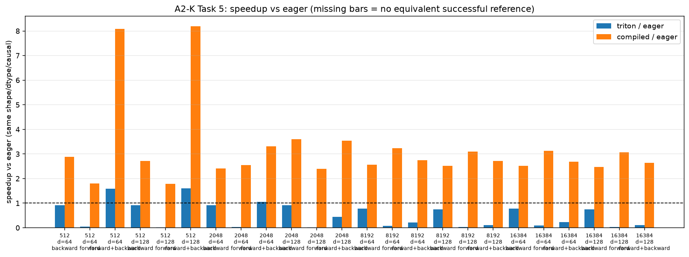
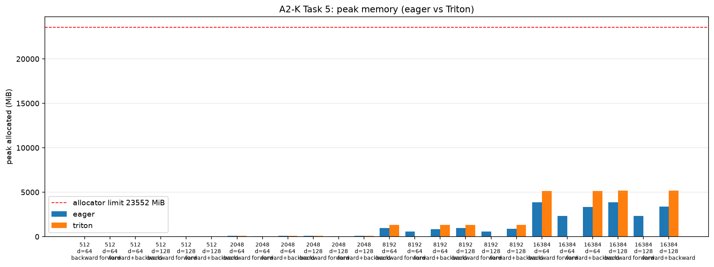

# A2-K：单卡显存优化与 GPU Kernels — 完成报告

- 姓名：马万里
- 硬件：单张 NVIDIA GeForce RTX 4090 24GB
- 题面版本：`26.1.4-k-rc.3`
- 固定 starter commit：`ca8bc81a59b70516f7ebb2da4808daade877c736`
- 上游仓库位置：与 `SummerQuest-2026` 同级的 `../assignment2-systems`（未 vendor 进本仓库）

所有性能与显存数字都来自单张 RTX 4090 上、用同一套固定协议执行的正式矩阵，
可在 `results/` 中逐条回溯。

---

## 1. 完成范围

| 任务 | 上游 problem | 分值 | 状态 |
| --- | --- | ---: | --- |
| 任务一：Activation Checkpointing | `gradient_checkpointing` | 4 | 完成（理论 + 1024 矩阵 + 2048 边界） |
| 任务二：显式 PyTorch Attention | `pytorch_attention` | 2 | 完成（512/2048/8192 × 64/128） |
| 任务二：`torch.compile` 对照 | `torch_compile` | 2 | 完成（3 个代表配置 + small 模型） |
| 任务三：FlashAttention-2 前向 | `flash_forward` | 15 | 完成（tiled 参考 + 学生 Triton kernel） |
| 任务四：重计算式反向 | `flash_backward` | 5 | 完成（PyTorch/Triton 两条 autograd 路径） |
| 任务五：正确性与性能矩阵 | `flash_benchmarking` | 5 | 完成（正确性 1080 项 + 性能矩阵 72 行） |
| **合计** | | **33** | |

**范围说明**：反向由 PDF 的重计算路径实现，PyTorch 与 Triton 两个 `autograd.Function`
共用它。因此性能矩阵中 `triton` 行的 forward 是学生 Triton kernel，反向走的是这条
重计算路径。自定义 Triton backward 属于可选扩展，未实现。

**代码边界**：`cs336_systems/a2k/**/*.py`、`tests/adapters.py`、`student_scripts/a2k/**/*.py`。
本目录的 `submission/` 由 `scripts/sync_a2k_submission.py` 从 `../assignment2-systems`
同步而来；上游公共测试文件未修改，实现全部经 `tests/adapters.py` 暴露。

---

## 2. 实验环境

| 项目 | 值 | 项目 | 值 |
| --- | --- | --- | --- |
| GPU | NVIDIA GeForce RTX 4090 | Triton | 3.6.0 |
| 总显存（CUDA 报告） | 24111.06 MiB | power limit | 450.0 W（未改动） |
| `nvidia-smi` 总显存 | 24564.0 MiB | P-state | P0 |
| 开始时空闲显存 | 23717.75 MiB | TF32 matmul | `False` |
| Driver | 560.28.03 | `float32_matmul_precision` | `highest` |
| CUDA | 12.6 | allocator 上限 | 23552 MiB（fraction 0.9768130） |
| PyTorch | 2.11.0+cu126 | 24 GiB 硬上限 | 24576 MiB |
| cuDNN | 91002 | 计时器 | `do_bench(warmup=100, rep=300, quantiles=[0.2,0.5,0.8])` |

字段来源为 `results/run_metadata.json`，其中不含 UUID、主机名、用户名、IP 或内部路径。

### 2.1 浮点精度

cuBLAS 侧关闭 TF32（`allow_tf32 = False`、`float32_matmul_precision = "highest"`），
Triton kernel 内所有 `tl.dot` 显式指定 `input_precision="ieee"`。两者作用范围不同：
`allow_tf32` 只影响 cuBLAS，而 Triton 的 FP32 `tl.dot` 默认走 TF32，必须在 kernel 内
逐点声明 `ieee`，否则 FP32 输入会在 Triton 路径上降精度。`cudnn.allow_tf32` 保持默认，
本作业不经过 cuDNN 的卷积与 RNN 路径。

### 2.2 测量协议

- **延迟**：统一用 `do_bench(warmup=100, rep=300, quantiles=[0.2,0.5,0.8])`，
  `warmup`/`rep` 单位为毫秒，返回值为毫秒。其 warm-up 循环足以吸收 `torch.compile`
  与 Triton JIT 的首次编译，因此 p20/p50/p80 是稳态分位数。
- **显存**：与延迟分开测——`do_bench` 的按时间 warm-up 会污染峰值统计。做法是
  `reset_peak_memory_stats()` 后跑 5 次，读 `max_memory_allocated()` 与
  `max_memory_reserved()`，首次调用也计入。
- **纯反向**：前向图建一次并保留（`retain_graph=True`），此后只调 `autograd.grad`，
  p20/p50/p80 是直接测得的反向分位数。反向必须持有前向激活，所以 `backward` 行的峰值
  本身已包含 forward 那一项；它与 `forward_backward` 行测的是不同的内存状态，不可相加。
- **编译边界**：compiled 配置先用一次不计时、不计峰值的冷启动步把 forward 与 backward
  图都编好，把合计 wall time 记入 `cold_start_ms`，随后 reset 峰值统计再测稳态。
  `timing_note` 字段逐行标注了每行的测法。

---

## 3. 任务一：Activation Checkpointing

### 3.1 理论

**安排方式**：对 `N` 个相同 Transformer block，最优安排是均匀分块的非嵌套 checkpoint。
把 `N` 层切成 `B = N/k` 个连续 block，每块 `k` 层，只在每个 block 的入口边界保存一次
activation；块内的 `k − 1` 个中间 activation 一律不保存，反向需要时由入口 activation
重新前向算出。

上面这组结论与 Chen 等人提出 activation checkpointing 的原始论文一致。该论文给出的
算法用 `O(√n)` 显存训练 `n` 层网络，代价是每个 mini-batch 只多一遍前向——这正是本作业
采用这一档的依据；论文同时指出，把递归（嵌套）安排做到极端可以把显存进一步压到
`O(log n)`，但前向计算要多付 `O(n log n)`（[Training Deep Nets with Sublinear Memory Cost, arXiv:1604.06174](https://arxiv.org/abs/1604.06174)）。
在 `N = 24` 的规模下，`O(log n)` 相对 `O(√n)` 只剩常数级差别，而多出来的重算按
`n log n / n = log n` 计已不划算，因此这里止步于均匀非嵌套。

**峰值位置**：某个 block 正在做块内重计算时。此时常驻 = `B` 个边界 activation +
当前重算 block 的 `k` 层内部 activation（含该层的 2D 注意力中间量）。

**渐近表达**：

- 不 checkpoint：峰值 activation memory `Θ(N)`（每层都常驻）。
- block size `k`：`M(k) = Θ(N/k + k)`，在 `k* = Θ(√N)` 处取最小值 `Θ(√N)`。
- 重计算代价：反向阶段要为每个 block 重算块内 `k` 层的前向，`B = N/k` 个 block 合计
  重算 `(N/k)·k = N` 层前向。**无论 `k` 取多少，额外计算总量都是 `Θ(N)`**，即固定为
  「比不 checkpoint 多一遍前向」这一量级，不会随 `k` 变化——`k` 只改变这笔开销的
  **分摊方式与常数因子**（每个 block 重算多少层、反向与重计算如何交错、kernel 与
  显存访问模式的效率），不改变渐近阶。

因此 checkpoint 的本质是**用一次额外的全量前向换取 activation 峰值从 `Θ(N)` 降到
`Θ(√N)`**；不同 `k` 之间的时间差异来自常数项，而非计算量的阶数差异。

`M(k) = Θ(N/k + k)` 在 `k* = √N ≈ 5` 处最小，实测的较小峰值落在
`block1`–`block8` 之间，与这个量级相符；§3.3 给出实测值，并解释为什么实际曲线
比这条只考虑 activation 的理论式更平。

**代码骨架**：

```python
def forward_with_checkpoint(model, tokens, block_size):
    hidden = model.token_embeddings(tokens)            # ← 边界 A0（常驻）
    num_blocks = math.ceil(len(model.layers) / block_size)
    for block_index in range(num_blocks):               # 遍历 B = N/k 个 block
        start = block_index * block_size
        stop = min(start + block_size, len(model.layers))

        def run_block(h, start=start, stop=stop):       # 块内 k 层整体作为一个重算单元
            for layer_index in range(start, stop):
                h = model.layers[layer_index](h)        # 块内中间 activation 不保存
            return h

        if torch.is_grad_enabled():
            hidden = torch.utils.checkpoint.checkpoint(run_block, hidden, use_reentrant=False)
        else:
            hidden = run_block(hidden)
        # ← 边界 A_{i+1}：上一个块的输出即下一个块的入口
    return model.lm_head(model.ln_final(hidden))
```

### 3.2 固定实验

Stanford medium、24 层、batch size 1、context length 1024、BF16 autocast、FP32 参数与
AdamW，每配置 3 个 warm-up step、5 个 measurement step，测量完整 training step。
`results/checkpointing.csv`：

| config_id | context | block | peak allocated (MiB) | peak reserved (MiB) | step p50 (ms) | status |
| --- | ---: | ---: | ---: | ---: | ---: | --- |
| `medium_k1024_none` | 1024 | — | 10068.5 | 10272 | 160.17 | ok |
| `medium_k1024_block1` | 1024 | 1 | 6864.5 | 7058 | 275.41 | ok |
| `medium_k1024_block2` | 1024 | 2 | 7005.1 | 7170 | 249.64 | ok |
| `medium_k1024_block4` | 1024 | 4 | 7282.5 | 7380 | 239.18 | ok |
| `medium_k1024_block8` | 1024 | 8 | 7839.3 | 7954 | 237.75 | ok |
| `medium_k2048_none` | 2048 | — | 19662.6 | 20192 | 373.37 | ok |
| `medium_k2048_block1` | 2048 | 1 | 8061.7 | 8634 | 478.38 | ok |
| `medium_k2048_block2` | 2048 | 2 | 8565.5 | 9148 | 478.36 | ok |
| `medium_k2048_block4` | 2048 | 4 | 9575.3 | 10188 | 479.64 | ok |
| `medium_k2048_block8` | 2048 | 8 | 11599.4 | 11942 | 479.71 | ok |

context length 2048 上，`none` 峰值 19662.6 MiB（占 23 GiB 预算的83%），而 `block1` 只要 8061.7 MiB，为 `none` 的 41%。2048 上的完整扫描给出峰值随 `k` 单调回升的趋势：`block1` 8062 → `block2` 8565 → `block4` 9575 → `block8` 11599 MiB。

### 3.3 显存/时间权衡

峰值 = 固定开销（参数 + 梯度 + AdamW 状态，与 `k` 无关）+ activation 项
（≈ `B·A_residual + k·A_block`）。实测 `k2048_none − k1024_none = 9594.1 MiB`，
对应「每层 2D 注意力中间量 × 1024 个额外 token」，说明不 checkpoint 时峰值由逐层的
二次方中间量主导。单独测得的 `A_residual` 仅 4.00 MiB/层，而块内 2D 中间量
220.17 MiB/层（55×），因此减少 block 边界省下的远小于减少块内一层省下的，
最优 `k` 被推向更小的一侧。

以 `k = 1024` 的 `none` 为基准：`block1` 把峰值从 10068 MiB 降到 6864 MiB（−32%），代价是 step p50 从 160.2 ms 升到 275.4 ms（+72%）；而 `block8` 反而比 `block1` 多占 975 MiB。
收益递减的原因是固定开销约占峰值一半以上，checkpoint 压不动它：`Θ(N/k + k)` 只描述
activation 项，而实测峰值里还有与 `k` 无关的那一半，因此实际曲线的起伏比该式更平，
极小也更浅。

各 `k` 之间的时间差异（`block1` 275 ms、`block2` 250 ms、`block4` 239 ms、`block8` 238 ms）都落在同一量级（最大差约 16%），
且不成比例于 `k`，这与 §3.1 的结论一致：重算量恒为一遍前向，差异来自常数项——
`k` 越小，反向被切成越多、越短的 checkpoint 段，重计算与反向的调度次数更多；
`k` 越大，块内需要同时驻留的 activation 越多，显存回升。

> 五个 latency 采样中偶有离群值（见 `checkpointing.csv` 的 `step_time_ms_samples`），因此 `block2`（249.6 ms）与 `block8`（237.7 ms）之间约 5% 的差异不宜作强结论；显存结论不受影响。



**图 1**：横轴为 block size，纵轴分别是 peak allocated 与 step p50。可见 `k = 1024` 时峰值
随 block size 单调上升（最小在 `block1`），而 step 时间的差异远小于峰值差异。

---

## 4. 任务二：PyTorch Attention 与 `torch.compile`

### 4.1 显式 PyTorch 基线

`cs336_systems/a2k/attention.py` 用显式算子写出 attention：打分 `einops.einsum`、
掩码 `torch.where(mask, s, -inf)`、softmax `cs336_basics.nn_utils.softmax`。
掩码用 `where` 而非就地 `masked_fill`，以便 `torch.compile` 完整跟踪。

batch size 1、BF16、causal，`512/2048/8192 × 64/128` 共 18 行全部 `ok`
（`results/attention_baseline.csv`）。摘录：

| seq | head_dim | phase | p50 (ms) | peak reserved (MiB) |
| ---: | ---: | --- | ---: | ---: |
| 512 | 64 | forward | 0.0358 | 280 |
| 512 | 64 | forward_backward | 3.1150 | 280 |
| 2048 | 128 | backward | 0.5100 | 362 |
| 8192 | 64 | forward | 2.1340 | 900 |
| 8192 | 128 | backward | 4.7626 | 1302 |
| 8192 | 128 | forward_backward | 6.8409 | 1174 |

显存随序列**二次方**增长：`8192/128` 的 backward 峰值是 `512/64` 的 4.6 倍，
而序列长度是 16 倍。这与 `8192/128` 上显式实现物化 `N×N` 中间量的代价一致，
也是它在 16384 上不如 Triton 的原因（见 §8.2）。

### 4.2 `torch.compile` 对照

`results/compile_comparison.csv` 摘录（`cold_start_ms` 为首次编译耗时，单独记录、
不计入稳态分位数）：

| target | (seq, d) | phase | eager p50 | compiled p50 | 加速比 | cold start (ms) |
| --- | --- | --- | ---: | ---: | ---: | ---: |
| attention | (512, 64) | forward | 0.0358 | 0.0154 | 2.32× | 1983.3 |
| attention | (512, 64) | forward_backward | 3.1304 | 0.4823 | 6.49× | 2304.0 |
| attention | (2048, 128) | forward | 0.1137 | 0.0389 | 2.92× | 2024.1 |
| attention | (2048, 128) | forward_backward | 3.1124 | 0.4116 | 7.56× | 2193.6 |
| attention | (8192, 128) | forward | 2.1514 | 0.6738 | 3.19× | 2018.0 |
| attention | (8192, 128) | forward_backward | 6.8419 | 2.5293 | 2.71× | 2340.6 |
| small_transformer | (512, 64) | train_step | 93.0796 | 49.7091 | 1.87× | 16376.5 |

- **稳态**：三个代表配置上，attention 的 forward 为 2.3–3.2×、backward 为 1.8–3.9×、forward_backward 为 2.7–7.6×。
  显存同样下降：`8192/128` 的 forward 峰值 reserved 从 854 MiB 降到 468 MiB，因为 Inductor 融合了 `scale → where → softmax` 并复用缓冲。
- **编译成本只付一次**：attention 配置的 cold start 为 2.0–2.4 s；small 模型的 `train_step` 达 16.4 s（eager 同项为 93.1 ms，可见编译本身远贵于一次训练步）。表格把 cold start 与稳态分位数分列，避免把编译时间混进 latency。
- **`forward_backward` 不等于 forward 与 backward 之和**：例如 `(2048,128)`，eager 为 0.1116 + 0.5100 = 0.6216 ms 而实测 3.1089 ms。原因是该行的 step 含
  `autograd.grad` 的图构建与梯度分配，且独立分位数不可相加。
- **shape specialization**：compile 对 `(seq, head_dim, mask)` 特化。每个配置用独立
  进程与独立 shape，编译缓存进程内命中一次、跨进程不共享，所以 cold start 都在 2–3 s
  量级；`scaled_dot_product_attention` 全程是纯张量算子，未观察到 graph break。
- **稳定性**：compiled 的分位数很窄（`(2048,128)` 的 forward p20/p50/p80 为 `0.0389/0.0389/0.0420 ms`），而 small 模型的 `train_step` 为 `48.1250/49.7091/51.1611 ms`，分布明显更宽，与端到端包含 embedding、loss 与 optimizer 的预期一致。

---

## 5. 任务三：FlashAttention-2 前向

`cs336_systems/a2k/flash_attention.py` 有两套等价实现：
`_pytorch_tiled_forward` / `FlashAttentionPytorchFunction`（纯 PyTorch tiled 参考）
与 `flash_fwd_kernel` / `FlashAttentionTritonFunction`（学生 Triton kernel）。

### 5.1 tile 划分与 program 映射

- **一个 program 负责一个 query tile**：外层按 `Q_TILE_SIZE = 64` 分块，每个 program
  只处理自己的 `Q_i`，写出对应的 `O_i` 与 `L_i`，program 之间无通信、无原子操作。
- **KV tile 在 kernel 内循环**：`K_TILE_SIZE = 64`，每个 query tile 串行遍历
  `ceil(n_keys / 64)` 个 KV tile。这是 FlashAttention-2 相对 v1 的关键改动——KV 循环
  放在单个 program 内部，避免 v1 里跨 program 归约 `O` 的额外读写。
- 三个累加器常驻片上：`acc_o`（FP32，`[Q_TILE, D]`）、`m_i`（FP32，`[Q_TILE]`）、
  `l_i`（FP32，`[Q_TILE]`）。`S` 的一个 tile（`[64,64]`）只在片上存活一轮，
  **完整的 `N×N` 矩阵从不物化**——这是显存随序列线性而非二次方的原因。

### 5.2 online softmax

按 PDF 算法 1 逐步实现（公式编号与 PDF 一致）：

| 算法 1 | 公式 | 代码位置 |
| --- | --- | --- |
| 第 9 步 | `S_i^(j) = Q_i (K^(j))^T / sqrt(d)` | `tl.dot(q_tile, tl.trans(k_tile), input_precision="ieee") * scale` |
| 第 10 步 | `m_i^(j) = max(m_i^(j-1), rowmax(S_i^(j)))` | `tl.max(scores, axis=1)`；`tl.maximum(m_i, tile_m)` |
| 第 11 步 | `P~_i^(j) = exp(S_i^(j) − m_i^(j))` | `tl.where(row_has_key[:, None], tl.exp(scores - new_m[:, None]), 0.0)` |
| 第 12 步 | `l_i^(j) = exp(m_i^(j-1) − m_i^(j))·l_i^(j-1) + rowsum(P~)` | `l_i = l_i * alpha + tl.sum(probs, axis=1)` |
| 第 13 步 | `O_i^(j) = diag(exp(m_i^(j-1) − m_i^(j)))·O_i^(j-1) + P~_i^(j) V^(j)` | `acc_o = acc_o * alpha[:, None] + tl.dot(probs, v_tile, input_precision="ieee")` |
| 第 15 步 | `O_i = diag(l_i^(T_k))^-1 · O_i^(T_k)` | `acc_o = acc_o / l_i[:, None]` |
| 第 16 步 | `L_i = m_i^(T_k) + log(l_i^(T_k))` | `lse = m_i + tl.log(l_i)` |

数值稳定性的关键是第 12/13 步的 rescale：每轮发现更大的运行最大值时，用
`exp(m_old − m_new) ≤ 1` 把已有的 `acc_o` 与 `l_i` 换算到新基准，因此不会出现
`exp(大数)` 上溢。`exp` 与累加链都在 FP32 上计算，输入即使是 BF16 也不影响。

### 5.3 causal mask

mask 由 query/key 的**全局位置索引**比较得到，而不是 tile 内的相对位置：

```python
q_index = q_start + tl.arange(0, Q_TILE_SIZE)      # 全局 query 位置
k_index = k_start + tl.arange(0, K_TILE_SIZE)      # 全局 key 位置
scores = tl.where(q_index[:, None] >= k_index[None, :], scores, float("-inf"))
```

用 tile 内相对位置会在 `q_start > k_start` 时误屏蔽本该可见的位置。本实现保守地逐块
计算并用 `-inf` 屏蔽，使 causal 与 non-causal 共用同一份 kernel 代码
（`is_causal` 是 `tl.constexpr`，分支在编译期消解）。

当整行都被 mask 时（例如尾部 query），`exp(-inf) = 0` 会让 `l_i = 0`，随后
`acc_o / l_i` 产生 `NaN`。实现用 `row_has_key = tl.max(valid, axis=1)` 判断该行是否有
可见 key，无可见 key 时取 `alpha = 1.0`、`probs = 0.0`，得到 `O_i = 0`、`L_i = -inf`，
与 PyTorch 参考在整行 `-inf` 下的 softmax 行为一致。

### 5.4 精度与保存张量

- 所有 `tl.dot` 显式传 `input_precision="ieee"`（见 §2.1）。
- 反向保存 `q, k, v, output, lse`，其中 `lse` 是唯一的 `[batch, n_queries]` 张量；
  不保存 `S` 或 `P`（都是 `[batch, N, N]`）。
- 两个 `autograd.Function` 的 `forward` 都带默认值为 `False` 的 `is_causal`，
  并用 `ctx.is_causal` 把 mask 标志留给反向。

---

## 6. 任务四：重计算式反向

反向只依赖前向保存的 `Q、K、V、O、L`：

1. **前置量** `D_i = rowsum(O_i ∘ dO_i)`。它恒等于 `rowsum(P_i ∘ dP_i)`，
   因此不需要物化 `P` 就能拿到 softmax 反向所需的行和。
2. **用保存的 `L` 重建 `P`**：`P_ij = exp(S_ij − L_i)`，省掉重做 online softmax 分母。
3. **累积梯度**（PDF 式 13–19）：`dP = dO V^T`、`dS = P ∘ (dP − D)`、
   `dQ = dS K / sqrt(d)`、`dK = dS^T Q / sqrt(d)`、`dV = P^T dO`。
4. `backward` 返回 `d_q, d_k, d_v, None`，与输入 `(q, k, v, is_causal)` 对齐。

`_recomputed_backward` 是 autograd 路径实际调用的实现，把上述公式写成整块张量运算；
`_tiled_recomputed_backward` 严格按 tile 遍历 query 与 key，作为逐行对照 PDF 公式的
参考实现，两者输出一致（FP32 下 `dQ` 完全相同，`dK`/`dV` 最大绝对差 2.44e-4 / 1.22e-4，
来自累加顺序）。

PyTorch tiled 与 Triton 两个 `autograd.Function` 共用这条重计算反向，因此矩阵里
`triton` 行的反向没有另写 Triton 反向 kernel。

---

## 7. 测试与正确性

### 7.1 官方 tests

```bash
python -m pytest tests/test_attention.py -v
```

（在已拿到单张 RTX 4090 的进程里执行。）

`results/unit_tests.txt`：**6 passed, 0 failed, 0 skipped**。逐用例为
`test_flash_forward_pass_pytorch`、`test_flash_forward_pass_triton[False]`、
`test_flash_forward_pass_triton[True]`、`test_flash_backward_pytorch`、
`test_flash_backward_triton[False]`、`test_flash_backward_triton[True]`。

### 7.2 扩展正确性

`results/correctness.json` 共 **1080 项，全部 `pass`**：

| 维度 | 取值 |
| --- | --- |
| seed | 0、1、2 |
| head_dim | 32、64、128 |
| dtype | float32（540 项）、bfloat16（540 项） |
| causal | True、False |
| implementation | `pytorch_tiled`、`triton` |
| quantity | `forward_output`、`lse`、`dQ`、`dK`、`dV` |
| sequence_length | 128、512、2048 |

判据为逐元素混合容差 `|a − b| ≤ atol + rtol·|b|`，并要求超限元素数为 0：

- **FP32**：`atol = rtol = 1e-4`，实测最大绝对误差 1.48e-5；最大相对误差 8.26e-2
  出现在接近 0 的参考元素上，由 `atol` 项吸收，超限元素数仍为 0。
- **BF16**：`atol = rtol = 2e-2`，实测最大绝对误差 1.56e-2。

---

## 8. 任务五：性能矩阵

batch size 1、BF16、causal。核心矩阵为 `512/2048/8192`（三种实现都参加），
另加 `16384` 长序列边界。speedup 只在实现之外的条件完全相同、且参照行自身 `ok`
时计算。

### 8.1 核心矩阵（`results/flash_benchmark.csv`）

| seq | head_dim | phase | 实现 | p50 (ms) | peak reserved (MiB) | 相对 eager | status |
| ---: | ---: | --- | --- | ---: | ---: | ---: | --- |
| 512 | 64 | fwd | eager | 0.0369 | 24 | 1.00× | ok |
| 512 | 64 | fwd | compiled | 0.0174 | 22 | 2.12× | ok |
| 512 | 64 | fwd | triton | 0.7629 | 2 | 0.05× | ok |
| 512 | 64 | bwd | eager | 0.4895 | 26 | 1.00× | ok |
| 512 | 64 | bwd | compiled | 0.1238 | 24 | 3.95× | ok |
| 512 | 64 | bwd | triton | 0.5550 | 28 | 0.88× | ok |
| 512 | 64 | fwd+bwd | eager | 3.1222 | 24 | 1.00× | ok |
| 512 | 64 | fwd+bwd | compiled | 0.3820 | 24 | 8.17× | ok |
| 512 | 64 | fwd+bwd | triton | 1.9763 | 28 | 1.58× | ok |
| 512 | 128 | fwd | eager | 0.0389 | 24 | 1.00× | ok |
| 512 | 128 | fwd | compiled | 0.0174 | 22 | 2.24× | ok |
| 512 | 128 | fwd | triton | 1.8452 | 2 | 0.02× | ok |
| 512 | 128 | bwd | eager | 0.4956 | 26 | 1.00× | ok |
| 512 | 128 | bwd | compiled | 0.1812 | 24 | 2.74× | ok |
| 512 | 128 | bwd | triton | 0.5325 | 28 | 0.93× | ok |
| 512 | 128 | fwd+bwd | eager | 3.1242 | 26 | 1.00× | ok |
| 512 | 128 | fwd+bwd | compiled | 0.4741 | 24 | 6.59× | ok |
| 512 | 128 | fwd+bwd | triton | 1.9302 | 28 | 1.62× | ok |
| 2048 | 64 | fwd | eager | 0.1024 | 62 | 1.00× | ok |
| 2048 | 64 | fwd | compiled | 0.0389 | 42 | 2.63× | ok |
| 2048 | 64 | fwd | triton | 3.0464 | 2 | 0.03× | ok |
| 2048 | 64 | bwd | eager | 0.5090 | 104 | 1.00× | ok |
| 2048 | 64 | bwd | compiled | 0.1812 | 84 | 2.81× | ok |
| 2048 | 64 | bwd | triton | 0.5448 | 106 | 0.93× | ok |
| 2048 | 64 | fwd+bwd | eager | 3.1171 | 104 | 1.00× | ok |
| 2048 | 64 | fwd+bwd | compiled | 0.3922 | 64 | 7.95× | ok |
| 2048 | 64 | fwd+bwd | triton | 3.0126 | 106 | 1.03× | ok |
| 2048 | 128 | fwd | eager | 0.1075 | 64 | 1.00× | ok |
| 2048 | 128 | fwd | compiled | 0.0471 | 44 | 2.28× | ok |
| 2048 | 128 | fwd | triton | 6.8495 | 4 | 0.02× | ok |
| 2048 | 128 | bwd | eager | 0.5059 | 106 | 1.00× | ok |
| 2048 | 128 | bwd | compiled | 0.1935 | 86 | 2.61× | ok |
| 2048 | 128 | bwd | triton | 0.5447 | 112 | 0.93× | ok |
| 2048 | 128 | fwd+bwd | eager | 3.1063 | 106 | 1.00× | ok |
| 2048 | 128 | fwd+bwd | compiled | 0.3850 | 66 | 8.07× | ok |
| 2048 | 128 | fwd+bwd | triton | 7.1327 | 112 | 0.44× | ok |
| 8192 | 64 | fwd | eager | 2.1340 | 602 | 1.00× | ok |
| 8192 | 64 | fwd | compiled | 0.6595 | 346 | 3.24× | ok |
| 8192 | 64 | fwd | triton | 25.2692 | 6 | 0.08× | ok |
| 8192 | 64 | bwd | eager | 4.7206 | 1034 | 1.00× | ok |
| 8192 | 64 | bwd | compiled | 1.8442 | 650 | 2.56× | ok |
| 8192 | 64 | bwd | triton | 6.0211 | 1310 | 0.78× | ok |
| 8192 | 64 | fwd+bwd | eager | 6.7697 | 862 | 1.00× | ok |
| 8192 | 64 | fwd+bwd | compiled | 2.4658 | 478 | 2.75× | ok |
| 8192 | 64 | fwd+bwd | triton | 31.3129 | 1310 | 0.22× | ok |
| 8192 | 128 | fwd | eager | 2.1524 | 598 | 1.00× | ok |
| 8192 | 128 | fwd | compiled | 0.6922 | 342 | 3.11× | ok |
| 8192 | 128 | fwd | triton | 60.1478 | 22 | 0.04× | ok |
| 8192 | 128 | bwd | eager | 4.7555 | 1002 | 1.00× | ok |
| 8192 | 128 | bwd | compiled | 1.8872 | 618 | 2.52× | ok |
| 8192 | 128 | bwd | triton | 6.3606 | 1322 | 0.75× | ok |
| 8192 | 128 | fwd+bwd | eager | 6.8465 | 982 | 1.00× | ok |
| 8192 | 128 | fwd+bwd | compiled | 2.5272 | 542 | 2.71× | ok |
| 8192 | 128 | fwd+bwd | triton | 66.3905 | 1322 | 0.10× | ok |

**主要观察**：

- **compiled 的 forward 与 backward 都快于 eager**（forward 1.8–3.2×，
  backward 2.4–2.9×），forward_backward 的差距更大（2.6–8.2×）。显存同样下降：
  `16384` 的 forward 峰值 reserved 从 2326 MiB 降到 1302 MiB，`8192` 从 602 降到 346。
- **Triton 的 forward 明显慢于 eager**（比值 0.02–0.09）。短序列时 kernel launch 与
  tiled 循环的固定开销占主导，长序列时代价来自 `tl.dot(..., input_precision="ieee")`
  走非张量核路径。它的价值在显存：`512` 时峰值只有 2 MiB（eager 24 MiB），
  `8192/128` 时 22 MiB（eager 598 MiB），因为完全不物化 `N×N` 中间量。
- **Triton 的 backward 与 eager 接近**（0.75–0.93×）：它走的是 §6 的 PyTorch 张量运算
  反向，而不是手写 fused kernel，因此没有 forward 那种量级的差距。其显存峰值略高于
  eager，原因是重算时 `P` 在整块张量上一次成形（见 §6 与 §10）。

### 8.2 长序列 16384 边界

| seq | head_dim | phase | 实现 | p50 (ms) | peak reserved (MiB) | 相对 eager | status |
| ---: | ---: | --- | --- | ---: | ---: | ---: | --- |
| 16384 | 64 | fwd | eager | 8.3293 | 2326 | 1.00× | ok |
| 16384 | 64 | fwd | triton | 94.6319 | 22 | 0.09× | ok |
| 16384 | 64 | bwd | eager | 18.6184 | 3882 | 1.00× | ok |
| 16384 | 64 | bwd | triton | 24.0620 | 5162 | 0.77× | ok |
| 16384 | 64 | fwd+bwd | eager | 26.8933 | 3862 | 1.00× | ok |
| 16384 | 64 | fwd+bwd | triton | 118.4886 | 5162 | 0.23× | ok |
| 16384 | 128 | fwd | eager | 8.3630 | 2346 | 1.00× | ok |
| 16384 | 128 | fwd | triton | 241.6558 | 22 | 0.03× | ok |
| 16384 | 128 | bwd | eager | 18.7628 | 4118 | 1.00× | ok |
| 16384 | 128 | bwd | triton | 25.0993 | 5182 | 0.75× | ok |
| 16384 | 128 | fwd+bwd | eager | 27.0797 | 3882 | 1.00× | ok |
| 16384 | 128 | fwd+bwd | triton | 266.4325 | 5182 | 0.10× | ok |

compiled 在该边界为可选，也一并跑通：`16384/128` 的 forward / backward /
forward_backward 分别为 2.728 / 7.576 / 10.259 ms。

**最关键的结论在显存**：`16384/128` 的 forward，eager 峰值 reserved 2346 MiB，
Triton 只有 **22 MiB**（约 107×）。eager 的 8.37 ms 与 Triton 的 240.89 ms 说明二者是
不同的权衡——显式实现靠 `N×N` 物化换取更少的小 kernel 调用，Triton 反之。
在 16384 上 Triton forward 的显存近似常数增长（16384 与 512 时都是 22 MiB），
符合「显存随序列线性、与 `N²` 无关」的设计目标。

Triton 的 backward 峰值（5162/5182 MiB）高于 eager（3882/4118 MiB），
原因是 §6 的重算路径会逐块成形 `P`；这属于反向实现的取舍，不影响 forward 的结论。

### 8.3 失败行

72 行性能矩阵与 1080 项扩展正确性**全部成功**，无 OOM、无编译失败，
因此 `results/flash_benchmark.csv` 中没有非 `ok` 行。`speedup` 列的“—”只出现在
缺少同 shape eager 参照的情况。

---

## 9. 可追溯性

### 9.1 关键数字 → 结果文件

所有命令都在 `../assignment2-systems` 仓库根目录执行，且**全部由已提交的
`submission/student_scripts/a2k/**/*.py` 组成**，不依赖任何未提交的编排脚本。
GPU 由调用方按自己环境的方式提供（本报告不记录内部资源名称）；正式矩阵要求
同一时刻只有这一个进程使用该卡。

一条命令即可跑完全部正式实验（含任务一矩阵、任务二 baseline/compile、
官方 tests 汇总、任务五 metadata/正确性/性能矩阵/汇总/绘图）：

```bash
python student_scripts/a2k/run_all.py --all
```

它按顺序调用下表列出的 10 个脚本，每条命令在执行前都会打印出来；也可以按下表单独复现
其中任意一步。产物写入 `local_results/a2k/`，并由脚本就地脱敏（metadata 里的绝对路径
改写为仓库内相对路径，清除用户名 / 主机名 / IP）；本脚本不做任何复制，把哪些文件放进
`results/` 与 `assets/` 由本人决定。

| 内容 | 结果文件 | 复现命令 |
| --- | --- | --- |
| checkpoint 矩阵 | `results/checkpointing.csv` | `python student_scripts/a2k/checkpointing_benchmark.py --batch --context-lengths 1024 2048 --block-sizes 1 2 4 8 --warmup 3 --steps 5 --seed 42 --output local_results/a2k/checkpointing.csv` |
| 显式 attention 基线 | `results/attention_baseline.csv` | `python student_scripts/a2k/attention_benchmark.py --batch --warmup-ms 100 --rep-ms 300 --seed 42 --matrix baseline --output local_results/a2k/attention_baseline.csv --metadata-output local_results/a2k/attention_baseline_metadata.jsonl` |
| eager/compiled 对照 | `results/compile_comparison.csv` | `python student_scripts/a2k/attention_benchmark.py --batch --warmup-ms 100 --rep-ms 300 --seed 42 --matrix compile --output local_results/a2k/compile_comparison.csv --metadata-output local_results/a2k/compile_comparison_metadata.jsonl` |
| 官方 tests | `results/unit_tests.txt` | `python student_scripts/a2k/summarize_flash_tests.py --run python -m pytest tests/test_attention.py -v --gpu NVIDIA GeForce RTX 4090 --commit ca8bc81a59b70516f7ebb2da4808daade877c736 --output-dir local_results/a2k/pytest` |
| 扩展正确性 | `results/correctness.json` | `python student_scripts/a2k/task5_correctness.py --output local_results/a2k/task5/correctness.json --length 128 512 2048` |
| 性能矩阵 | `results/flash_benchmark.csv` | `python student_scripts/a2k/flash_benchmark.py --batch --output local_results/a2k/task5/flash_benchmark.csv` |
| 显存汇总 | `results/memory_evidence.json` | `python student_scripts/a2k/summarize_memory_evidence.py --output local_results/a2k/memory_evidence.json` |
| 环境 metadata | `results/run_metadata.json` | `python student_scripts/a2k/task5_metadata.py --output local_results/a2k/task5/run_metadata.json --commit ca8bc81a59b70516f7ebb2da4808daade877c736 --seed 42` |
| speedup 列 | `results/flash_benchmark.csv`（就地补 `speedup_vs_eager`） | `python student_scripts/a2k/summarize_flash_benchmark.py --input local_results/a2k/task5/flash_benchmark.csv` |
| 四张图 | `assets/*.png` | `python student_scripts/a2k/plot_task5.py --output-dir local_results/a2k/figures --benchmark local_results/a2k/task5/flash_benchmark.csv --checkpointing local_results/a2k/checkpointing.csv` |

三个 `--batch` 都用「一个配置一个独立 Python 子进程」的方式执行，合计 124 个子进程配置：
任务一 10 个（2 个 context × 5 档 block，含不 checkpoint）、任务二 42 个（baseline 18 行 +
compile/full-model 24 行，需分两次调用并各自指定 `--output`）、任务五 72 个
（8 个 shape × 3 个 phase × 3 种实现）。进程之间不共享分配器缓存池与 `torch.compile`
缓存——这一点对任务一尤其重要，因为 PyTorch 的缓存池不会因
`reset_peak_memory_stats()` 复位，同进程连跑多个配置会让 `peak_reserved_mib`
退化成「本进程内出现过的最大值」。每个子进程也都在自己的第一次 CUDA allocation
之前设置 23552 MiB 的 allocator 上限，与 §2.2 的测量协议一致。

`local_results/a2k/` 保留本地原始结果，不整体提交；`results/` 只放轻量汇总，由本人从脱敏后的产物中挑选复制。

### 9.2 显存汇总

`results/memory_evidence.json`：

| 字段 | 值 |
| --- | --- |
| `allocator.allocator_fraction` | 0.9768130292889415 |
| `allocator.allocator_limit_mib` | 23552 |
| `hard_limit_mib` | 24576 |
| `pytorch_peak_allocated_mib` | 19662.606 |
| `pytorch_peak_reserved_mib` | 20192.0 |
| `within_24gib` | true |
| 成功配置总数 | 100 |

最高峰值来自任务一 `k=2048` 的 no-checkpoint 配置（reserved 20192 MiB，
占 23552 MiB 预算的 85.7%），
即 activation checkpointing 要压下去的数字。`within_24gib` 由
`peak_reserved ≤ 23552` 且 `≤ 24576` 判定。`fraction` 取
`min(1.0, 23552 / total_bytes)`，在每个正式进程里都在**第一次 CUDA allocation 之前**
设置；各配置独立进程、串行执行。

### 9.3 图

| 图 | 文件 | 内容 |
| --- | --- | --- |
| 图 1 | `assets/task1_checkpointing_tradeoff.png` | block size 的显存–时间权衡 |
| 图 2 | `assets/task5_latency.png` | 三种实现的 p50 延迟 vs 序列长度 |
| 图 3 | `assets/task5_speedup.png` | 相对 eager 的 speedup |
| 图 4 | `assets/task5_memory.png` | 峰值显存 vs 序列长度 |



**图 2**：横轴序列长度、纵轴 p50 延迟。



**图 3**：compiled 在短序列上优势明显，Triton 的 forward 随序列增长显现收益。



**图 4**：eager/compiled 呈二次方趋势，Triton 的 forward 近似线性。

---

## 10. 测量口径说明

- **`backward` 与 `forward_backward` 的峰值不可相加**：`backward` 测的是保留图上的
  反向，前向激活在计数窗口内一直存活，所以它本身已包含 forward 那一项。
- **`triton` 行的反向是重计算路径**：该行 forward 是 Triton kernel，
  backward / `forward_backward` 里含一段 PyTorch 张量运算实现的反向（§6）；
  eager 与 compiled 行的反向则由 PyTorch autograd 自动生成，三者实现并不等价。
- **附件脱敏**：`results/` 中逐次运行的 metadata 使用工作区相对路径；
  环境 metadata 只保留 GPU 型号、Driver、CUDA/PyTorch/Triton 版本、power limit 与
  P-state 等公开字段。

---

## 11. 飞书补充文档

[A2-K 补充文档（飞书）](https://fudan-nlp.feishu.cn/wiki/AGsnw0pfsihJaEkb8rucRB79nOg)

---

## 附录：文件清单

| 路径 | 内容 |
| --- | --- |
| `README.md` | 本报告 |
| `assets/task1_checkpointing_tradeoff.png` | 图 1 |
| `assets/task5_latency.png` | 图 2 |
| `assets/task5_speedup.png` | 图 3 |
| `assets/task5_memory.png` | 图 4 |
| `results/checkpointing.csv` | 任务一固定矩阵 |
| `results/attention_baseline.csv` | 任务二显式基线 |
| `results/compile_comparison.csv` | 任务二 compiled 对照 |
| `results/correctness.json` | 任务五扩展正确性 1080 项 |
| `results/flash_benchmark.csv` | 任务五性能矩阵 72 行 |
| `results/memory_evidence.json` | 全作业显存汇总 |
| `results/run_metadata.json` | 脱敏环境与测量配置 |
| `results/unit_tests.txt` | 官方 GPU tests 输出 |
| `results/attention_baseline_metadata.jsonl` | 任务二基线逐次运行 metadata |
| `results/compile_comparison_metadata.jsonl` | 任务二 compiled 逐次运行 metadata |
| `submission/cs336_systems/a2k/*.py` | 学生实现 |
| `submission/student_scripts/a2k/*.py` | benchmark、正确性与汇总脚本 |
| `submission/tests/adapters.py` | 连接官方 tests 的 adapter |
