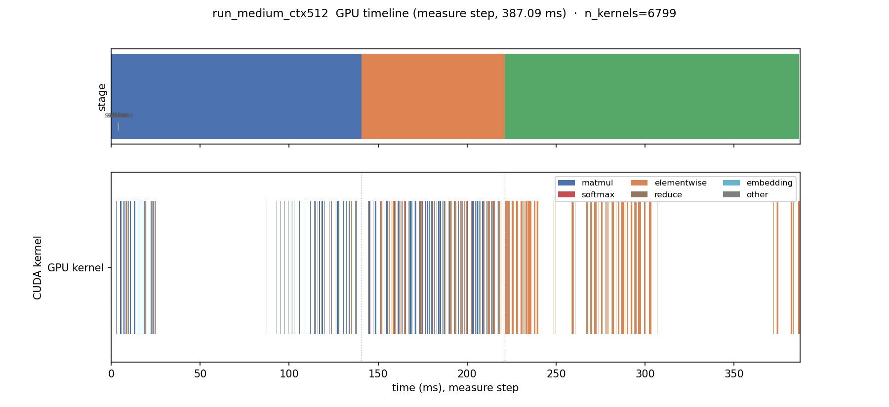
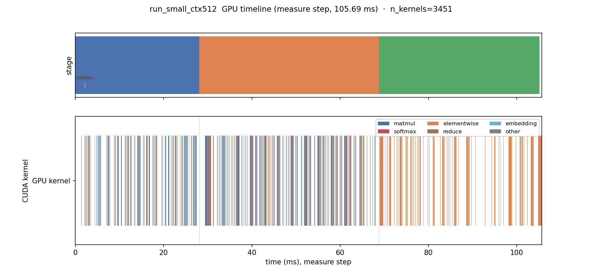
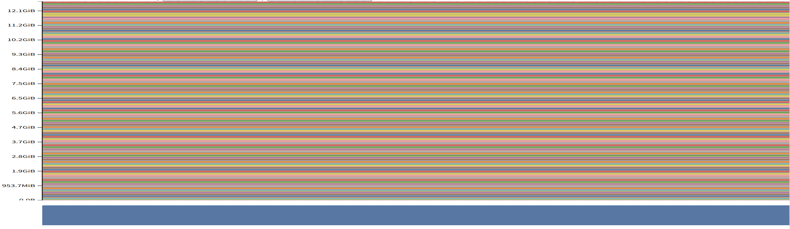
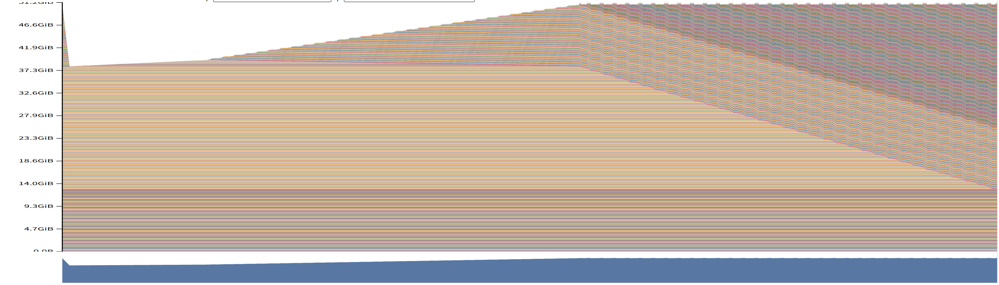
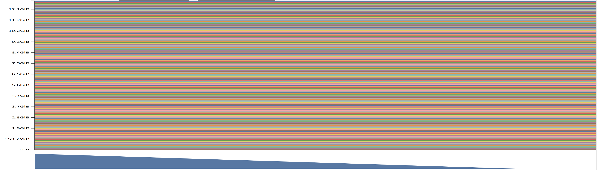
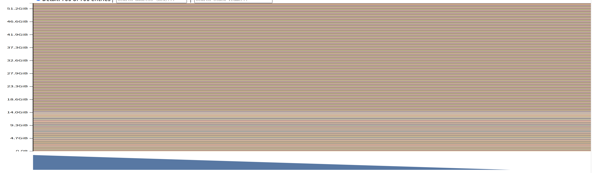
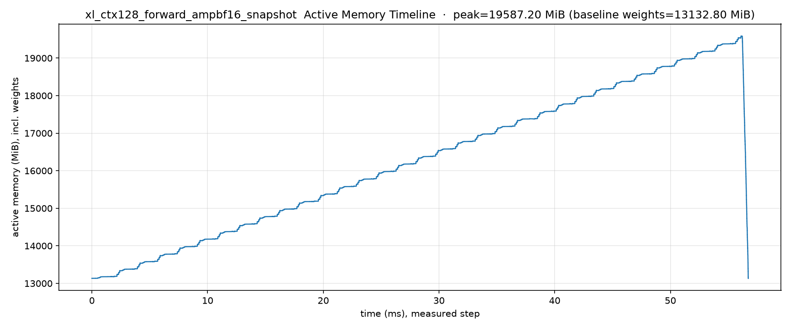
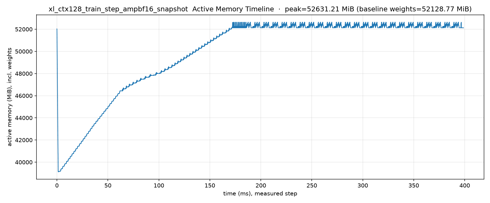

# A2-P 公开提交：马万里

## 基本信息

- 题面版本：`26.1.4-rc.3`。本报告只覆盖 Profiling 子作业，不含 A2-K、activation checkpointing、Triton kernel、DDP、optimizer state sharding 或 FSDP。
- 完成范围：任务一（End-to-End Benchmark）、任务二（Compute Profiling）、任务三（Mixed Precision）、任务四（Memory Profiling）均已执行。
- 未完成项：`xl/ctx2048` 的 fp32 `train_step`。RTX 4090（24 GiB）与 A800（80 GiB）均 OOM；A800 上失败前 `max_memory_allocated` = 77.52 GiB、`max_memory_reserved` = 78.53 GiB，失败阶段为 warm-up，记录见 `results/memory/failures.jsonl`。按题面顺序的回退中，`xl/ctx1024` 已完成（见第 4 节），`Large/ctx2048` 未执行。
- 上游 starter commit：[`ca8bc81a59b70516f7ebb2da4808daade877c736`](https://github.com/stanford-cs336/assignment2-systems/tree/ca8bc81a59b70516f7ebb2da4808daade877c736)
- 工作仓库（本地执行目录）：`../assignment2-systems`

## 环境与工具

| 项目 | 公开、脱敏的信息 |
| --- | --- |
| GPU（任务一、任务二） | NVIDIA GeForce RTX 4090，compute capability 8.9，可用显存约 23.5 GiB |
| GPU（任务四） | forward 配置使用同一台 RTX 4090；`train_step` 在 24 GiB 上放不下，改用 NVIDIA A800-SXM4-80GB（见第 4 节） |
| Driver / CUDA | NVIDIA driver 560.28.03（RTX 4090 节点）/ 580.159.03（A800 节点）；CUDA 12.6 |
| PyTorch / Python | 2.11.0+cu126 / 3.12.14 |
| Compute profiler | NVIDIA Nsight Systems 2023.1.2.43 |
| 运行环境限制 | 节点无 GUI，无法使用 Nsight GUI 与 Perfetto 网页，compute/memory 时间线在节点上用离线脚本（matplotlib）成图；节点无中文字体，图中文字为英文 |

## 1. End-to-End Benchmark

### 复现命令与计时方法

统一入口 `profiling/benchmark.py`，支持 `--model-size`、`--batch-size`、`--context-length`、`--dtype`、`--mode`、`--warmup`、`--steps`、`--seed`、`--output`。三种 mode 的计时边界：

| mode | 内容 | 说明 |
| --- | --- | --- |
| `forward` | `model(input)`，包在 `no_grad` | 不含 loss/backward/optimizer |
| `forward_backward` | forward → `cross_entropy` → `loss.backward()`；每步 `model.zero_grad` | 梯度不跨 step 累积 |
| `train_step` | zero_grad → forward → loss → backward → `optimizer.step()` | 完整训练 step |

计时方法：
- 用 `time.perf_counter()` 计时。
- **每个被测 CUDA step 后调用 `torch.cuda.synchronize()`**；测量循环开始前再显式调用一次 `torch.cuda.synchronize()`，确保上一个 warm-up step 的尾部 kernel 不计入测量。
- 数据生成与模型初始化**不计时**。
- 先跑 `warmup` 步，再对 `steps` 步计时；记录 raw timing、均值、样本标准差与变异系数（CV）。

复现命令（small / batch=4 / context=512 / fp32 基线，**5 warm-up / 10 测量**，train_step 额外对比 warm-up=0）：
```bash
B=profiling/benchmark.py
python $B --model-size small --batch-size 4 --context-length 512 --dtype fp32 --mode forward          --warmup 5 --steps 10 --output results/benchmark.csv
python $B --model-size small --batch-size 4 --context-length 512 --dtype fp32 --mode forward_backward --warmup 5 --steps 10 --output results/benchmark.csv
python $B --model-size small --batch-size 4 --context-length 512 --dtype fp32 --mode train_step       --warmup 5 --steps 10 --output results/benchmark.csv
python $B --model-size small --batch-size 4 --context-length 512 --dtype fp32 --mode train_step       --warmup 0 --steps 10 --output results/benchmark.csv
```

### 结果

来自 `results/benchmark.csv`（small、batch 4、context 512、fp32，每条配置 n=10）：

| mode | warmup | mean (s) | std (s) | CV (%) |
| --- | ---: | ---: | ---: | ---: |
| forward | 5 | 0.023460 | 0.000179 | 0.76 |
| forward_backward | 5 | 0.079043 | 0.000101 | 0.13 |
| train_step | 5 | 0.089029 | 0.000134 | 0.15 |
| train_step | 0 | 0.121089 | 0.101093 | 83.49 |

raw timing 以每步一行写入同一 CSV 的 `time_sec` 列，每条配置 10 行。

### 分析

- **warm-up 前后差异**：warm-up=0 时第一个测量 step 为 0.4088 s，包含 CUDA 上下文初始化、cuDNN 自动调优与首次显存分配等一次性开销，使均值升到 0.121 s、CV 达 83.49%；warm-up=5 时 CV 为 0.15%，说明 5 步预热后分配器与 kernel 选择已进入稳定状态。只预热 1–2 步时，首个测量 step 仍可能带初始化余量，结果偏大。
- **mode 排序**：forward（0.0235 s）< forward_backward（0.0790 s）< train_step（0.0890 s）。backward 约 0.0556 s，为 forward 的 2.4 倍（反传涉及计算量更大的矩阵乘与逐元素运算）；forward 与 backward 合计为 forward 的 3.4 倍；optimizer 额外约 0.0100 s（= train_step − forward_backward），对应 AdamW 的逐元素更新。
- 除 warm-up=0 外，样本标准差均在 0.0001–0.0002 s 之间，测量稳定。

## 2. Compute Profiling

### 六个 `train_step` trace 与命令

选 `small`、`medium` 两个规模 × {256, 512, 1024} 三个 context，共 6 个完整 `train_step` trace，统一使用 Nsight Systems，统一取 batch=1，使六条 trace 的批大小一致。

- 采集与统计范围：`nsys profile`（Nsight Systems 2023.1.2.43）单条 trace 覆盖整个进程，即 5 个 warm-up step 与紧随其后的 1 个测量 step；报告中的 kernel、CUDA API 与 stage 三类数字只统计 NVTX `profile/measure` 区间，即**单个预热后的测量 step**。该区间的边界由 `summarize.py` 从 `.sqlite` 的 NVTX 记录取得，并写入 `run_metadata.json` 的 `measure_window_ns` / `measure_window_us`。
- 阶段标记（NVTX，见 `nvtx_ranges.py` / `profile_one_step.py`）：`profile/warmup`、`profile/measure`、`forward`、`backward`、`optimizer`、`attention/scores`、`attention/softmax`、`attention/value`。
- 复现（六个配置 × batch=1；`profile_one_step.py` 会先调用 `patch_attention()` 挂载 attention 子区间标记）：
```bash
for M in small medium; do for C in 256 512 1024; do
  N=run_${M}_ctx${C}
  nsys profile --output results/profile/${N} --force-overwrite true \
      python profiling/profile_one_step.py --model-size $M --batch-size 1 \
      --context-length $C --dtype fp32 --warmup 5
  rm -f results/profile/${N}.sqlite
  nsys stats --report cuda_gpu_kern_sum,cuda_api_sum --force-export true --format csv \
      results/profile/${N}.nsys-rep > results/profile/${N}_stats.csv
done; done
python profiling/summarize.py     # → results/profile/{trace_summary.csv, run_metadata.json}
```

每个配置的模型规模、context、mode、dtype、batch、工具、命令与本地 trace 文件名见 `results/profile/run_metadata.json`（六条均为 `batch_size=1`、`dtype=fp32`、`tool=nsys`、`status=success`）；同一文件另记录整段 trace 的采集范围（`capture_scope`）、汇总范围（`summary_scope`）与测量步边界（`measure_window_ns`）。

### Kernel、Calls 与时间线

`results/profile/trace_summary.csv` 用 `kind` 列区分五类行，列依次为 `model_size`、`context_length`、`kind`、`name`、`calls`、`cpu_time_us`、`cuda_time_us`、`stage_time_us`、`phase`。每行的统计范围都是该配置的 `profile/measure` 区间：kernel 与 CUDA API 行由 `summarize.py` 按 NVTX 边界从 `.sqlite` 过滤后聚合，stage 行取同一区间内的 NVTX 区间。`nsys stats` 导出的 `*_stats.csv` 覆盖整段 trace，保留在本地作为原始证据，不用于本表。

- `kind=kernel` / `kind=kernel_total`：测量步内 GPU kernel 的 Calls 与累计 GPU 时间，写在 `cuda_time_us`（前者每配置 top5，只含 kernel，不混入 CUDA API 项）；
- `kind=stage`：NVTX 阶段区间（`profile/measure`、`forward`/`backward`/`optimizer`，以及 `attention/scores|softmax|value`）的 Calls 与主机侧区间时长。NVTX 记录的是主机线程上的区间，因此时长写在 `stage_time_us`，不写入 `cuda_time_us`；
- `kind=cpu_api` / `kind=cpu_api_total`：测量步内 CUDA runtime API 的 Calls 与累计 CPU 时间。

| 配置 | 测量步内 top kernel（Calls / 累计 CUDA 时间，phase） |
| --- | --- |
| small/ctx256 | vectorized_elementwise(AUnaryFunctor)(716×4.42ms, elementwise) · vectorized_elementwise(CUDAFunctor_add)(663×2.81ms, elementwise) · elementwise(157×1.99ms, elementwise) · ampere_sgemm_128x64_tn(37×1.58ms, matmul) · cutlass_Kernel2(36×1.48ms, matmul) |
| small/ctx512 | vectorized_elementwise(AUnaryFunctor)(716×4.39ms, elementwise) · ampere_sgemm_64x64_nn(73×4.06ms, matmul) · vectorized_elementwise(CUDAFunctor_add)(663×3.03ms, elementwise) · cutlass_Kernel2(37×2.83ms, matmul) · ampere_sgemm_64x64_tn(60×2.80ms, matmul) |
| small/ctx1024 | ampere_sgemm_128x64_tn(85×7.15ms, matmul) · cutlass_Kernel2(37×5.27ms, matmul) · ampere_sgemm_128x64_nn(72×4.97ms, matmul) · vectorized_elementwise(AUnaryFunctor)(716×4.43ms, elementwise) · vectorized_elementwise(BinaryFunctor)(184×3.51ms, elementwise) |
| medium/ctx256 | vectorized_elementwise(AUnaryFunctor)(1412×14.52ms, elementwise) · vectorized_elementwise(CUDAFunctor_add)(1311×8.48ms, elementwise) · elementwise(313×6.33ms, elementwise) · ampere_sgemm_128x64_tn(169×6.19ms, matmul) · ampere_sgemm_32x32_sliced1x4_nn(144×5.83ms, matmul) |
| medium/ctx512 | vectorized_elementwise(AUnaryFunctor)(1412×14.54ms, elementwise) · ampere_sgemm_128x64_tn(73×9.15ms, matmul) · vectorized_elementwise(CUDAFunctor_add)(1311×8.95ms, elementwise) · ampere_sgemm_128x64_nn(73×8.89ms, matmul) · elementwise(313×6.40ms, elementwise) |
| medium/ctx1024 | ampere_sgemm_128x64_tn(169×22.71ms, matmul) · vectorized_elementwise(AUnaryFunctor)(1412×14.87ms, elementwise) · cutlass_Kernel2(73×13.57ms, matmul) · cutlass_Kernel2(73×10.76ms, matmul) · vectorized_elementwise(BinaryFunctor)(364×10.05ms, elementwise) |

CPU 侧（`kind=cpu_api_total`，测量步内 CUDA runtime API 累计 CPU 时间）：small/ctx256 22.2 ms、small/ctx512 21.2 ms、small/ctx1024 91.2 ms、medium/ctx256 46.1 ms、medium/ctx512 50.0 ms、medium/ctx1024 76.4 ms。small/ctx1024 与 medium/ctx1024 偏高：这两个测量步内各发生一次 `cudaMalloc`（66.2 ms / 30.3 ms，见 `kind=cpu_api` 行），即该步仍触发了显存池扩容，预热没有覆盖到全部 allocation。

代表配置（medium、context 512、batch 1）的 GPU timeline 见下图，测量步共 387.09 ms、6799 个 kernel：



各阶段耗时（来源：`results/profile/trace_summary.csv` 的 `kind=stage` 行，时长列 `stage_time_us`）：

| 阶段 | Calls | 耗时 (ms) | 占比 |
| --- | ---: | ---: | ---: |
| profile/measure（整步） | 1 | 387.09 | 100% |
| forward | 1 | 140.73 | 36.4% |
| backward | 1 | 80.39 | 20.8% |
| optimizer | 1 | 165.26 | 42.7% |
| attention/scores | 24 | 7.26 | — |
| attention/softmax | 24 | 0.94 | — |
| attention/value | 24 | 3.32 | — |

上表是主机侧区间时长，受 nsys 采样与 host-bound 执行影响：同一测量步内 GPU kernel 累计时间为 87.82 ms（`kind=kernel_total`，6799 个 kernel）。因此该表用于说明同一 trace 内的阶段分布，不与 `benchmark.py` 的计时或其它配置的 wall time 直接比较。

**阶段标记的实现方式**：`attention/scores|softmax|value` 来自 `nvtx_ranges.py` 的 `annotated_sdpa`，它在建模前替换 `cs336_basics.model.scaled_dot_product_attention`。starter 的实现同样是 `einsum` 与 softmax，patch 版只额外包裹 NVTX 区间，差别是用 `torch.softmax` 代替了 starter 的 `cs336_basics.nn_utils.softmax`，因此 `attention/softmax` 子区间反映的是前者的 kernel。六条 trace 使用同一 patch，配置之间可比；attention 子区间的绝对时长仍受主机侧口径影响，这里只用于比较 scores、softmax、value 三者的相对量级。

测量步内的 kernel 家族计数（medium/ctx512）：elementwise 5849、matmul 578、other 171、reduce 152、softmax 48、embedding 1。

小模型代表配置（small、context 512、batch 1）的 timeline 见下图：测量步 105.69 ms、3451 个 kernel，阶段时长为 forward 28.09 ms、backward 40.67 ms、optimizer 36.39 ms；kernel 家族计数为 elementwise 2969、matmul 290、reduce 80、softmax 24、other 87、embedding 1，同样以 elementwise 为主。



### 工具能力

`nsys profile` 采集系统级轨迹，`nsys stats --report cuda_gpu_kern_sum,cuda_api_sum` 给出 GPU kernel 汇总与 CUDA runtime API 汇总，可以把 CPU 侧的 `cudaLaunchKernel`、`cudaMemcpyAsync` 等调用与 GPU kernel 关联；NVTX 区间用于区分 warm-up 与测量 step，并划出 `forward`/`backward`/`optimizer` 与 `attention/*` 子区间。本报告的 kernel、CUDA API 与 stage 三类数字均由 `summarize.py` 从 `.sqlite` 按测量步边界聚合，`kind` 取值为 `kernel`、`kernel_total`、`stage`、`cpu_api`、`cpu_api_total`。

### 关键结论（对应 PDF §2.1.4 的 (a)–(e)）

- (a) `benchmark.py` 只实测了 small/ctx512（forward 0.0235 s，见第 1 节），未测 medium/ctx512；profiler 中 medium/ctx512 的 forward 阶段主机侧时长为 140.73 ms。两者计时口径不同，因此不作数值对比，profiler 数据仅用于阶段归因。
- (b) 测量步内累计 GPU 时间最高的 kernel：ctx=256/512 是 **elementwise**（SiLU、LayerNorm、cast 等），context 增大到 1024 时 **matmul(sgemm)** 反超成为最高（small/ctx1024 7.15 ms、medium/ctx1024 22.71 ms）；而 matmul 的**调用次数**始终远少于 elementwise。
- (c) 除矩阵乘外，elementwise 与 reduce（LayerNorm、softmax 的 max/sum、激活、cast、梯度）以及 AdamW 的逐元素更新占用可观 CUDA 时间——optimizer 区间几乎全是 elementwise。
- (d) 完整训练 step 中 matmul 占比相对纯推理（forward）下降，elementwise 与 optimizer 占比上升。
- (e) 同一测量步内用 `attention/*` 子区间对比：scores（7.26 ms）与 value（3.32 ms）远大于 softmax（0.94 ms），与三者 FLOPs 量级和访存特征的差异方向一致——softmax 访存受限，矩阵乘计算密集。

## 3. Mixed Precision

### 四种累加实验

对同一求和 `Σ 0.01 × 1000 = 10.0`，四种写法（`profiling/mixed_precision.py --run accumulation`）：

| 写法 | 结果 | 误差 | 说明 |
| --- | ---: | ---: | --- |
| fp32 累加器 + fp32 加数 | 10.0001335 | +0.000134 | 基准，几乎精确 |
| **fp16 累加器 + fp16 加数** | **9.953125** | **-0.046875** | 累加器低精度，误差最大 |
| fp32 累加器 + fp16 加数 | 10.0021362 | +0.002136 | 输入量化 |
| fp32 累加器 + cast(fp16→fp32) 加数 | 10.0021362 | +0.002136 | 与上一行同值 |

**两类误差来源**：
- **累加器精度**占主导：fp16 累加器每次加法都要把结果舍入回 fp16，误差逐步累积，最终比真值少 0.046875（约 -0.47%）；fp32 累加器几乎不受累加过程影响。
- **输入量化**是次要的：0.01 用 fp16 表示为 0.0100021362，单次偏差 +2.14×10⁻⁶，1000 次累加后在 fp32 累加器上表现为 +0.0021362；第 3、4 段等价（PyTorch 会把 fp16 加数提升到 fp32 再相加）。

结论：**应在 fp32 下完成累加与 reduction**，即使参与运算的加数被降精度；否则低精度累加器带来的误差远大于输入量化。这一结论对应训练中的 softmax、LayerNorm 与 loss reduction：累加器与 reduction 保持 fp32，输入可以来自低精度算子。

### FP32 与 BF16 autocast

`ToyModel`（fc1 → ReLU → LayerNorm → fc2）由 `profiling/mixed_precision.py --run all` 在 GPU 上运行，数据在 `results/mixed_precision.json`。计时与 dtype 记录都在 `torch.autocast(device_type="cuda", dtype=torch.bfloat16)` 内完成，并在相同 batch、warm-up 与 steps 下对比 FP32 与 BF16 autocast 的 forward+backward 时间、峰值显存与数值趋势。

**组件 dtype（实测）**：

| 组件 | FP16 autocast | BF16 autocast |
| --- | --- | --- |
| 参数 (`fc1.weight`) | fp32 | fp32 |
| `fc1` 输出 | fp16 | bf16 |
| ReLU 输出 | fp16 | bf16 |
| LayerNorm 输出 | **fp32** | **fp32** |
| logits | fp16 | bf16 |
| loss | fp32 | fp32 |
| 梯度 (fc1/ln/fc2) | **fp32** | **fp32** |

要点：参数不被 autocast 改变（保持 fp32）；`Linear`（matmul）被降到 autocast dtype 以使用 Tensor Core；ReLU 跟随输入；**LayerNorm 保持 fp32**，因为归一化与 reduction 需要 fp32 的动态范围；loss 与**梯度均为 fp32**（autocast 的反向安全策略）。换成 BF16 后 LayerNorm 依旧保持 fp32：BF16 的指数字段与 fp32 相同，动态范围不缩小（不像 FP16 容易溢出或下溢），但尾数仍为 8 位，归一化与累积仍宜在 fp32 中完成。

**FP32 vs BF16（batch=32、warmup=5、steps=10）**：

| 项 | FP32 | BF16 autocast |
| --- | --- | --- |
| 平均时间 (ms) | **1.202** (±0.042) | **1.508** (±0.049) |
| 峰值显存 (MiB) | 16.28 | 16.29 |
| loss | 1.9449 | 1.9456 |
| logits 平均绝对值 | 0.4703 | 0.4707 |

趋势：在这个小模型上 BF16 反而更慢（1.202 ms 对 1.508 ms），显存几乎不变（16.28 MiB 对 16.29 MiB）——ToyModel 的矩阵乘规模太小，用不到 Tensor Core，autocast 还引入类型转换与 kernel 启动开销；数值上 BF16 与 FP32 很接近（无溢出、无 NaN）。**混合精度的时间收益取决于矩阵乘规模**，规模小时启动与转换开销会占主导。

## 4. Memory Profiling

### 配置、峰值与 fallback

测量矩阵为 XL（batch=1）的下列配置，全部由 `profiling/memory_profiler.py` 完成：初始化与 warm-up 之后开启 `torch.cuda.memory._record_memory_history`，测量步结束后 `_dump_snapshot`。

- fp32 的 forward 与 train_step：context {128, 1024, 2048}；
- 混合精度（`--dtype fp32 --amp bf16`：参数保持 fp32，forward 与 loss 在 `torch.autocast(bf16)` 下执行）的 forward 与 train_step：context {128, 1024}；
- 纯 BF16（`--dtype bf16`：参数、梯度与优化器状态均为 bf16）的 forward 与 train_step：context {128, 1024}。

峰值口径（`results/memory/peaks.csv` 的列）：
- `peak_active_mib` = `torch.cuda.max_memory_allocated()`：PyTorch 口径的**在用（active）峰值**，包含在开启 memory history 之前就已存活的权重与优化器 allocation；
- `peak_reserved_mib` = `torch.cuda.max_memory_reserved()`：**预留（reserved）峰值**，按定义不小于 active；
- `traced_delta_mib` = 仅由开启 history 之后的 alloc/free 事件重建的**增量**（不含权重），只作诊断，**不代表在用显存**。

失败配置（含阶段、异常类型与失败前峰值）见 `results/memory/failures.jsonl`。

峰值表（GiB，`peak_active_mib` = PyTorch `max_memory_allocated`）：

| 配置 | fp32 forward | fp32 train_step | mixed(autocast bf16) forward | mixed train_step | **pure BF16** forward | **pure BF16** train_step |
| --- | ---: | ---: | ---: | ---: | ---: | ---: |
| xl/128 | 12.85 | **51.40** | 19.13 | 51.40 | **6.36** | **25.65** |
| xl/1024 | 13.38 | **56.36** | 19.35 | 57.01 | **6.63** | **28.76** |
| xl/2048 | 14.95 | OOM（>80） | — | — | — | — |

`xl/2048` 的 fp32 train_step 是唯一失败配置：失败前 `max_memory_allocated` = 79 376.49 MiB（77.52 GiB）、`max_memory_reserved` = 80 414 MiB（78.53 GiB）。

三种精度口径：
- **fp32**：基线。
- **混合精度（autocast bf16）**：参数保持 fp32，`torch.autocast(bf16)` 把 matmul 等算子降到 bf16；实测峰值不降，forward 反而升高。
- **纯 BF16**：`model.to(torch.bfloat16)` 后参数、梯度与优化器状态均为 bf16，峰值约为 fp32 的一半（forward 12.85→6.36 GiB、train_step 51.40→25.65 GiB）。

residual stream 理论大小：1.25 / 10 / 20 MiB（context 128 / 1024 / 2048，= batch × seq × d_model × 4，d_model = 2560）。

**OOM 记录**：train_step 全部在 A800（80 GiB）上执行，因为该模式需要权重、梯度与两份 AdamW 动量，实测峰值即 51.40 GiB（xl/128），超过 RTX 4090 的 23.5 GiB 可用显存。`xl/2048` 的 fp32 train_step 在 80 GiB 上仍然 OOM（失败前 `max_memory_allocated` 77.52 GiB、reserved 78.53 GiB），`failures.jsonl` 记录 `stage=warmup`、`torch.OutOfMemoryError`。混合精度（autocast bf16）只测到 context 1024，未扩展到 2048。

### Timeline、allocation 与 residual/gradient

- **Active / Reserved 时间线（PyTorch memory_viz，官方工具，截图已裁剪）**：
  - forward（在用 active）：峰值约等于权重基线 12.85 GiB 加激活增量 21 MiB。

    
  - full train_step（在用 active）：峰值 **51.40 GiB**，出现在反向与优化器阶段（权重、梯度与两份 AdamW 动量）。

    
  - reserved（Cached Segment）：forward 约 12.86 GiB、train_step 约 53.23 GiB，与 `peaks.csv` 的 `peak_reserved_mib` 对应（13 168 MiB / 54 508 MiB）。

    
    
- **口径**：报告峰值一律使用 `peak_active_mib` 与 `peak_reserved_mib`。`peak_active_mib` 取自 PyTorch `max_memory_allocated()`，包含开启 history 之前已存活的权重与优化器状态；`peak_reserved_mib` 取自 `max_memory_reserved()`，是预留池口径，按定义不小于 active；`traced_delta_mib` 只是开启 history 之后的分配增量，不含权重，不等于在用显存。memory_viz 的 "Active" 视图包含 private pools，与 `torch.cuda.memory_allocated()` 的口径不完全相同，因此这里只把时间线用于解释形状与阶段，数值一律以 `peaks.csv` 为准。
- **最大 allocation**：由 `plot_memory_timeline.py` 的 top allocation 输出得到（`python profiling/plot_memory_timeline.py --tag TAG`）：xl/128 forward 单次 5 MiB、xl/1024 forward 128 MiB、xl/2048 forward 512 MiB，来源是前向激活与梯度。该脚本的 Python 栈只能归到最外层脚本，无法逐层归因，这是已知限制。
- **residual 与 gradient**：单层 residual stream 张量为 `[batch, seq, d_model] × 4 B`（XL 的 d_model = 2560）：context 128 为 1.25 MiB、1024 为 10 MiB、2048 为 20 MiB。train_step 需要为每层保存该 residual 供反向使用，反向再产生同量级的**梯度**；XL 共 32 层，残差流合计约 32 × [seq, d_model]。结合 train_step ≈ 权重 + 梯度 + 2 × AdamW 动量 + 激活 ≈ 4 × 权重，可以解释 train_step 峰值远高于 forward（xl/128 实测 51.40 GiB ≈ 12.85 × 4）。
- **任务四 (c) 混合精度**：`torch.autocast(bf16)` 下 forward 峰值升高（xl/128 12.85→19.13 GiB、xl/1024 13.38→19.35 GiB），train_step 基本持平（51.40→51.40 GiB、56.36→57.01 GiB）。原因：参数仍为 fp32，autocast 需要缓存 bf16 权重副本（约 +6.4 GiB），而 train_step 的峰值由 fp32 的权重、梯度与优化器状态主导。因此在这组设定下，混合精度对峰值显存没有明显收益。

  

  

  上面两张图由 `profiling/plot_memory_timeline.py` 用 snapshot 的 alloc/free 事件离线绘制（同样是 active 口径，并以 segments 的 active_size 作为权重基线），与前两张 memory_viz 截图分属不同工具。
- **纯 BF16 的对比**：把模型整体转为 BF16（`model.to(torch.bfloat16)`）时，峰值约为 fp32 的一半（forward 12.85→6.36 GiB、train_step 51.40→25.65 GiB），因为权重、梯度与优化器状态都是 bf16。

## 5. 限制与复现

代码同步命令：`python3 scripts/sync_a2p_submission.py --name '马万里'`

轻量结果目录 `results/`：`benchmark.csv`、`profile/{trace_summary.csv, run_metadata.json}`、`mixed_precision.json`、`memory/{peaks.csv, run_metadata.json, failures.jsonl}`。`.nsys-rep`、`.sqlite`、`.qdstrm` 与 memory snapshot（`*.pickle`）等大型原始文件保留在本地工作仓库的 `results/profile/` 与 `results/memory/snapshots/`。

已知限制：
- 任务二：六条 trace 统一为 batch=1、同一张 RTX 4090；未采集 batch=4 的 trace。
- 任务四：train_step 在 A800（80 GiB）上完成；`xl/2048` 的 fp32 train_step 在 80 GiB 上仍 OOM，未按 `Large/context=2048` 继续回退。
- 阶段（stage）时长是主机侧区间，不适合跨配置比较；跨配置比较以 GPU kernel 累计时间为准（见第 2 节）。
- memory 时间线在无 GUI 节点上用离线工具成图，图表文字为英文。

最小复现步骤：
- 任务一：第 1 节的四条 `python profiling/benchmark.py ...` 命令；
- 任务二：第 2 节的 `nsys profile` / `nsys stats` 循环，随后运行 `python profiling/summarize.py`（按 `profile/measure` 边界从 `.sqlite` 聚合得到汇总）；出图 `python profiling/plot_nsys_timeline.py --name run_medium_ctx512 --out assets/medium512_timeline.png`；
- 任务三：`python profiling/mixed_precision.py --run all`；
- 任务四（在 A800 上执行）：对每个配置运行
  `python profiling/memory_profiler.py --model-size xl --context-length C --batch-size 1 --dtype fp32 [--amp bf16] --mode {forward,train_step} --warmup 3 --tag TAG`（C 取 128 / 1024 / 2048，TAG 自定），
  然后运行 `python profiling/memory_profiler.py --finalize`，出图 `python profiling/plot_memory_timeline.py --tag TAG --out results/figures/TAG_mem.png`；memory_viz 用的 snapshot 位于 `results/memory/snapshots/`。

## 飞书补充文档

https://fudan-nlp.feishu.cn/wiki/Won8wo5rriiyS3kQBlzcWxw2nvd

## 提交范围与附件

- `README.md` 为主报告（Markdown）；所有图片使用相对路径，且都被本报告引用。
- 附件为 `results/` 与 `assets/`，合计 1 195 485 字节（1.14 MiB），低于 2 MiB 上限。
- 大型 profiler 原始文件与 memory snapshot 保留在本地工作仓库，不在提交范围内。
- 飞书补充文档为组织内可见，未开启互联网公开访问。
