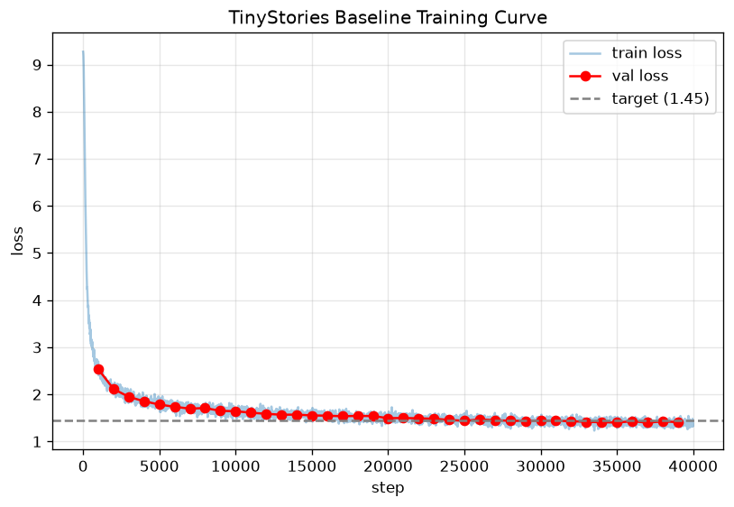
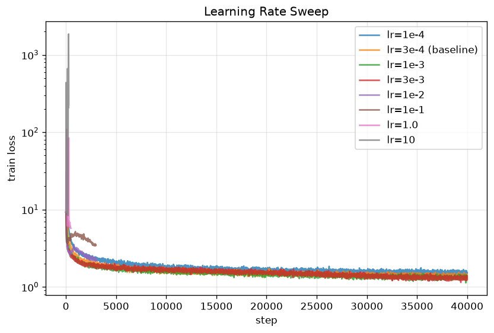
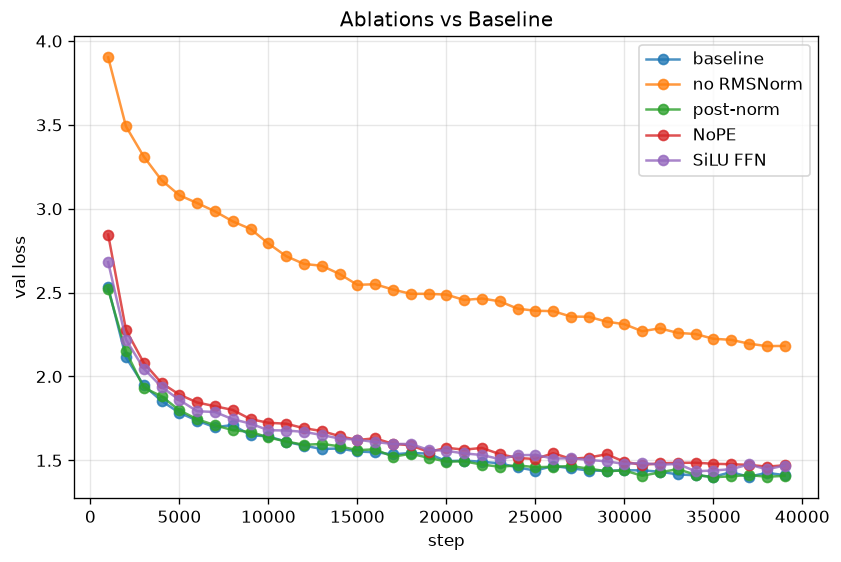

# A1 公开提交：龚天时

> 本文件和同目录代码公开可见。只提交允许公开且已经脱敏的内容；组织内材料放在下方
> 登记的飞书补充文档中，密钥和访问凭据不进入任何提交材料。

> 评分标准与评测方式见 [`assignments/A1/EVALUATION.md`](../../../assignments/A1/EVALUATION.md)；日志格式见 [`assignments/A1/README.md` 的《实验日志格式》](../../../assignments/A1/README.md#实验日志格式)。
> 本模板固定报告、代码、脚本、日志和图表的提交位置；各部分照下方占位填写即可。

## 基本信息

- 作业题面版本：26.0.4
- 完成范围：BPE tokenizer、Transformer LM 全部模块、训练组件（cross-entropy、AdamW、cosine schedule、gradient clipping）、data loader、checkpoint、训练脚本、自回归生成；TinyStories 与 OWT 训练、学习率扫、batch size 扫、四个架构消融、文本生成实验；全部书面题。
- 未完成项：无
- 上游 starter commit：`a158843b20107949f1a8d7df1b05cd33b9166712`
- 本地工作仓库：`../assignment1-basics`（必须与 `SummerQuest-2026` 同级）

## Markdown 报告

### 1. 书面题

#### unicode1

**(a)** `chr(0)` returns `'\x00'`

**(b)** `repr(chr(0))` shows `'\x00'` while printed representation is null

**(c)** When this character occur in text, it will take one charater position, but when print the text, this character won't appear.

#### unicode2

**(a)** UTF-8 is preferred because it often produce shorter byte sequences, which can lead to fewer tokenizer input units, and therefore lower the cost.

**(b)** "牛" will cause error becuase some characters are represented by multi byte sequences. They must be decoded together.

**(c)** `b"\xC3\x28"`. This is invalid UTF-8 because `0xC3` must be followed by a continuation byte in the range `0x80–0xBF`, but `0x28` is not one.

#### tokenizer_experiment

**(a)** Based on full valid dataset sample, the compression ratio of TinyStories is 4.12 bytes/token. On dataset OWT, the compression ratio is 4.37 bytes/token. 10 documents sample has close result. OWT has higher ratio because it has larger vocab size, which means it can compress longer sequences into single token. Therefore, it has higher compression ratio.

**(b)** When using TinyStories tokenizer tokenize OWT, the compression ratio decreases to 3.17 from 4.37. It is because TinyStories's smaller vocab comes from child stories and lack common words, phrases, terms on Websites. Therefore, it has to break them into more tokens. Therefore, compression ratio decrease.

**(c)** OWT train is 3694247 bytes/sec ≈ 3.7 MB/s.
825 GB = 825 × 1024³ ≈ 8.86 × 10¹¹ bytes
time = 8.86e11 / 3.69e6 ≈ 240,000 s ≈ 66.7 hours

**(d)** unit16 is the smallest types that can fits both vocab size. Every token takes only 2 bytes. Compare to default int64, it can save 4 times save space and memory.

#### transformer_accounting

**(a)** trainable parameters = embedding + num_layers × (attention + FFN + 2rmsnorm) + final_norm + lm_head
= 50257 × 1600 + 48 × (4 × 1600² + 3 × 1600 × 4288 + 2 × 1600) + 1600 + 1600 × 50257
= 1,640,452,800
memory = 4 × 1,640,452,800 / (1024³) = 6.11 GB

**(b)**

| Matrix multiply | Shape | FLOPs |
|---|---|---|
| Q proj | `(T, d_model) @ (d_model, d_model)` | 2·T·d_model² |
| K proj | same as above | 2·T·d_model² |
| V proj | same as above | 2·T·d_model² |
| Q·Kᵀ | `(T, d_model) @ (d_model, T)` | 2·T²·d_model |
| scores·V | `(T, T) @ (T, d_model)` | 2·T²·d_model |
| O proj | `(T, d_model) @ (d_model, d_model)` | 2·T·d_model² |
| FFN w1 | `(T, d_model) @ (d_model, d_ff)` | 2·T·d_model·d_ff |
| FFN w3 | same as above | 2·T·d_model·d_ff |
| FFN w2 | `(T, d_ff) @ (d_ff, d_model)` | 2·T·d_ff·d_model |

× num_layers

| Matrix multiply | Shape | FLOPs |
|---|---|---|
| LM head | `(T, d_model) @ (d_model, vocab)` | 2·T·d_model·vocab |
total flops = num_layers × sum + LM head = 3,516,769,894,400

**(c)** FFN requires most FLOPS, nearly 57.5%. It is because SwiGLU has three large matrix w1 w2 w3. The matrix multiplication among these matrices requries a large amount of FLOPs

**(d)**

| components | small | medium | large | XL |
|---|---|---|---|---|
| Attn proj | 16.6% | 20.0% | 21.4% | 28.6% |
| Attn T² | 11.1% | 10.0% | 8.6% | 9.2% |
| FFN | 49.8% | 59.9% | 64.2% | 57.5% |
| LM head | 22.6% | 10.2% | 5.8% | 4.7% |
| 总 FLOPs | 0.35T | 1.03T | 2.26T | 3.52T |

Since vocab size is fixed, as model size increase, FFN and attention projection part takes control, LM head proportion decrese fast.

**(e)** Increasing the context length from 1,024 to 16,384 (16×) raises the total FLOPs for one forward pass to ≈133.6 TFLOPs (≈38×). The linear terms (Q/K/V/O projections, FFN, LM head) scale linearly with T and thus grow 16×, whereas the attention operations QKᵀ and scores·V contain a T² term and grow 256×. As a result, attention's share of total FLOPs jumps from 9.2% to 61.7%, becoming the dominant cost—demonstrating that attention's quadratic complexity in sequence length is the primary computational bottleneck at long context.

#### learning rate tuning

With lr=10, the loss decreases steadily but slowly (still at ~3.1 after 10 steps). With lr=100, it converges rapidly to near-zero (≈1e-16) within a few steps. With lr=1000, the loss diverges, growing by several orders of magnitude each step toward infinity—the update step overshoots the minimum and amplifies each iteration.

#### adamw_accounting

**(a)** `B` = batch_size, `L` = context_length, `d` = d_model, `h` = num_heads, `n` = num_layers, `V` = vocab_size, with `d_ff = (8/3)·d`. All tensors are float32 (4 bytes each).

**Parameter count** `P`:
P = V·d                          (token embedding)

n·(4d² + 8d² + 2d)           (per layer: attn Q/K/V/O = 4d²; FFN = 3d·d_ff = 8d²; 2 RMSNorm = 2d)
d                            (final RMSNorm)
d·V                          (lm_head)
= 2Vd + n·(12d² + 2d) + d

**1. Parameters:** `4P` bytes

**2. Gradients:** one gradient per parameter, same shape → `4P` bytes

**3. Optimizer state:** AdamW stores `m` and `v` per parameter → `2P` params → `8P` bytes

**4. Activations** (elements, ×4 bytes for memory):

Per Transformer block:

| Component | Shape | Elements |
|---|---|---|
| 2× RMSNorm | (B, L, d) | 2BLd |
| Q, K, V projections | (B, L, d) | 3BLd |
| QKᵀ | (B, h, L, L) | BhL² |
| softmax | (B, h, L, L) | BhL² |
| weighted sum (scores·V) | (B, L, d) | BLd |
| output projection | (B, L, d) | BLd |
| FFN W1 output | (B, L, d_ff) | BL·d_ff |
| FFN W3 output (gate) | (B, L, d_ff) | BL·d_ff |
| SiLU output | (B, L, d_ff) | BL·d_ff |
| element-wise product | (B, L, d_ff) | BL·d_ff |
| FFN W2 output | (B, L, d) | BLd |

Per-layer subtotal (using `d_ff = 8/3·d`):
8BLd + 4BL·d_ff + 2BhL²
= 8BLd + (32/3)BLd + 2BhL²
= (56/3)·BLd + 2BhL²

Outside the blocks:

| Component | Shape | Elements |
|---|---|---|
| final RMSNorm | (B, L, d) | BLd |
| output embedding (logits) | (B, L, V) | BLV |
| cross-entropy | (B, L, V) | BLV |

Total activation elements:
A = n·((56/3)·BLd + 2BhL²) + BLd + 2BLV

Activation memory = `4A` bytes.

**Total peak memory:**
Total = 4·(P + P + 2P) + 4A
= 16P + 4A
= 16P + 4·[ n·((56/3)·BLd + 2BhL²) + BLd + 2BLV ] bytes

**(b)**

memory = 16,373,391,360 · B + 26,247,244,800 = 15.25·B + 24.44  (GB)

15.25·B + 24.44 ≤ 80

B ≤ (80 - 24.44) / 15.25 = 3.64 → max batch size = 3

**(c)**

Forward-pass FLOPs (matrix multiplies):
F_fwd = B·[ n·(2·4·L·d² + 2·2·L²·d + 2·3·L·d·d_ff) + 2·L·d·V ]
= B·[ n·(8Ld² + 4L²d + 6Ld·d_ff) + 2LdV ]

One AdamW step = forward + backward + optimizer update:
F_step = F_fwd + F_bwd + F_opt
= F_fwd + 2·F_fwd + O(P)
≈ 3·F_fwd

**Justification:** The backward pass costs twice the forward pass, so forward + backward = 3·F_fwd. The AdamW parameter update touches each of the P parameters a constant number of times, costing O(P) FLOPs—negligible compared to the forward pass, which scales with the much larger L·d² and L²·d terms.

**(d)**

Effective compute = 495 TFLOP/s × 50% MFU = 247.5 TFLOP/s \
Per step = 3 × 3.52T × 1024 (batch) = 10.80 PFLOPs \
Total = 10.80 PFLOPs × 400,000 = 4.32 × 10²¹ FLOPs \
Time = 4.32e21 / 247.5e12 ≈ 17,460,230 s ≈ **4,850 hours ≈ 202 days**

### 2. Tokenizer 实验

在 TinyStories 上训练 10K 词表、OWT 上训练 32K 词表的 BPE tokenizer。

**压缩率（bytes/token）：**

| Tokenizer | 数据集 | 压缩率 |
|---|---|---|
| TinyStories (10K) | TinyStories | 4.12 |
| OWT (32K) | OpenWebText | 4.37 |
| TinyStories (10K) | OpenWebText（跨域） | 3.17 |

更大词表（OWT 32K）压缩率更高。将 TinyStories tokenizer 用于 OWT 时压缩率下降约 27%（4.12 → 3.17），因为简单儿童故事词表无法很好覆盖真实网页文本。

**吞吐量**：编码约 3.7 MB/s（引入记忆化缓存后重复文本可显著加速）；按此速率编码 The Pile（825 GB）约需 67 小时。

**最长 token**：

- TinyStories (10K)：`b' accomplishment'`（15 bytes），一个带前导空格的完整常见词。
- OWT (32K)：`b'\xc3\x83\xc3\x82...'`（64 bytes，`ÃÂ` 重复 16 次），一段编码错乱序列。

**观察**：TinyStories 是干净的 GPT-4 生成文本，最长 token 是有意义的常见词（BPE 把高频的"空格+词"合并成单 token，符合预期）。OWT 是真实爬取的网页文本，最长 token 却是重复的 `ÃÂ` 乱码——这是双重 UTF-8 编码错误在网页数据中反复出现，被 BPE 忠实地合并成一个超长 token。这说明 tokenizer 会把训练数据中的编码噪声也学进词表；更大的词表（32K）和更"脏"的数据放大了这一现象。
### 3. TinyStories 训练

**Baseline 配置**：vocab 10,000 / context 256 / d_model 512 / d_ff 1,344 / layers 4 / heads 16 / RoPE θ 10,000 / batch 32 / total steps 40,000（total tokens = 327,680,000）/ max lr 3e-4 / min lr 3e-5 / warmup 800 / weight decay 0.1。模型参数量 **22,696,448**（约 17M 非嵌入参数）。

**结果**：最终 val loss = **1.381**，低于目标 1.45，达标。单次训练约 16.5 分钟（1× RTX 4090 / H200）。

训练曲线呈典型的"快速下降 → 平缓收敛"，train/val loss 贴合，无过拟合，val loss 稳定穿过目标线 1.45。

### 4. 超参数扫描

所有扫描保持 total tokens = 3.28 亿不变，每次只改一个变量。

**4.1 学习率扫描（含发散 run）：**

| lr | final val loss | 行为 |
|---|---|---|
| 1e-4 | 1.550 | 太小，欠拟合 |
| 3e-4 (baseline) | 1.381 | 良好 |
| 1e-3 | 1.327 | 最优 |
| 3e-3 | 1.316 | 也很好 |
| 1e-1 | 3.471 | 退化（AdamW 自适应步长容错高，仅缓慢变差，未爆炸） |
| 1.0 | 5.72 | 剧烈震荡，峰值破百（step 70 达 109），但 cosine 后期降 lr 将其拉回 |
| 10 | 938.97 | 真正发散：loss 爆升至 1862，val loss 持续恶化（14→106→238→938），无法收敛 |

发散分析：AdamW 的自适应步长使其对学习率容错很高——lr=1e-1 仅退化；lr=1.0 剧烈震荡但被 cosine schedule 降 lr 救回；lr=10（min_lr=max_lr，全程保持大 lr）则彻底发散，loss 持续恶化。

**4.2 Batch Size 扫描（token 总量恒定）：**

| batch | steps | final val loss |
|---|---|---|
| 1 | 10000 | 2.52 |
| 32 | 40000 | 1.381 |
| 64 | 20000 | 1.438 |
| 128 | 10000 | 1.507 |

显存上限：可上网GPU资源上，batch=256 可运行，batch=512 触发 CUDA OOM（cross_entropy 处需额外 4.88GB 时显存不足），可用上限约为 256。

分析：batch=1 梯度噪声最大、收敛最差（2.52）；token 预算恒定时，小 batch（更多更新步）收敛更优。上限由激活内存决定（随 batch 线性增长）。

### 5. 架构消融

四个消融各训练一次，只改动对应组件，其余与 baseline 相同。

| 配置 | final val loss | vs baseline | 结论 |
|---|---|---|---|
| Baseline | 1.381 | — | |
| 删除 RMSNorm | 2.190 | +0.809 | 影响最大，归一化对稳定训练至关重要 |
| Pre-Norm → Post-Norm | 1.415 | +0.034 | Pre-Norm 略优 |
| RoPE → NoPE | 1.483 | +0.102 | 位置编码有明显贡献 |
| SwiGLU → SiLU FFN | 1.439 | +0.058 | 门控机制优于普通 FFN |

- **删除 RMSNorm 影响最大**（+0.81），曲线明显与其他分离——归一化对训练稳定性和最终性能都至关重要。
- **Post-Norm** 仅略差（+0.03），此小模型规模下 Pre/Post 差异不大，但 Pre-Norm 仍略优。
- **NoPE**（+0.10）与 **SiLU FFN**（+0.06）都有可见退化，分别证明 RoPE 与 SwiGLU 门控的价值。
- SiLU FFN 去掉 gate 分支（w3），属参数量近似匹配的对照。

### 6. OpenWebText 训练

与 TinyStories 相同架构和训练步数（40,000 步），vocab size 改为 32,000。最终 val loss = **4.025**，单次训练约 21 分钟。

OWT 的 val loss（4.03）显著高于 TinyStories（1.38）：OpenWebText 是真实网页文本，词汇与主题多样性远高于 GPT-4 生成的简单儿童故事，在相同训练预算下更难拟合。该差异在下方生成样本中也有直接体现。

### 7. 文本生成与评价

使用自回归生成（temperature + top-p nucleus sampling）。

**TinyStories，prompt `"Once upon a time"`：**

temperature = 0.3（低温，保守）：
> Once upon a time, there was a little boy named Tim. Tim had a toy car that he loved to play with. One day, Tim's toy car broke. He was very sad. ... He learned that when you work together and share, you can make things better.

temperature = 0.8（中温，平衡）：
> Once upon a time, there was a little boy named Tim. Tim was a fearful boy who was scared of many things. ... After some time, Tim felt safe in his room. He was not fearful anymore. ...

temperature = 1.5（高温，混乱）：
> Once upon a time, there was a frog. The frog was eager to show his lucky numbers. Every day, he hopped around in the woods, adding good carefully at steps every fragile bulb heches off. ... With a donst light, the temperature struck theirBear soon out. ...

**OpenWebText，prompt `"The"`（temperature = 0.8）：**
> The players have yet to get any of the money or money to get in the squad. ... According to ESPN, the draft picks are a good way to get to the Kings. ... The draft will come into the draft with the second-round draft, and they will be looking to trade it up.

**评价：**

*流畅度*：TinyStories baseline（val loss 1.38）生成高度流畅、语法正确、情节完整的儿童故事，并能自然地以 `<|endoftext|>` 结束。

*影响因素 1 — Temperature*：低温（0.3）连贯但公式化；中温（0.8）在连贯性与多样性间取得平衡；高温（1.5）分布被压平，采样到大量低概率 token，导致语法破碎、出现生造词（"heches"、"donst"、"Eutter"）、语义崩坏。

*影响因素 2 — 训练数据集 / loss*：TinyStories（val loss 1.38）生成有清晰起承转合的完整叙事；OpenWebText（val loss 4.03）虽局部语法尚可，但语义发散、主题重复空洞（不断在 "draft/money/season" 间打转），缺乏连贯叙事推进。数据集多样性越高、loss 越大，生成越破碎。

## 复现说明

- 环境与依赖：Python 3.12+，`uv` 管理依赖，PyTorch（CUDA 12.x）。依赖锁固定在兄弟目录 `../assignment1-basics/uv.lock`，个人提交不含 `pyproject.toml`/lock。
- 数据准备：TinyStories 与 OpenWebText 为公开数据集；用训练好的 BPE tokenizer 编码为 uint16 `.npy`（train/valid）。数据文件不提交，路径以相对路径 `data/*.npy` 传入。
- Tokenizer、训练与生成命令：
  - 训练 BPE：`python scripts/train_bpe.py`（TinyStories 10K / OWT 32K）
  - 编码数据：`python scripts/encode.py`
  - 训练：`python scripts/train.py --train_data data/ts_train.npy --val_data data/ts_valid.npy --d_model 512 --num_layers 4 --num_heads 16 --d_ff 1344 --context_length 256 --batch_size 32 --total_steps 40000 --max_lr 3e-4 --warmup_iters 800 --out_dir runs/ts_baseline`
  - 消融：追加 `--use_rmsnorm false` / `--norm_position post` / `--use_rope false` / `--ffn_type silu`
  - 生成：`python scripts/generate.py --checkpoint <ckpt> --vocab <vocab.pkl> --merges <merges.pkl> --prompt "Once upon a time" --max_tokens 256 --temperature 0.8 --top_p 0.9`
- 同步命令：`python3 scripts/sync_a1_submission.py --name '龚天时'`
- 配置文件：无（全部超参通过命令行参数传入）

## 代码与脚本

- 真实实现：`submission/cs336_basics/`
- 测试 adapter：`submission/tests/adapters.py`
- 训练、数据编码与生成脚本：`submission/scripts/`
- 实现说明：
  - **BPE**：merge 数 = `vocab_size - 256 - len(special_tokens)`；tie-break 取字典序更大的 pair；三轮优化（增量计数 + 反向索引、带惰性删除的堆、多进程分块）将编码吞吐从约 0.9 MB/s 提升至 6.8 MB/s。
  - **模型**：Linear/Embedding/RMSNorm/RoPE/MHA/SwiGLU/Transformer block/LM 全部 from scratch，属性名匹配 state_dict；RMSNorm 权重初始化为 `torch.ones`；attention 用 float32 稳定 softmax + causal mask。
  - **训练**：AdamW 按题面 Algorithm 1 顺序（weight decay 用原始 lr、主更新用修正后 lr）；cosine schedule（warmup + 退火）；全局梯度裁剪。训练脚本支持可配置、mmap、验证、JSONL 日志与恢复。四个消融通过配置开关（`use_rmsnorm/norm_position/use_rope/ffn_type`）实现，一套代码传参切换。
  - **生成**：自回归循环，temperature 缩放 + top-p nucleus sampling + `<|endoftext|>` 停止 + context 截断。

## 实验日志

- 日志目录：`logs/`
- 文件与格式：见 [`assignments/A1/README.md` 的《实验日志格式》](../../../assignments/A1/README.md#实验日志格式)
- 与报告中实验的对应说明：每个子目录对应一个 run，含 `train_log.jsonl`（逐点 step/wall_clock_sec/train_loss/lr，定期 val_loss）、`summary.json`（final val loss、总训练时间、关键配置）、`config.json`（超参）。对应关系：`ts_baseline`=第 3 节基线；`lr_1e-4/lr_1e-3/lr_3e-3/lr_1e-2/lr_1e-1`=第 4.1 节学习率扫（基线 3e-4 见 `ts_baseline`）；`bs_64/bs_128`=第 4.2 节 batch 扫；`ts_nonorm/ts_postnorm/ts_norope/ts_silu`=第 5 节四消融；`owt_baseline`=第 6 节 OWT。

## 飞书补充文档

- 链接：[<A1补充>](https://fudan-nlp.feishu.cn/wiki/H3Qew34b7i0AFFk1tuPcjGaun7g?from=from_copylink)

该文档设置为组织内公开，不得开启互联网公开访问，只保存不能公开到 GitHub 但确有
审核必要的最小差量材料。

